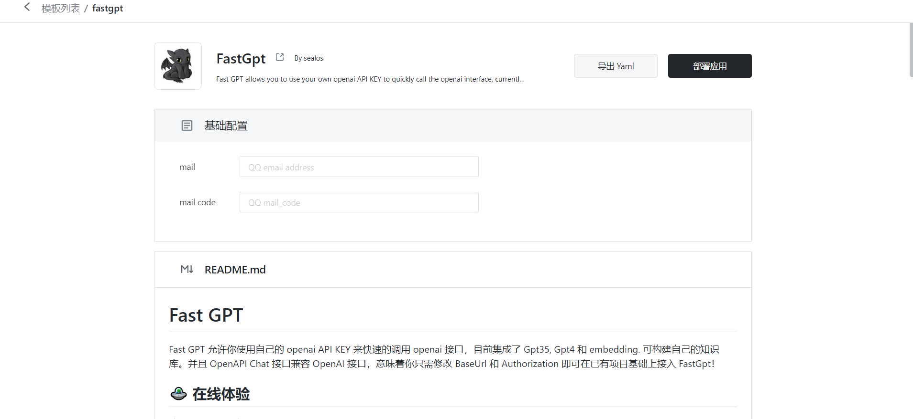

## 如何引入Deploy On Sealos

- 首先需要为您的应用创建模板，模板的具体创建方式见 [example.md](example.md)，以fastgpt为例。


- 在 png 目录下为您准备了 Deploy On Sealos 的按钮图标，您只需将该按钮跳转到 https://fastdeploy.cloud.sealos.io/deploy?type=form&templateName=fastgpt 即可进入 Sealos 的一键部署页面，其中 'fastgpt' 改你的文件名字，且改名字应与 Metadata.name 字段下的值保持一致

- 按钮的源地址可以有一下三种引入方式：

  - Markdown:

    ```markdown
    ](https://fastdeploy.cloud.sealos.io/deploy?type=form&templateName=fastgpt
    ```

  - HTML：

    ```
    <a href="https://fastdeploy.cloud.sealos.io/deploy?type=form&templateName=fastgpt"></a>
    ```

  - URL：

    ```
    https://fastdeploy.cloud.sealos.io/deploy?type=form&templateName=fastgpt
    ```

    


- 引入后只需点击Deploy On Sealo按钮即可跳转至应用部署界面，输入必要参数即可完成部署。


