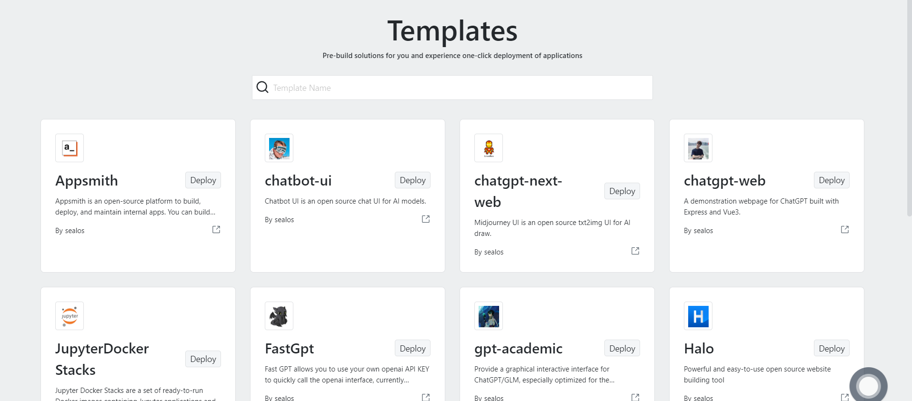

# Sealos Template Repository

With the templates in this repository, you can easily run various applications on Sealos without worrying about dependencies between applications, just deploy with one click. [Use Online](https://cloud.sealos.io/?openapp=system-fastdeploy%3F)



[简体中文](README_zh.md) | [Template Usage Tutorial](https://cloud.sealos.io/?openapp=system-fastdeploy%3F)

## How to create a template

- You can create your application template through existing template files or the Create Template (TODO) button. You can create the desired template based on [template.yaml](template.yaml).
- The system has some built-in common environment variables and functions. Use syntax like `GitHub Actions` to write template parameters like the `${{SEALOS_NAMESPACE}}` environment variable. For specific built-in environment variable information, see [variables](example.md#Built-in-system-variables-and-functions).
- Taking FastGPT as an example, this shows how to create a complete template, see [example.md](example.md) for details.

## Way to use Sealos one-click deployment button

The Deploy-on-Sealos button icon is ready for use in the current directory. All you need is insert the button image and link to the specific application address to enter the Sealos template one-click deployment page.

[](https://cloud.sealos.io/?openapp=system-fastdeploy%3FtemplateName%3Dfastgpt)

### Button include method

- Markdown:
```markdown
[](https://cloud.sealos.io/?openapp=system-fastdeploy%3FtemplateName%3Dfastgpt)
```
- HTML:
```html
<a href="https://cloud.sealos.io/?openapp=system-fastdeploy%3FtemplateName%3Dfastgpt"></a>
```
