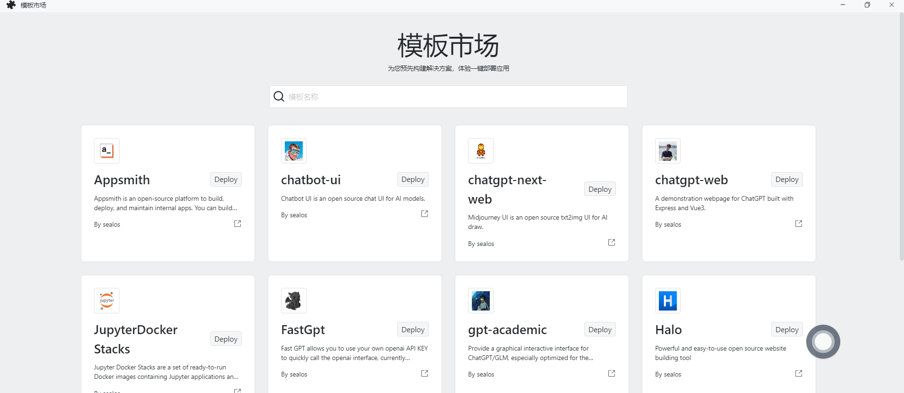

# sealos 模板仓库

通过本仓库的模板可以轻松在 Sealos 上运行各种应用，无需关心应用之间的依赖关系，只需一键轻松部署。[在线使用](https://cloud.sealos.io/?openapp=system-fastdeploy)



[模板使用教程](https://cloud.sealos.io/?openapp=system-fastdeploy)

## 如何创建模板

- 直接通过现有的模板文件或 Create Template(TODO)按钮来创建应用模版。可基于 [template.yaml](template.yaml) 来创建想要的模板。
- 系统内置了一些通用的环境变量信息与内置函数。使用像 `GitHub Actions` 一样的语法，通过 `${{ SEALOS_NAMESPACE }}`环境变量来编写模板参数。具体内置的环境变量信息可以查看[变量](example.md)。
- 文档以FastGPT为例展示如何完整的创建一个模板，详见[example.md](example.md)

## 如何引入 sealos 一键部署按钮

当前目录下准备了 Deploy on Sealos 的按钮图标，只需插入该按钮图片,并配置链接跳转到特定应用地址，如 [fastgpt](https://cloud.sealos.io/?openapp=system-fastdeploy%3FtemplateName%3Dfastgpt) ，即可进入 Sealos 模板市场的一键部署页面。

[](https://cloud.sealos.io/?openapp=system-fastdeploy%3FtemplateName%3Dfastgpt)

### 按钮引入方式

- Markdown:
```markdown
[](https://cloud.sealos.io/?openapp=system-fastdeploy%3FtemplateName%3Dfastgpt)
```
- HTML：
```
<a href="https://cloud.sealos.io/?openapp=system-fastdeploy%3FtemplateName%3Dfastgpt"></a>
```
