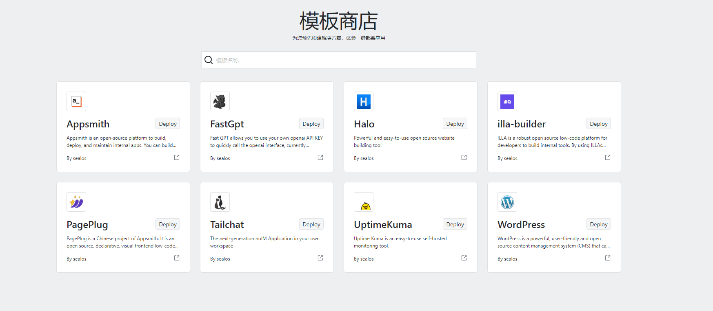

# Sealos 模板仓库

[English](README.md) | [在线使用](https://os.sealos.io)

本仓库是 Sealos 应用商店模板的源码。用户可以通过已发布模板快速部署应用，贡献者可以新增 `template/<app-name>/` 目录来提交应用模板。



## 🚀 快速开始

### 部署你的第一个应用

1. **浏览可用模板**，可以在 [Sealos 应用商店](https://sealos.io/products/app-store) 或 [`template/`](template/) 目录中选择应用。
2. **打开模板文档**，点击 "Deploy on Sealos" 按钮。
3. **填写参数并部署**，按表单完成必要配置。

模板编写快速入口:
- 基于 [template.yaml](template.yaml) 开始，并把完成后的文件放在 `template/<app-name>/index.yaml`。
- 在同一目录补齐 `README.md`、`README_zh.md`、图标和 `website-screenshot.webp`。
- 内置变量/函数使用类似 `GitHub Actions` 的语法，详见 [example.md](example.md)。
- FastGPT 完整示例见 [example.md](example.md)；数据库 Cluster YAML 示例（MongoDB/PostgreSQL/MySQL/Redis/Kafka/Milvus/ClickHouse）见 [example_zh.md](example_zh.md)。

你的应用几分钟内就能运行起来。

### 热门模板

| 模板 | 描述 | 部署 |
|------|------|------|
| FastGPT | 使用 AI 构建你自己的知识库 | [](https://sealos.io/products/app-store/fastgpt) |
| ChatGPT-Next-Web | 搭配你自己的 API Key 的 ChatGPT Web 界面 | [](https://sealos.io/products/app-store/chatgpt-next-web) |
| Code-Server | 浏览器中的 VS Code | [](https://sealos.io/products/app-store/code-server) |
| Cloudreve | 云存储系统 | [](https://sealos.io/products/app-store/cloudreve) |
| Appsmith | 低代码应用构建平台 | [](https://sealos.io/products/app-store/appsmith) |

[查看所有模板 →](template/)

## 📚 文档

- **[如何创建模板](#如何创建模板)** - 创建你自己的应用模板
- **[模板使用教程](https://os.sealos.io)** - 模板使用指南
- **[example.md](example.md)** - 详细的模板开发教程
- **[template.yaml](template.yaml)** - 模板参考文件

## 🛠️ 如何创建模板

新增模板时，在 `template/<app-name>/` 下放置可部署 YAML、用户文档和应用商店展示素材。

### 1. 从模板参考文件开始

把 [template.yaml](template.yaml) 复制到新的应用目录：

```bash
mkdir -p template/my-app
cp template.yaml template/my-app/index.yaml
```

然后更新应用元信息、镜像、输入项、资源名称、README 链接、图标和截图地址。

### 2. 补齐必要文件

一个完整模板目录通常包含：

```text
template/my-app/
├── index.yaml
├── README.md
├── README_zh.md
├── logo.png
└── website-screenshot.webp
```

如果上游项目更适合使用 `logo.svg` 或其他图片格式，可以选择对应格式。英文和中文 README 需要聚焦应用在 Sealos 部署后的使用方式。

### 3. 理解模板结构

模板文件主要分为两部分：

- **元数据 CR**：模板信息、默认值和用户输入
- **Kubernetes 资源**：StatefulSet、Service、Ingress 等

详细说明请查看 [example.md](example.md)。

### 4. 使用变量和函数

系统提供了内置的环境变量和函数。使用类似 `GitHub Actions` 的语法：

```yaml
# 系统内置变量
${{ SEALOS_NAMESPACE }}

# 生成随机字符串的函数
${{ random(8) }}

# 用户输入变量
${{ inputs.your_parameter }}
```

完整参考请查看 [内置系统变量和函数](example.md#built-in-system-variables-and-functions)。

### 5. 查看完整示例

[FastGPT](example.md) 示例展示了如何创建完整的模板，包括：
- 默认应用名称和主机名
- 用户可配置的输入（API 密钥、密码、数据库类型）
- 多个 Kubernetes 资源（数据库、应用、Ingress）

## 🔗 使用 "Deploy on Sealos" 按钮

你可以在项目的 README 中添加 "Deploy on Sealos" 按钮：

### Markdown

```markdown
[](https://sealos.io/products/app-store/your-app-name)
```

### HTML

```html
<a href="https://sealos.io/products/app-store/your-app-name">
  
</a>
```

将 `your-app-name` 替换为你的模板中 Template CR 的 `metadata.name`。

## 🤝 贡献指南

欢迎贡献！请按照以下步骤：

1. **Fork** 本仓库
2. **创建分支** 用于你的模板或改进
3. **新增或更新一个 `template/<app-name>/` 目录**
4. **在提交前测试** 你的模板
5. **提交 Pull Request**，写清楚改动内容和验证记录

### 模板规范

- **命名**：使用小写、连字符分隔的名称（如 `my-awesome-app`）
- **描述**：编写清晰、简洁的描述
- **文档**：提供英文和中文使用说明
- **素材**：提供图标和当前应用截图
- **默认值**：为所有输入提供合理的默认值
- **资源**：设置合理的资源限制（CPU/内存）

## 📖 相关资源

- [Sealos 官方文档](https://sealos.io/docs/Intro)
- [Sealos 应用商店](https://sealos.io/products/app-store)
- [问题反馈](https://github.com/labring-actions/templates/issues) - 报告问题或请求新功能
- [讨论区](https://github.com/labring-actions/templates/discussions) - 提问和分享想法

## 📄 许可证

本仓库遵循 Sealos 项目许可证。
