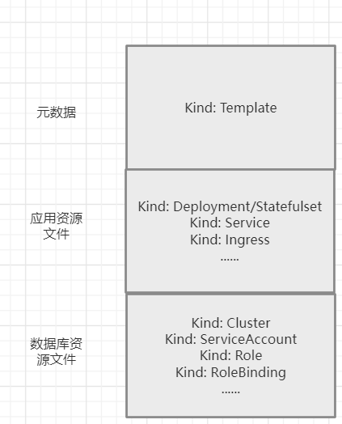

- 以FastGPT为例展示如何创建一个模板，假设您对Kubernetes的资源文件已有一定了解，本示例只对模板特有的一些参数进行解释。模板文件主要分为三个部分

- ### 元数据

  ```yaml
  apiVersion: template.app.sealos.io/v1beta1
  kind: Template
  metadata: 
    name: ${{ defaults.app_name }}
  spec:
    title: 'FastGpt'                         
    url: 'https://fastgpt.run/'                         
    github: 'https://github.com/labring/FastGPT'        
    author: 'sealos'                                     
    description: 'Fast GPT allows you to use your own openai API KEY to quickly call the openai interface, currently integrating Gpt35, Gpt4 and embedding. You can build your own knowledge base.'    
    readme: 'https://github.com/labring/FastGPT/blob/main/README.md'
    icon: 'https://avatars.githubusercontent.com/u/50446880?s=48&v=4'
    template_type: inline
    defaults:
      app_name:
        type: string
        value: fastgpt-${{ random(8) }}
      app_host:
        type: string
        value: ${{ random(8) }}
      fastgpt_admin_host:
        type: string
        value: ${{ random(8) }}
      fastgpt_keys_host:
        type: string
        value: ${{ random(8) }}
    inputs:
      mail:
        description: 'QQ email address'
        type: string
        default: ''
        required: true
      mail_code:
        description: 'QQ mail_code'
        type: string
        default: ''
        required: true
  ```

- 为帮助您了解如何使用 YAML 语法来创建模板文件，接下来解释介绍示例的代码：

  | 代码              | 说明                                                         |
  | :---------------- | :----------------------------------------------------------- |
  | `kind:  `         | Template 表示这是一个模版类型的资源文件                      |
  | `template_type: ` | inline 表示这是一个内嵌模式的模板，所有 yaml 文件集成在一个文件中 |
  | `spec: `          | 用于指定所部署应用所需要的一些基础信息                       |
  | `title: `         | 与文件名一致                                                 |
  | `defaults:  `     | 定义默认值填充到资源文件当中，如应用名称(app_name)，域名(app_host)等 |
  | `inputs:  `       | 定义应用部署时由用户来定义的一些参数，如Email、API-KEY等，没有则可省略该项 |

  定义好 Template 后接下来需要创建具体的资源文件，FastGPT依赖到项目有FastGPT-Admin、FastGPT、FastGPT-Keys、Mongo

- ### 应用资源文件

  - 这一部分一般以 Deployment/Statefulset、Service、Ingress 这三个类型的文件为一组，一组对应一个应用，如果应用不需要开启外放访问，则不需要 Ingress 类型的文件。

  ```yaml
  apiVersion: apps/v1
  kind: Deployment
  metadata:
    name: ${{ defaults.app_name }}
    annotations:
      originImageName: c121914yu/fast-gpt:latest
      deploy.cloud.sealos.io/minReplicas: '1'
      deploy.cloud.sealos.io/maxReplicas: '1'
    labels:
      dev.sealos.run/deploy-on-sealos: ${{ defaults.app_name }}
      dev.sealos.run/app-deploy-manager: ${{ defaults.app_name }}
      app: ${{ defaults.app_name }}
  spec:
    replicas: 1
    revisionHistoryLimit: 1
    selector:
      matchLabels:
        app: ${{ defaults.app_name }}
    template:
      metadata:
        labels:
          app: ${{ defaults.app_name }}
      spec:
        containers:
          - name: ${{ defaults.app_name }}
            image: c121914yu/fast-gpt:latest
            env:
              - name: MONGO_PASSWORD
                valueFrom:
                  secretKeyRef:
                    name: ${{ defaults.app_name }}-mongo-conn-credential
                    key: password
              - name: PG_PASSWORD
                valueFrom:
                  secretKeyRef:
                    name: ${{ defaults.app_name }}-pg-conn-credential
                    key: password    
              - name: ONEAPI_URL
                value: ${{ defaults.app_name }}-key.${{ SEALOS_NAMESPACE }}.svc.cluster.local:3000/v1
              - name: ONEAPI_KEY
                value: sk-xxxxxx
              - name: DB_MAX_LINK
                value: 5
              - name: MY_MAIL
                value: ${{ inputs.mail }}
              - name: MAILE_CODE
                value: ${{ inputs.mail_code }}
              - name: TOKEN_KEY
                value: fastgpttokenkey
              - name: ROOT_KEY
                value: rootkey
              - name: MONGODB_URI
                value: >-
                  mongodb://root:$(MONGO_PASSWORD)@${{ defaults.app_name }}-mongo-mongo.${{ SEALOS_NAMESPACE }}.svc:27017
              - name: MONGODB_NAME
                value: fastgpt
              - name: PG_HOST
                value: ${{ defaults.app_name }}-pg-pg.${{ SEALOS_NAMESPACE }}.svc
              - name: PG_USER
                value: postgres
              - name: PG_PORT
                value: '5432'
              - name: PG_DB_NAME
                value: postgres
            resources:
              requests:
                cpu: 100m
                memory: 102Mi
              limits:
                cpu: 1000m
                memory: 1024Mi
            command: []
            args: []
            ports:
              - containerPort: 3000
            imagePullPolicy: Always
            volumeMounts: []
        volumes: []
  
  ---
  apiVersion: v1
  kind: Service
  metadata:
    name: ${{ defaults.app_name }}
    labels:
      dev.sealos.run/deploy-on-sealos: ${{ defaults.app_name }}
      dev.sealos.run/app-deploy-manager: ${{ defaults.app_name }}
  spec:
    ports:
      - port: 3000
    selector:
      app: ${{ defaults.app_name }}
  
  ---
  apiVersion: networking.k8s.io/v1
  kind: Ingress
  metadata:
    name: ${{ defaults.app_name }}
    labels:
      dev.sealos.run/deploy-on-sealos: ${{ defaults.app_name }}
      dev.sealos.run/app-deploy-manager: ${{ defaults.app_name }}
      dev.sealos.run/app-deploy-manager-domain: ${{ defaults.app_host }}
    annotations:
      kubernetes.io/ingress.class: nginx
      nginx.ingress.kubernetes.io/proxy-body-size: 32m
      nginx.ingress.kubernetes.io/server-snippet: |
        client_header_buffer_size 64k;
        large_client_header_buffers 4 128k;
      nginx.ingress.kubernetes.io/ssl-redirect: 'false'
      nginx.ingress.kubernetes.io/backend-protocol: HTTP
      nginx.ingress.kubernetes.io/rewrite-target: /$2
      nginx.ingress.kubernetes.io/client-body-buffer-size: 64k
      nginx.ingress.kubernetes.io/proxy-buffer-size: 64k
      nginx.ingress.kubernetes.io/configuration-snippet: |
        if ($request_uri ~* \.(js|css|gif|jpe?g|png)) {
          expires 30d;
          add_header Cache-Control "public";
        }
  spec:
    rules:
      - host: ${{ defaults.app_host }}.${{ SEALOS_CLOUD_DOMAIN }}
        http:
          paths:
            - pathType: Prefix
              path: /()(.*)
              backend:
                service:
                  name: ${{ defaults.app_name }}
                  port:
                    number: 3000
    tls:
      - hosts:
          - ${{ defaults.app_host }}.${{ SEALOS_CLOUD_DOMAIN }}
        secretName: ${{ SEALOS_Cert_Secret_Name }}
  ```

- #### 主要需要关注以下几个字段：

| 代码                         | 说明                                                         |
| :--------------------------- | :----------------------------------------------------------- |
| ` originImageName: `         | 改为你的 Docker 镜像                                         |
| `image: `                    | 改为你的 Docker 镜像                                         |
| `env: `                      | 为容器配置环境变量                                           |
| `port: `                     | 改为你的 Docker 镜像对应的端口                               |
| `${{ defaults.app_name }}  ` | 可以通过${{ defaults.xxxx }}的方式来读取 Template 中定义的参数 |

- 如应用有涉及到数据库的使用可通过如下代码将数据库的密码添加到环境变量中，添加后在容器中可以通过$(MONGO_PASSWORD)的方式读取到MONGODB的密码，目前 Sealos 支持MySQL、MongoDB、PostgreSQL、Redis，数据库的命名方式统一采用${{ defaults.app_name }}-mysql(pg,mongo,redis)的方式。

  ```yaml
  spec:
    containers:
      - name: ${{ defaults.app_name }}
        image: c121914yu/fast-gpt:latest
        env:
          - name: MONGO_PASSWORD
            valueFrom:
              secretKeyRef:
                name: ${{ defaults.app_name }}-mongo-conn-credential
                key: password
  ```

- 部署 FastGPT-key 和 FastGPT-admin 的方式和 FastGPT 主应用的方式基本相同，下面提供部署数据库的模版资源文件，这一部分您只需关心数据库所使用的资源，以下为您提供了创建MongoDB、PostgreSQL、MySQL、Redis的模板。

| 代码          | 说明          |
| ------------- | ------------- |
| `replicas: `  | 实例数        |
| `resources: ` | 分配cpu和内存 |
| `storage: `   | 存储卷大小    |

- ### 数据库资源文件

  - 需要使用哪种数据库直接复制相应的资源文件就可。

- MongDB

```yaml
apiVersion: apps.kubeblocks.io/v1alpha1
kind: Cluster
metadata:
  finalizers:
    - cluster.kubeblocks.io/finalizer
  labels:
    clusterdefinition.kubeblocks.io/name: mongodb
    clusterversion.kubeblocks.io/name: mongodb-5.0.14
    sealos-db-provider-cr: ${{ defaults.app_name }}-mongo
  annotations: {}
  name: ${{ defaults.app_name }}-mongo
  generation: 1
spec:
  affinity:
    nodeLabels: {}
    podAntiAffinity: Preferred
    tenancy: SharedNode
    topologyKeys: []
  clusterDefinitionRef: mongodb
  clusterVersionRef: mongodb-5.0.14
  componentSpecs:
    - componentDefRef: mongodb
      monitor: true
      name: mongodb
      replicas: 1
      resources:
        limits:
          cpu: 1000m
          memory: 1024Mi
        requests:
          cpu: 100m
          memory: 102Mi
      serviceAccountName: ${{ defaults.app_name }}-mongo
      volumeClaimTemplates:
        - name: data
          spec:
            accessModes:
              - ReadWriteOnce
            resources:
              requests:
                storage: 3Gi
            storageClassName: openebs-backup  
  terminationPolicy: Delete
  tolerations: []


---
apiVersion: v1
kind: ServiceAccount
metadata:
  labels:
    sealos-db-provider-cr: ${{ defaults.app_name }}-mongo
    app.kubernetes.io/instance: ${{ defaults.app_name }}-mongo
    app.kubernetes.io/managed-by: kbcli
  name: ${{ defaults.app_name }}-mongo

---
apiVersion: rbac.authorization.k8s.io/v1
kind: Role
metadata:
  labels:
    sealos-db-provider-cr: ${{ defaults.app_name }}-mongo
    app.kubernetes.io/instance: ${{ defaults.app_name }}-mongo
    app.kubernetes.io/managed-by: kbcli
  name: ${{ defaults.app_name }}-mongo
rules:
  - apiGroups:
      - ''
    resources:
      - events
    verbs:
      - create

---
apiVersion: rbac.authorization.k8s.io/v1
kind: RoleBinding
metadata:
  labels:
    sealos-db-provider-cr: ${{ defaults.app_name }}-mongo
    app.kubernetes.io/instance: ${{ defaults.app_name }}-mongo
    app.kubernetes.io/managed-by: kbcli
  name: ${{ defaults.app_name }}-mongo
roleRef:
  apiGroup: rbac.authorization.k8s.io
  kind: Role
  name: ${{ defaults.app_name }}-mongo
subjects:
  - kind: ServiceAccount
    name: ${{ defaults.app_name }}-mongo
    namespace: ${{ SEALOS_NAMESPACE}}
```

- PostgreSQL

```yaml
apiVersion: apps.kubeblocks.io/v1alpha1
kind: Cluster
metadata:
  finalizers:
    - cluster.kubeblocks.io/finalizer
  labels:
    clusterdefinition.kubeblocks.io/name: postgresql
    clusterversion.kubeblocks.io/name: postgresql-14.8.0
    sealos-db-provider-cr: ${{ defaults.app_name }}-pg
  annotations: {}
  name: ${{ defaults.app_name }}-pg
spec:
  affinity:
    nodeLabels: {}
    podAntiAffinity: Preferred
    tenancy: SharedNode
    topologyKeys: []
  clusterDefinitionRef: postgresql
  clusterVersionRef: postgresql-14.8.0
  componentSpecs:
    - componentDefRef: postgresql
      monitor: true
      name: postgresql
      replicas: 1
      resources:
        limits:
          cpu: 1000m
          memory: 1024Mi
        requests:
          cpu: 100m
          memory: 102Mi
      serviceAccountName: ${{ defaults.app_name }}-pg
      switchPolicy:
        type: Noop
      volumeClaimTemplates:
        - name: data
          spec:
            accessModes:
              - ReadWriteOnce
            resources:
              requests:
                storage: 5Gi
            storageClassName: openebs-backup
  terminationPolicy: Delete
  tolerations: []

---
apiVersion: v1
kind: ServiceAccount
metadata:
  labels:
    sealos-db-provider-cr: ${{ defaults.app_name }}-pg
    app.kubernetes.io/instance: ${{ defaults.app_name }}-pg
    app.kubernetes.io/managed-by: kbcli
  name: ${{ defaults.app_name }}-pg

---
apiVersion: rbac.authorization.k8s.io/v1
kind: Role
metadata:
  labels:
    sealos-db-provider-cr: ${{ defaults.app_name }}-pg
    app.kubernetes.io/instance: ${{ defaults.app_name }}-pg
    app.kubernetes.io/managed-by: kbcli
  name: ${{ defaults.app_name }}-pg
rules:
  - apiGroups:
      - ''
    resources:
      - events
    verbs:
      - create
  - apiGroups:
      - ''
    resources:
      - configmaps
    verbs:
      - create
      - get
      - list
      - patch
      - update
      - watch
      - delete
  - apiGroups:
      - ''
    resources:
      - endpoints
    verbs:
      - create
      - get
      - list
      - patch
      - update
      - watch
      - delete
  - apiGroups:
      - ''
    resources:
      - pods
    verbs:
      - get
      - list
      - patch
      - update
      - watch

---
apiVersion: rbac.authorization.k8s.io/v1
kind: RoleBinding
metadata:
  labels:
    sealos-db-provider-cr: ${{ defaults.app_name }}-pg
    app.kubernetes.io/instance: ${{ defaults.app_name }}-pg
    app.kubernetes.io/managed-by: kbcli
  name: ${{ defaults.app_name }}-pg
roleRef:
  apiGroup: rbac.authorization.k8s.io
  kind: Role
  name: ${{ defaults.app_name }}-pg
subjects:
  - kind: ServiceAccount
    name: ${{ defaults.app_name }}-pg
    namespace: ${{ SEALOS_NAMESPACE }}
```

- MySQL

```yaml
apiVersion: apps.kubeblocks.io/v1alpha1
kind: Cluster
metadata:
  finalizers:
    - cluster.kubeblocks.io/finalizer
  labels:
    clusterdefinition.kubeblocks.io/name: apecloud-mysql
    clusterversion.kubeblocks.io/name: ac-mysql-8.0.30
    sealos-db-provider-cr: ${{ defaults.app_name }}-mysql
  annotations: {}
  name: ${{ defaults.app_name }}-mysql
spec:
  affinity:
    nodeLabels: {}
    podAntiAffinity: Preferred
    tenancy: SharedNode
    topologyKeys: []
  clusterDefinitionRef: apecloud-mysql
  clusterVersionRef: ac-mysql-8.0.30
  componentSpecs:
    - componentDefRef: mysql
      monitor: true
      name: mysql
      replicas: 1
      resources:
        limits:
          cpu: 1000m
          memory: 1024Mi
        requests:
          cpu: 100m
          memory: 102Mi
      serviceAccountName: ${{ defaults.app_name }}-mysql
      volumeClaimTemplates:
        - name: data
          spec:
            accessModes:
              - ReadWriteOnce
            resources:
              requests:
                storage: 3Gi
            storageClassName: openebs-backup
  terminationPolicy: Delete
  tolerations: []
  ---
  apiVersion: v1
kind: ServiceAccount
metadata:
  labels:
    sealos-db-provider-cr: ${{ defaults.app_name }}-mysql
    app.kubernetes.io/instance: ${{ defaults.app_name }}-mysql
    app.kubernetes.io/managed-by: kbcli
  name: ${{ defaults.app_name }}-mysql

---
apiVersion: rbac.authorization.k8s.io/v1
kind: Role
metadata:
  labels:
    sealos-db-provider-cr: ${{ defaults.app_name }}-mysql
    app.kubernetes.io/instance: ${{ defaults.app_name }}-mysql
    app.kubernetes.io/managed-by: kbcli
  name: ${{ defaults.app_name }}-mysql
rules:
  - apiGroups:
      - ''
    resources:
      - events
    verbs:
      - create

---
apiVersion: rbac.authorization.k8s.io/v1
kind: RoleBinding
metadata:
  labels:
    sealos-db-provider-cr: ${{ defaults.app_name }}-mysql
    app.kubernetes.io/instance: ${{ defaults.app_name }}-mysql
    app.kubernetes.io/managed-by: kbcli
  name: ${{ defaults.app_name }}-mysql
roleRef:
  apiGroup: rbac.authorization.k8s.io
  kind: Role
  name: ${{ defaults.app_name }}-mysql
subjects:
  - kind: ServiceAccount
    name: ${{ defaults.app_name }}-mysql
    namespace: ${{ SEALOS_NAMESPACE }}

```

- Redis

```yaml
apiVersion: apps.kubeblocks.io/v1alpha1
kind: Cluster
metadata:
  finalizers:
    - cluster.kubeblocks.io/finalizer
  labels:
    clusterdefinition.kubeblocks.io/name: redis
    clusterversion.kubeblocks.io/name: redis-7.0.6
    sealos-db-provider-cr: ${{ defaults.app_name }}-redis
  annotations: {}
  name: ${{ defaults.app_name }}-redis
spec:
  affinity:
    nodeLabels: {}
    podAntiAffinity: Preferred
    tenancy: SharedNode
    topologyKeys: []
  clusterDefinitionRef: redis
  clusterVersionRef: redis-7.0.6
  componentSpecs:
    - componentDefRef: redis
      monitor: true
      name: redis
      replicas: 1
      resources:
        limits:
          cpu: 1000m
          memory: 1024Mi
        requests:
          cpu: 100m
          memory: 102Mi
      serviceAccountName: ${{ defaults.app_name }}-redis
      switchPolicy:
        type: Noop
      volumeClaimTemplates:
        - name: data
          spec:
            accessModes:
              - ReadWriteOnce
            resources:
              requests:
                storage: 3Gi
            storageClassName: openebs-backup
    - componentDefRef: redis-sentinel
      monitor: true
      name: redis-sentinel
      replicas: 1
      resources:
        limits:
          cpu: 100m
          memory: 100Mi
        requests:
          cpu: 100m
          memory: 100Mi
      serviceAccountName: ${{ defaults.app_name }}-redis
  terminationPolicy: Delete
  tolerations: []
---
apiVersion: v1
kind: ServiceAccount
metadata:
  labels:
    sealos-db-provider-cr: ${{ defaults.app_name }}-redis
    app.kubernetes.io/instance: ${{ defaults.app_name }}-redis
    app.kubernetes.io/managed-by: kbcli
  name: ${{ defaults.app_name }}-redis

---
apiVersion: rbac.authorization.k8s.io/v1
kind: Role
metadata:
  labels:
    sealos-db-provider-cr: ${{ defaults.app_name }}-redis
    app.kubernetes.io/instance: ${{ defaults.app_name }}-redis
    app.kubernetes.io/managed-by: kbcli
  name: ${{ defaults.app_name }}-redis
rules:
  - apiGroups:
      - ''
    resources:
      - events
    verbs:
      - create

---
apiVersion: rbac.authorization.k8s.io/v1
kind: RoleBinding
metadata:
  labels:
    sealos-db-provider-cr: ${{ defaults.app_name }}-redis
    app.kubernetes.io/instance: ${{ defaults.app_name }}-redis
    app.kubernetes.io/managed-by: kbcli
  name: ${{ defaults.app_name }}-redis
roleRef:
  apiGroup: rbac.authorization.k8s.io
  kind: Role
  name: ${{ defaults.app_name }}-redis
subjects:
  - kind: ServiceAccount
    name: ${{ defaults.app_name }}-redis
    namespace: ${{ SEALOS_NAMESPACE }}
```

