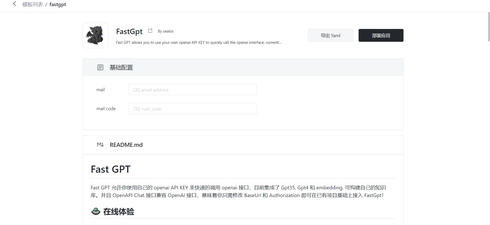

# Template File Example



[简体中文](example_zh.md)

Taking FastGPT as an example here to demonstrate how to create a template. This example assumes that you already have a certain understanding of Kubernetes resource files, and will only explains some parameters unique to the template. The template file is mainly divided into two parts.


## Part One: `Metadata CR`

```yaml
apiVersion: app.sealos.io/v1
kind: Template
metadata: 
  name: ${{ defaults.app_name }}
spec:
  title: 'FastGpt'                         
  url: 'https://fastgpt.run/'                         
  gitRepo: 'https://github.com/labring/FastGPT'        
  author: 'sealos'                                     
  description: 'Fast GPT allows you to use your own openai API KEY to quickly call the openai interface, currently integrating Gpt35, Gpt4 and embedding. You can build your own knowledge base.'    
  readme: 'https://raw.githubusercontent.com/labring/FastGPT/main/README.md'
  icon: 'https://avatars.githubusercontent.com/u/50446880?s=96&v=4'
  templateType: inline
  defaults:
    app_name:
      type: string
      value: fastgpt-${{ random(8) }}
    app_host:
      type: string
      value: ${{ random(8) }}
  inputs:
    root_passowrd:
      description: 'Set root password. login: username: root, password: root_passowrd'
      type: string
      default: ${{ SEALOS_NAMESPACE }}
      required: true
    openai_key:
      description: 'openai api key'
      type: string
      default: ''
      required: true
    database_type:
      description: 'type of database'
      required: false
      type: choice
      default: 'mysql'
      options:
        - sqlite
        - mysql
```

As demo shows, the metatda CR is a regular Kubernetes custom resource type, and the following table lists the fields that need to be filled in.

| Code            | Description                                                  |
| :---------------| :----------------------------------------------------------- |
| `templateType` | `inline` indicates this is an inline mode template, all yaml files are integrated in one file. |
| `defaults`      | Define default values to be filled into the resource file, such as application name (app_name), domain name (app_host), etc. |
| `inputs`        | Define some parameters needed by the user when deploying the application, such as Email, API-KEY, etc. If none, this item can be omitted |

### Explain: `Variables`

Any characters enclosed in `${{ }}` are variables, and the variables are divided into these types:

1. `SEALOS_` pre-defined system built-in variables with upper case letters, such as `${{ SEALOS_NAMESPACE }}`, are variables provided by Sealos itself. For all currently supported system variables, please refer to [System Variables](#built-in-system-variables-and-functions).
2. `functions()` functions, such as `${{ random(8) }}`, are functions provided by Sealos itself. For all currently supported functions, please refer to [Functions](#built-in-system-variables-and-functions).
3. `defaults` is a list of names and values that are filled in by parsing, usually used for random values.
4. `inputs` filled in by the user when deploying the application, inputs will be rendered into frontend form.

### Explain: `Defaults`

`spec.defaults` is a map of names, types and values that are filled as defaults when parsing the template.

| Name    | Description |
| :-------| :---------- |
| `type`  | `string` or `number` stands for the type of the variable, the only difference is that the string type will be quoted when rendered, and the number type will not. |
| `value` | The value of the variable, if the value is a function, it will be rendered. |

**In the current implementation, `defaults` must have a field named `app_name`, and it must contain a random string generated by `${{ random(8) }}` as the unique name of the application, otherwise an error will occur.**

### Explain: `Inputs`

`spec.defaults` is a map of defined objects that are parsed and shown as form inputs for user to react.

| Name    | Description |
| :-------| :---------- |
| `description` | The description of the input. Will be rendered as input placeholder. |
| `default`     | The default value of the input. |
| `required`    | Whether the input is required. |
| `type`        | Must be one of `string` \| `number` \| `choice` \| `boolean` |
| `options`?    | When type is `choice`, set list of available options. |
| `if`?         | JavaScript expression, control whether this option is enabled. |

Inputs as demoed above will be rendered as form inputs in the frontend:

<table>
<tr>
<td> Template </td> <td> View </td>
</tr>
<tr>
<td width="50%"> 

```yaml
inputs:
  root_passowrd:
    description: 'Set root password. login: username: root, password: root_passowrd'
    type: string
    default: ''
    required: true
  openai_key:
    description: 'openai api key'
    type: string
    default: ''
    required: true
```

</td> 
<td> 

 

</td>
</tr>
</table>

#### Usage of `if` parameter in `Inputs`

- The form supports dynamic rendering, where the `if` parameter controls whether a form item is displayed.
- The content of the `if` parameter is an expression, do not use `${{ }}` to wrap it.
- When the result of the expression is `true`, the parameter is rendered; when the result is `false`, the parameter is not rendered, and the corresponding `required` parameter will not take effect.
- If the result is not a boolean value, it will be coerced into a boolean value.

### Built-in system variables and functions

Sealos template engine uses the syntax of `${{ expression }}` to parse expressions.

- `expression` is a valid JavaScript expression.
- The expression can access Sealos built-in variables and functions.

#### Built-in System Variables

- `${{ SEALOS_NAMESPACE }}` The namespace where Sealos user is deployed.
- `${{ SEALOS_CLOUD_DOMAIN }}` The domain suffix of the Sealos cluster.
- `${{ SEALOS_CERT_SECRET_NAME }}` The name of the secret that Sealos uses to store the tls certificate.
- `${{ SEALOS_SERVICE_ACCOUNT }}` Sealos user's SA.

#### Built-in System Functions

- `${{ random(length) }}`: Generates a random string of length `length`.
- `${{ base64(expression) }}`: Encodes the result of the expression into base64 format.
  - `${{ base64('hello world') }}` will return `aGVsbG8gd29ybGQ=`.
  - You can also reference variables, like `${{ base64(inputs.secret) }}`.

> Note:
>
> You cannot use `${{ inputs.enabled }}` to determine whether to enable an option because `enabled` is a string, not a boolean.
>
> You should use `${{ inputs.enabled === 'true' }}` to determine whether to enable an option.

#### Conditional Rendering

The Sealos template engine supports conditional rendering using `${{ if(expression) }}`, `${{ elif(expression) }}`, `${{ else() }}`, and `${{ endif() }}`.

- Conditional rendering is a special built-in system function
- Conditional statements must be on a separate line and cannot be on the same line as other content.
- Conditional expressions must return a boolean value (`true` or `false`), otherwise they will be coerced into a boolean value.
- Allow rendering across yaml lists.
- `Template CR` does not support conditional rendering.

**Example:**

```yaml
${{ if(inputs.enableIngress === 'true') }}
apiVersion: networking.k8s.io/v1
kind: Ingress
...
${{ endif() }}
```

This code snippet indicates that the Ingress resource will only be rendered if `inputs.enableIngress` is `true`.

<details>

<summary>A more complete example</summary>

```yaml
apiVersion: app.sealos.io/v1
kind: Template
metadata:
  name: chatgpt-next-web
spec:
  title: 'chatgpt-next-web'
  url: 'https://github.com/Yidadaa/ChatGPT-Next-Web'
  gitRepo: 'https://github.com/Yidadaa/ChatGPT-Next-Web'
  author: 'Sealos'
  description: 'One-click free deployment of your cross-platform private ChatGPT application'
  readme: 'https://raw.githubusercontent.com/Yidadaa/ChatGPT-Next-Web/main/README.md'
  icon: 'https://raw.githubusercontent.com/Yidadaa/ChatGPT-Next-Web/main/docs/images/icon.svg'
  templateType: inline
  categories:
    - ai
  defaults:
    app_host:
      type: string
      value: ${{ random(8) }}
    app_name:
      type: string
      value: chatgpt-next-web-${{ random(8) }}
  inputs:
    DOMAIN:
      description: "Custom domain name, needs to be CNAME to: ${{ defaults.app_host + '.' + SEALOS_CLOUD_DOMAIN }}"
      type: string
      default: ''
      required: false
    OPENAI_API_KEY:
      description: 'This is the API key you applied for on the OpenAI account page. Use English commas to separate multiple keys, so that these keys can be randomly polled'
      type: string
      default: ''
      required: true
    HIDE_USER_API_KEY:
      description: 'If you don't want users to fill in the API Key by themselves, check it'
      type: boolean
      default: 'false'
      required: false
    AUZRE_ENABLE:
      description: 'Enable Azure'
      type: boolean
      default: 'false'
      required: false
    AZURE_API_KEY:
      description: 'Azure key'
      type: string
      default: ''
      required: true
      if: inputs.AUZRE_ENABLE === 'true'
    AZURE_URL:
      description: 'Azure deployment address'
      type: string
      default: 'https://{azure-resource-url}/openai/deployments/{deploy-name}'
      required: true
      if: inputs.AUZRE_ENABLE === 'true'

---
apiVersion: apps/v1
kind: Deployment
metadata:
  name: ${{ defaults.app_name }}
  annotations:
    originImageName: yidadaa/chatgpt-next-web:v2.12.4
  labels:
    cloud.sealos.io/app-deploy-manager: ${{ defaults.app_name }}
    app: ${{ defaults.app_name }}
spec:
  replicas: 1
  revisionHistoryLimit: 1
  selector:
    matchLabels:
      app: ${{ defaults.app_name }}
  template:
    metadata:
      labels:
        app: ${{ defaults.app_name }}
    spec:
      automountServiceAccountToken: false
      containers:
        - name: ${{ defaults.app_name }}
          image: yidadaa/chatgpt-next-web:v2.12.4
          env:
            - name: OPENAI_API_KEY
              value: ${{ inputs.OPENAI_API_KEY }}
            ${{ if(inputs.HIDE_USER_API_KEY === 'true') }}
            - name: HIDE_USER_API_KEY
              value: '1'
            ${{ endif() }}
            ${{ if(inputs.AUZRE_ENABLE === 'true') }}
            - name: AZURE_URL
              value: ${{ inputs.AZURE_URL }}
            - name: AZURE_API_KEY
              value: ${{ inputs.AZURE_API_KEY }}
            ${{ endif() }}
          ports:
            - containerPort: 3000
---
apiVersion: v1
kind: Service
metadata:
  name: ${{ defaults.app_name }}
  labels:
    cloud.sealos.io/app-deploy-manager: ${{ defaults.app_name }}
spec:
  ports:
    - port: 3000
  selector:
    app: ${{ defaults.app_name }}
---
apiVersion: networking.k8s.io/v1
kind: Ingress
metadata:
  name: ${{ defaults.app_name }}
  labels:
    cloud.sealos.io/app-deploy-manager: ${{ defaults.app_name }}
    cloud.sealos.io/app-deploy-manager-domain: ${{ defaults.app_host }}
spec:
  rules:
    - host: ${{ inputs.DOMAIN || defaults.app_host + '.' + SEALOS_CLOUD_DOMAIN }}
      http:
        paths:
          - pathType: Prefix
            path: /()(.*)
            backend:
              service:
                name: ${{ defaults.app_name }}
                port:
                  number: 3000
  tls:
    - hosts:
        - ${{ inputs.DOMAIN || defaults.app_host + '.' + SEALOS_CLOUD_DOMAIN }}
      secretName: "${{ inputs.DOMAIN ? defaults.app_name + '-cert' : SEALOS_CERT_SECRET_NAME }}"

---
${{ if(inputs.DOMAIN !== '') }}
apiVersion: cert-manager.io/v1
kind: Issuer
metadata:
  name: ${{ defaults.app_name }}
  labels:
    cloud.sealos.io/app-deploy-manager: ${{ defaults.app_name }}
spec:
  acme:
    server: https://acme-v02.api.letsencrypt.org/directory
    email: admin@sealos.io
    privateKeySecretRef:
      name: letsencrypt-prod
    solvers:
      - http01:
          ingress:
            class: nginx
            serviceType: ClusterIP

---
apiVersion: cert-manager.io/v1
kind: Certificate
metadata:
  name: ${{ defaults.app_name }}-cert
  labels:
    cloud.sealos.io/app-deploy-manager: ${{ defaults.app_name }}
spec:
  secretName: ${{ defaults.app_name }}-cert
  dnsNames:
    - ${{ inputs.DOMAIN }}
  issuerRef:
    name: ${{ defaults.app_name }}
    kind: Issuer
${{ endif() }}
```

</details>

## Part Two: `Application Resource File(s)`

This part generally consists of a group of types of resources:

- Applications `Deployment`, `StatefulSet`, `Service`
- External Access, `Ingress`
- Underlying Requirements, `Database`, `Object Storage`

Each resources can repeat any times without order.

### Explain: `Applications`

Applications is list of as many as `Deployment`, `StatefulSet`, `Service` Or/And `Job`, `Secret`, `ConfigMap`, `Custom Resource` as you want.

<details>

<summary>Demo</summary>

```yaml
apiVersion: apps/v1
kind: Deployment
metadata:
  name: ${{ defaults.app_name }}
  annotations:
    originImageName: c121914yu/fast-gpt:latest
    deploy.cloud.sealos.io/minReplicas: '1'
    deploy.cloud.sealos.io/maxReplicas: '1'
  labels:
    cloud.sealos.io/app-deploy-manager: ${{ defaults.app_name }}
    app: ${{ defaults.app_name }}
spec:
  replicas: 1
  revisionHistoryLimit: 1
  selector:
    matchLabels:
      app: ${{ defaults.app_name }}
  template:
    metadata:
      labels:
        app: ${{ defaults.app_name }}
    spec:
      containers:
        - name: ${{ defaults.app_name }}
          image: c121914yu/fast-gpt:latest
          env:
            - name: MONGO_PASSWORD
              valueFrom:
                secretKeyRef:
                  name: ${{ defaults.app_name }}-mongo-conn-credential
                  key: password
            - name: PG_PASSWORD
              valueFrom:
                secretKeyRef:
                  name: ${{ defaults.app_name }}-pg-conn-credential
                  key: password    
            - name: ONEAPI_URL
              value: ${{ defaults.app_name }}-key.${{ SEALOS_NAMESPACE }}.svc.cluster.local:3000/v1
            - name: ONEAPI_KEY
              value: sk-xxxxxx
            - name: DB_MAX_LINK
              value: 5
            - name: MY_MAIL
              value: ${{ inputs.mail }}
            - name: MAILE_CODE
              value: ${{ inputs.mail_code }}
            - name: TOKEN_KEY
              value: fastgpttokenkey
            - name: ROOT_KEY
              value: rootkey
            - name: MONGODB_URI
              value: >-
                mongodb://root:$(MONGO_PASSWORD)@${{ defaults.app_name }}-mongo-mongo.${{ SEALOS_NAMESPACE }}.svc:27017
            - name: MONGODB_NAME
              value: fastgpt
            - name: PG_HOST
              value: ${{ defaults.app_name }}-pg-pg.${{ SEALOS_NAMESPACE }}.svc
            - name: PG_USER
              value: postgres
            - name: PG_PORT
              value: '5432'
            - name: PG_DB_NAME
              value: postgres
          resources:
            requests:
              cpu: 100m
              memory: 102Mi
            limits:
              cpu: 1000m
              memory: 1024Mi
          command: []
          args: []
          ports:
            - containerPort: 3000
          imagePullPolicy: IfNotPresent
          volumeMounts: []
      volumes: []

---
apiVersion: v1
kind: Service
metadata:
  name: ${{ defaults.app_name }}
  labels:
    cloud.sealos.io/app-deploy-manager: ${{ defaults.app_name }}
spec:
  ports:
    - port: 3000
  selector:
    app: ${{ defaults.app_name }}
```

</details>

Frequently changes with the following fields:

| Code                         | Description                                                  |
| :--------------------------- | :----------------------------------------------------------- |
| `metadata.annotations`<br/>`metadata.labels` | Change to match launchpad's requirements, like `originImageName`, `minReplicas`, `maxReplicas`. |
| `spec.containers[].image` | Change to your Docker image. |
| `spec.containers[].env` | Configure environment variables for the container            |
| `spec.containers[].ports.containerPort` | Change to the port corresponding to your Docker image        |
| `${{ defaults.app_name }}` | You can use the `${{ defaults.xxxx }}`\|`${{ inputs.xxxx }}` variables to set parameters defined in the `Template CR`. |

### Explain: `External Accesses`

If the application needs to be accessed externally, you need to add the following code:

<details>

<summary>Demo</summary>

```yaml
apiVersion: networking.k8s.io/v1
kind: Ingress
metadata:
  name: ${{ defaults.app_name }}
  labels:
    cloud.sealos.io/app-deploy-manager: ${{ defaults.app_name }}
    cloud.sealos.io/app-deploy-manager-domain: ${{ defaults.app_host }}
  annotations:
    kubernetes.io/ingress.class: nginx
    nginx.ingress.kubernetes.io/proxy-body-size: 32m
    nginx.ingress.kubernetes.io/server-snippet: |
      client_header_buffer_size 64k;
      large_client_header_buffers 4 128k;
    nginx.ingress.kubernetes.io/ssl-redirect: 'false'
    nginx.ingress.kubernetes.io/backend-protocol: HTTP
    nginx.ingress.kubernetes.io/rewrite-target: /$2
    nginx.ingress.kubernetes.io/client-body-buffer-size: 64k
    nginx.ingress.kubernetes.io/proxy-buffer-size: 64k
    nginx.ingress.kubernetes.io/configuration-snippet: |
      if ($request_uri ~* \.(js|css|gif|jpe?g|png)) {
        expires 30d;
        add_header Cache-Control "public";
      }
spec:
  rules:
    - host: ${{ defaults.app_host }}.${{ SEALOS_CLOUD_DOMAIN }}
      http:
        paths:
          - pathType: Prefix
            path: /()(.*)
            backend:
              service:
                name: ${{ defaults.app_name }}
                port:
                  number: 3000
  tls:
    - hosts:
        - ${{ defaults.app_host }}.${{ SEALOS_CLOUD_DOMAIN }}
      secretName: ${{ SEALOS_CERT_SECRET_NAME }}
```

</details>

Please note that the `host` field needs to be randomly set for security purpose. You can use `${{ random(8) }}` set to `defaults.app_host` and use `${{ defaults.app_host }}` then.

### Explain: `Underlying Requirements`

Almost all applications needs underlying requirements, such as `database`, `cache`, `object storage` etc. You can add the following code to deploy some underlying requirements we provided:

#### `Database`

We using [`kubeblocks`](https://kubeblocks.io/) to provide database resources support. You can directly use the following code to deploy a database:

<details>

<summary>MongoDB</summary>

```yaml
apiVersion: apps.kubeblocks.io/v1alpha1
kind: Cluster
metadata:
  finalizers:
    - cluster.kubeblocks.io/finalizer
  labels:
    clusterdefinition.kubeblocks.io/name: mongodb
    clusterversion.kubeblocks.io/name: mongodb-5.0
    sealos-db-provider-cr: ${{ defaults.app_name }}-mongo
  annotations: {}
  name: ${{ defaults.app_name }}-mongo
  generation: 1
spec:
  affinity:
    nodeLabels: {}
    podAntiAffinity: Preferred
    tenancy: SharedNode
    topologyKeys: []
  clusterDefinitionRef: mongodb
  clusterVersionRef: mongodb-5.0
  componentSpecs:
    - componentDefRef: mongodb
      monitor: true
      name: mongodb
      replicas: 1
      resources:
        limits:
          cpu: 1000m
          memory: 1024Mi
        requests:
          cpu: 100m
          memory: 102Mi
      serviceAccountName: ${{ defaults.app_name }}-mongo
      volumeClaimTemplates:
        - name: data
          spec:
            accessModes:
              - ReadWriteOnce
            resources:
              requests:
                storage: 3Gi
            storageClassName: openebs-backup  
  terminationPolicy: Delete
  tolerations: []


---
apiVersion: v1
kind: ServiceAccount
metadata:
  labels:
    sealos-db-provider-cr: ${{ defaults.app_name }}-mongo
    app.kubernetes.io/instance: ${{ defaults.app_name }}-mongo
    app.kubernetes.io/managed-by: kbcli
  name: ${{ defaults.app_name }}-mongo

---
apiVersion: rbac.authorization.k8s.io/v1
kind: Role
metadata:
  labels:
    sealos-db-provider-cr: ${{ defaults.app_name }}-mongo
    app.kubernetes.io/instance: ${{ defaults.app_name }}-mongo
    app.kubernetes.io/managed-by: kbcli
  name: ${{ defaults.app_name }}-mongo
rules:
  - apiGroups:
      - '*'
    resources:
      - '*'
    verbs:
      - '*'

---
apiVersion: rbac.authorization.k8s.io/v1
kind: RoleBinding
metadata:
  labels:
    sealos-db-provider-cr: ${{ defaults.app_name }}-mongo
    app.kubernetes.io/instance: ${{ defaults.app_name }}-mongo
    app.kubernetes.io/managed-by: kbcli
  name: ${{ defaults.app_name }}-mongo
roleRef:
  apiGroup: rbac.authorization.k8s.io
  kind: Role
  name: ${{ defaults.app_name }}-mongo
subjects:
  - kind: ServiceAccount
    name: ${{ defaults.app_name }}-mongo
```

</details>

<details>

<summary>PostgreSQL</summary>

```yaml
apiVersion: apps.kubeblocks.io/v1alpha1
kind: Cluster
metadata:
  finalizers:
    - cluster.kubeblocks.io/finalizer
  labels:
    clusterdefinition.kubeblocks.io/name: postgresql
    clusterversion.kubeblocks.io/name: postgresql-14.8.0
    sealos-db-provider-cr: ${{ defaults.app_name }}-pg
  annotations: {}
  name: ${{ defaults.app_name }}-pg
spec:
  affinity:
    nodeLabels: {}
    podAntiAffinity: Preferred
    tenancy: SharedNode
    topologyKeys: []
  clusterDefinitionRef: postgresql
  clusterVersionRef: postgresql-14.8.0
  componentSpecs:
    - componentDefRef: postgresql
      monitor: true
      name: postgresql
      replicas: 1
      resources:
        limits:
          cpu: 1000m
          memory: 1024Mi
        requests:
          cpu: 100m
          memory: 102Mi
      serviceAccountName: ${{ defaults.app_name }}-pg
      switchPolicy:
        type: Noop
      volumeClaimTemplates:
        - name: data
          spec:
            accessModes:
              - ReadWriteOnce
            resources:
              requests:
                storage: 5Gi
            storageClassName: openebs-backup
  terminationPolicy: Delete
  tolerations: []

---
apiVersion: v1
kind: ServiceAccount
metadata:
  labels:
    sealos-db-provider-cr: ${{ defaults.app_name }}-pg
    app.kubernetes.io/instance: ${{ defaults.app_name }}-pg
    app.kubernetes.io/managed-by: kbcli
  name: ${{ defaults.app_name }}-pg

---
apiVersion: rbac.authorization.k8s.io/v1
kind: Role
metadata:
  labels:
    sealos-db-provider-cr: ${{ defaults.app_name }}-pg
    app.kubernetes.io/instance: ${{ defaults.app_name }}-pg
    app.kubernetes.io/managed-by: kbcli
  name: ${{ defaults.app_name }}-pg
rules:
  - apiGroups:
      - '*'
    resources:
      - '*'
    verbs:
      - '*'
---
apiVersion: rbac.authorization.k8s.io/v1
kind: RoleBinding
metadata:
  labels:
    sealos-db-provider-cr: ${{ defaults.app_name }}-pg
    app.kubernetes.io/instance: ${{ defaults.app_name }}-pg
    app.kubernetes.io/managed-by: kbcli
  name: ${{ defaults.app_name }}-pg
roleRef:
  apiGroup: rbac.authorization.k8s.io
  kind: Role
  name: ${{ defaults.app_name }}-pg
subjects:
  - kind: ServiceAccount
    name: ${{ defaults.app_name }}-pg
```

</details>

<details>

<summary>MySQL</summary>

```yaml
apiVersion: apps.kubeblocks.io/v1alpha1
kind: Cluster
metadata:
  finalizers:
    - cluster.kubeblocks.io/finalizer
  labels:
    clusterdefinition.kubeblocks.io/name: apecloud-mysql
    clusterversion.kubeblocks.io/name: ac-mysql-8.0.30
    sealos-db-provider-cr: ${{ defaults.app_name }}-mysql
  annotations: {}
  name: ${{ defaults.app_name }}-mysql
spec:
  affinity:
    nodeLabels: {}
    podAntiAffinity: Preferred
    tenancy: SharedNode
    topologyKeys: []
  clusterDefinitionRef: apecloud-mysql
  clusterVersionRef: ac-mysql-8.0.30
  componentSpecs:
    - componentDefRef: mysql
      monitor: true
      name: mysql
      replicas: 1
      resources:
        limits:
          cpu: 1000m
          memory: 1024Mi
        requests:
          cpu: 100m
          memory: 102Mi
      serviceAccountName: ${{ defaults.app_name }}-mysql
      volumeClaimTemplates:
        - name: data
          spec:
            accessModes:
              - ReadWriteOnce
            resources:
              requests:
                storage: 3Gi
            storageClassName: openebs-backup
  terminationPolicy: Delete
  tolerations: []
---
apiVersion: v1
kind: ServiceAccount
metadata:
  labels:
    sealos-db-provider-cr: ${{ defaults.app_name }}-mysql
    app.kubernetes.io/instance: ${{ defaults.app_name }}-mysql
    app.kubernetes.io/managed-by: kbcli
  name: ${{ defaults.app_name }}-mysql

---
apiVersion: rbac.authorization.k8s.io/v1
kind: Role
metadata:
  labels:
    sealos-db-provider-cr: ${{ defaults.app_name }}-mysql
    app.kubernetes.io/instance: ${{ defaults.app_name }}-mysql
    app.kubernetes.io/managed-by: kbcli
  name: ${{ defaults.app_name }}-mysql
rules:
  - apiGroups:
      - '*'
    resources:
      - '*'
    verbs:
      - '*'

---
apiVersion: rbac.authorization.k8s.io/v1
kind: RoleBinding
metadata:
  labels:
    sealos-db-provider-cr: ${{ defaults.app_name }}-mysql
    app.kubernetes.io/instance: ${{ defaults.app_name }}-mysql
    app.kubernetes.io/managed-by: kbcli
  name: ${{ defaults.app_name }}-mysql
roleRef:
  apiGroup: rbac.authorization.k8s.io
  kind: Role
  name: ${{ defaults.app_name }}-mysql
subjects:
  - kind: ServiceAccount
    name: ${{ defaults.app_name }}-mysql

```

</details>

<details>

<summary>Redis</summary>

```yaml
apiVersion: apps.kubeblocks.io/v1alpha1
kind: Cluster
metadata:
  finalizers:
    - cluster.kubeblocks.io/finalizer
  labels:
    clusterdefinition.kubeblocks.io/name: redis
    clusterversion.kubeblocks.io/name: redis-7.0.6
    sealos-db-provider-cr: ${{ defaults.app_name }}-redis
  annotations: {}
  name: ${{ defaults.app_name }}-redis
spec:
  affinity:
    nodeLabels: {}
    podAntiAffinity: Preferred
    tenancy: SharedNode
    topologyKeys: []
  clusterDefinitionRef: redis
  clusterVersionRef: redis-7.0.6
  componentSpecs:
    - componentDefRef: redis
      monitor: true
      name: redis
      replicas: 1
      resources:
        limits:
          cpu: 1000m
          memory: 1024Mi
        requests:
          cpu: 100m
          memory: 102Mi
      serviceAccountName: ${{ defaults.app_name }}-redis
      switchPolicy:
        type: Noop
      volumeClaimTemplates:
        - name: data
          spec:
            accessModes:
              - ReadWriteOnce
            resources:
              requests:
                storage: 3Gi
            storageClassName: openebs-backup
    - componentDefRef: redis-sentinel
      monitor: true
      name: redis-sentinel
      replicas: 1
      resources:
        limits:
          cpu: 100m
          memory: 100Mi
        requests:
          cpu: 100m
          memory: 100Mi
      serviceAccountName: ${{ defaults.app_name }}-redis
  terminationPolicy: Delete
  tolerations: []
---
apiVersion: v1
kind: ServiceAccount
metadata:
  labels:
    sealos-db-provider-cr: ${{ defaults.app_name }}-redis
    app.kubernetes.io/instance: ${{ defaults.app_name }}-redis
    app.kubernetes.io/managed-by: kbcli
  name: ${{ defaults.app_name }}-redis

---
apiVersion: rbac.authorization.k8s.io/v1
kind: Role
metadata:
  labels:
    sealos-db-provider-cr: ${{ defaults.app_name }}-redis
    app.kubernetes.io/instance: ${{ defaults.app_name }}-redis
    app.kubernetes.io/managed-by: kbcli
  name: ${{ defaults.app_name }}-redis
rules:
  - apiGroups:
      - '*'
    resources:
      - '*'
    verbs:
      - '*'

---
apiVersion: rbac.authorization.k8s.io/v1
kind: RoleBinding
metadata:
  labels:
    sealos-db-provider-cr: ${{ defaults.app_name }}-redis
    app.kubernetes.io/instance: ${{ defaults.app_name }}-redis
    app.kubernetes.io/managed-by: kbcli
  name: ${{ defaults.app_name }}-redis
roleRef:
  apiGroup: rbac.authorization.k8s.io
  kind: Role
  name: ${{ defaults.app_name }}-redis
subjects:
  - kind: ServiceAccount
    name: ${{ defaults.app_name }}-redis
```

</details>


<details>

<summary>Weaviate</summary>

```yaml
apiVersion: apps.kubeblocks.io/v1alpha1
kind: Cluster
metadata:
  finalizers:
    - cluster.kubeblocks.io/finalizer
  labels:
    clusterdefinition.kubeblocks.io/name: weaviate
    clusterversion.kubeblocks.io/name: weaviate-1.18.0
  name: ${{ defaults.app_name }}-weaviate
spec:
  affinity:
    podAntiAffinity: Preferred
    tenancy: SharedNode
  clusterDefinitionRef: weaviate
  clusterVersionRef: weaviate-1.18.0
  componentSpecs:
    - componentDefRef: weaviate
      monitor: false
      name: weaviate
      noCreatePDB: false
      replicas: 1
      resources:
        limits:
          cpu: "1"
          memory: 1Gi
        requests:
          cpu: "1"
          memory: 1Gi
      rsmTransformPolicy: ToSts
      serviceAccountName: ${{ defaults.app_name }}-weaviate
      volumeClaimTemplates:
        - name: data
          spec:
            accessModes:
              - ReadWriteOnce
            resources:
              requests:
                storage: 10Gi
  monitor: {}
  resources:
    cpu: "0"
    memory: "0"
  storage:
    size: "0"
  terminationPolicy: Delete
---
apiVersion: v1
kind: ServiceAccount
metadata:
  labels:
    sealos-db-provider-cr: ${{ defaults.app_name }}-weaviate
    app.kubernetes.io/instance: ${{ defaults.app_name }}-weaviate
    app.kubernetes.io/managed-by: kbcli
  name: ${{ defaults.app_name }}-weaviate

---
apiVersion: rbac.authorization.k8s.io/v1
kind: Role
metadata:
  labels:
    sealos-db-provider-cr: ${{ defaults.app_name }}-weaviate
    app.kubernetes.io/instance: ${{ defaults.app_name }}-weaviate
    app.kubernetes.io/managed-by: kbcli
  name: ${{ defaults.app_name }}-weaviate
rules:
  - apiGroups:
      - '*'
    resources:
      - '*'
    verbs:
      - '*'
---
apiVersion: rbac.authorization.k8s.io/v1
kind: RoleBinding
metadata:
  labels:
    sealos-db-provider-cr: ${{ defaults.app_name }}-weaviate
    app.kubernetes.io/instance: ${{ defaults.app_name }}-weaviate
    app.kubernetes.io/managed-by: kbcli
  name: ${{ defaults.app_name }}-weaviate
roleRef:
  apiGroup: rbac.authorization.k8s.io
  kind: Role
  name: ${{ defaults.app_name }}-weaviate
subjects:
  - kind: ServiceAccount
    name: ${{ defaults.app_name }}-weaviate
```

</details>

When deploy databases, you only need to concern about the resources used by the database:

| Code        | Description             |
| ----------- | ----------------------- |
| `replicas`  | Number of instances     |
| `resources` | Allocate CPU and memory |
| `storage`   | Volume size             |

#### How to access database for applications

The database username/password is set into one secret for future usage. It can be added to the environment variables through the following code. After adding, you can read the MONGODB password in the container through $(MONGO_PASSWORD).

```yaml
...
spec:
  containers:
    - name: ${{ defaults.app_name }}
      ...
      env:
        - name: MONGO_PASSWORD
          valueFrom:
            secretKeyRef:
              name: ${{ defaults.app_name }}-mongo-conn-credential
              key: password
...
```

#### `Object Storage`

We use object storage to provide bucket resource support. You can deploy a bucket directly using the following code:

```yaml
apiVersion: objectstorage.sealos.io/v1
kind: ObjectStorageBucket
metadata:
  name: ${{ defaults.app_name }}
spec:
  policy: private
```

There are three types of policies: private (Private Bucket, Not Open), publicRead (Shared Bucket, Open for Public Read), and publicReadwrite (Shared Bucket, Open for Public Read and Write).

#### How to access the application's bucket

The bucket's access key and endpoint are stored in a single secret. You can add it to the environment variable with the following code.

```yaml
...
spec:
  containers:
    - name: ${{ defaults.app_name }}
      ...
      env:
        - name: ACCESS_KEY
          valueFrom:
            secretKeyRef:
              name: object-storage-key-${{ SEALOS_SERVICE_ACCOUNT }}-${{ defaults.app_name }}
              key: accessKey
        - name: SECRET_KEY
          valueFrom:
            secretKeyRef:
              name: object-storage-key-${{ SEALOS_SERVICE_ACCOUNT }}-${{ defaults.app_name }}
              key: secretKey
        - name: EXTERNAL_ENDPOINT
          valueFrom:
            secretKeyRef:
              name: object-storage-key-${{ SEALOS_SERVICE_ACCOUNT }}-${{ defaults.app_name }}
              key: external
        - name: INTERNAL_ENDPOINT
          valueFrom:
            secretKeyRef:
              name: object-storage-key-${{ SEALOS_SERVICE_ACCOUNT }}-${{ defaults.app_name }}
              key: internal
        - name: BUCKET_NAME
          valueFrom:
            secretKeyRef:
              name: object-storage-key-${{ SEALOS_SERVICE_ACCOUNT }}-${{ defaults.app_name }}
              key: bucket
...
```

### Explanation: System Underlying Processing Logic

#### Template To Instance

To facilitate users to manage and modify applications deployed through templates, the system will deploy an `app.sealos.io/v1, Kind=Instance` CRD as the instance of the template during actual deployment.

The CRD itself will be migrated according to the format and fields the same of `app.sealos.io/v1, Kind=Template`, and the processing logic is as follows:

1. Replace all variables/functions in the template with a determined value.
2. Change the kind from `Template` to `Instance`.
3. Apply the instance of this template to the user's namespace.

#### Resource Label

For all resources deployed through the templates, including system resources such as `deploy`, `service`, and custom resources such as `app`, `kb database`, etc., a unified label `cloud.sealos.io/deploy-on-sealos: $app_name` will be added.

Where `app_name` is the name of the application deployed by the user, which is by default a random string, such as `fastgpt-zu1n048s`.

## Part Three: `Rendering Process Explained`

The Sealos template engine follows a specific order during the rendering process to ensure that variables and conditional statements are parsed correctly.

<details>

<summary>The following flowchart details the entire rendering process</summary>


</details>

- **Parse Template CR**
  - First, the system reads the `Template CR` file.
  - Then, it parses the `spec.defaults` field, which defines the default values for the template.
    - In the `defaults` field, only predefined [built-in system variables](#built-in-system-variables) and [built-in system functions](#built-in-system-functions) are allowed.
  - Next, it parses the `spec.inputs` field, which defines the parameters that the user needs to fill in.
    - In the `inputs` field, in addition to using built-in system variables and functions, you can also reference variables defined in `defaults`.
- **Parse Application Resource Files**
  - In this stage, the expressions can reference `built-in system variables`, `built-in system functions`, `defaults`, and `inputs`.
  - Firstly, [conditional rendering](#conditional-rendering) is performed, selectively rendering code blocks based on the truth value of conditional expressions.
  - Then, [variable parsing](#built-in-system-variables) is performed, using `defaults`, `inputs`, and built-in variables/functions to replace placeholders in the resource files.
- **Render Form and YAML File Lists**
  - Finally, the system renders the Form based on the parsed `inputs` field, allowing users to fill in custom parameters.
    - In this stage, the expressions can reference `built-in system variables`, `built-in system functions`, `defaults`, and `inputs`.
  - When the `Form` changes, it triggers a re-rendering of the `YAML` file list.

> Note:
>
> When the user enters information in the input box, the `Template CR` content will not be re-parsed,
> meaning that the original expression will not be re-evaluated, such as `value: ${{ random(8) }}`.
