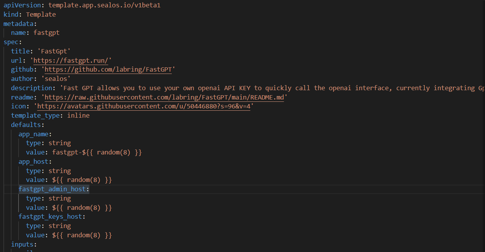
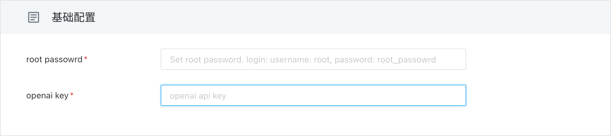
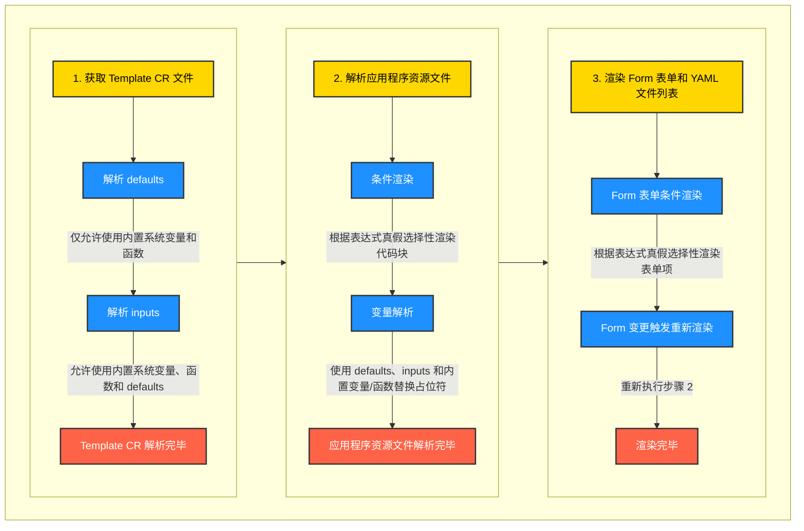

# 模板说明



以 FastGPT 为例，代码如何创建模板。本示例假设您已经对 Kubernetes 资源文件有一定的了解，并且仅解释一些模板特有的参数。模板文件主要分为两个部分。


## 第一部分: `Metadata CR`

```yaml
apiVersion: app.sealos.io/v1
kind: Template
metadata: 
  name: ${{ defaults.app_name }}
spec:
  title: 'FastGpt'                         
  url: 'https://fastgpt.run/'                         
  gitRepo: 'https://github.com/labring/FastGPT'        
  author: 'sealos'                                     
  description: 'Fast GPT allows you to use your own openai API KEY to quickly call the openai interface, currently integrating Gpt35, Gpt4 and embedding. You can build your own knowledge base.'    
  readme: 'https://raw.githubusercontent.com/labring/FastGPT/main/README.md'
  icon: 'https://avatars.githubusercontent.com/u/50446880?s=96&v=4'
  templateType: inline
  defaults:
    app_name:
      type: string
      value: fastgpt-${{ random(8) }}
    app_host:
      type: string
      value: ${{ random(8) }}
  inputs:
    root_passowrd:
      description: 'Set root password. login: username: root, password: root_passowrd'
      type: string
      default: ${{ SEALOS_NAMESPACE }}
      required: true
    openai_key:
      description: 'openai api key'
      type: string
      default: ''
      required: true
    database_type:
      description: 'type of database'
      required: false
      type: choice
      default: 'mysql'
      options:
        - sqlite
        - mysql
```

如代码所示，元数据 CR 是常规的 Kubernetes 自定义资源类型，下表列出了需要填写的字段。

| 代码            | 描述                                                         |
| :---------------| :----------------------------------------------------------- |
| `templateType` | `inline` 表示这是一个内联模板，所有 yaml 文件都集成在一个文件中。 |
| `defaults`      | 定义要填充到资源文件中的默认值，例如应用程序名称（app_name）、域名（app_host）等。 |
| `inputs`        | 定义部署应用程序时用户需要的一些参数，例如电子邮件、API-KEY 等。如果没有，则可以省略此项 |

### 解释：`变量`

任何被 `${{ }}` 包围的字符都是变量，变量分为以下几种类型：

1. `SEALOS_` 全大写字母的预定义系统内置变量，例如 `${{ SEALOS_NAMESPACE }}`，是 Sealos 本身提供的变量。有关所有当前支持的系统变量，请参阅[系统变量](#内置系统变量和函数)。
2. `functions()` 函数，例如 `${{ random(8) }}`，是 Sealos 本身提供的函数。有关所有当前支持的函数，请参阅[函数](#内置系统变量和函数)。
3. `defaults` 是填充随机值时解析的名称和值列表。
4. `inputs` 是在部署应用程序时由用户填写的，输入将呈现为前端表单。

### 解释：`Defaults`

`spec.defaults` 是在解析模板时填充为默认值的名称、类型和值的映射。

| 名称    | 描述 |
| :-------| :---------- |
| `type`  | `string` 或 `number` 表示变量的类型，唯一的区别是在渲染时字符串类型将被引用，而数字类型不会。 |
| `value` | 变量的值，如果值是函数，则将被渲染。 |

**在目前的版本实现中, `defaults` 必须要有一个 `app_name` 的字段,且其中需要包含 `${{ random(8) }}` 的随机数来作为应用的唯一名字,否则会报错.**

### 解释：`Inputs`

`spec.defaults` 是一个定义的对象映射，被解析并显示为用户反应的表单输入。

| 名称    | 描述 |
| :-------| :---------- |
| `description` | 输入的描述。将呈现为输入占位符。 |
| `default`     | 输入的默认值。 |
| `required`    | 输入是否必需。 |
| `type`        | 必须是 `string` \| `number` \| `choice` \| `boolean` 中的一个 |
| `options`?    | 当类型为 `choice` 时，设置可用选项列表。 |
| `if`?         | JavaScript 表达式，控制是否启用此选项。 |

如上所示的输入将在前端呈现为表单输入：

<table>
<tr>
<td> 模板 </td> <td> 视图 </td>
</tr>
<tr>
<td width="50%"> 

```yaml
inputs:
  root_passowrd:
    description: 'Set root password. login: username: root, password: root_passowrd'
    type: string
    default: ''
    required: true
  openai_key:
    description: 'openai api key'
    type: string
    default: ''
    required: true
```

</td> 
<td> 

 

</td>
</tr>
</table>

#### `Inputs` 中 `if` 参数的用法

- 表单支持动态渲染，通过 `if` 参数控制表单项是否开启。
- 参数的内容是表达式，不要使用 `${{ }}` 包裹。
- 表达式的结果为 `true` 时，渲染该参数；结果为 `false` 时，不渲染该参数，且对应的 `required` 参数也不会生效。
- 如果结果不是布尔值时，会被强制转换为布尔值。

### 内置系统变量和函数

Sealos 模板引擎使用 `${{ expression }}` 的语法来解析表达式。

- `expression` 是一个有效的 JavaScript 表达式。
- 表达式中可以访问 Sealos 内置变量和函数。

Sealos 提供了一些内置的系统变量和函数，方便用户在模板中使用。

#### 内置系统变量

- `${{ SEALOS_NAMESPACE }}` Sealos 用户部署的命名空间。
- `${{ SEALOS_CLOUD_DOMAIN }}` Sealos 集群的域名后缀。
- `${{ SEALOS_CERT_SECRET_NAME }}` Sealos 用于存储 TLS 证书的 secret 名称。
- `${{ SEALOS_SERVICE_ACCOUNT }}` Sealos 用户的 SA。

#### 内置系统函数

- `${{ random(length) }}` 生成长度为 `length` 的随机字符串。
- `${{ base64(expression) }}` 将表达式结果编码成 base64 格式。
  - `${{ base64('hello world') }}` 会返回 `aGVsbG8gd29ybGQ=`。
  - 也可以引用变量 `${{ base64(inputs.secret) }}`。

> 注意
>
> 不能通过 `${{ inputs.enabled }}` 来判断是否启用某个选项，因为 `enabled` 是一个字符串，不是布尔值。
>
> 需要使用 `${{ inputs.enabled === 'true' }}` 来判断是否启用某个选项。

#### 条件渲染

Sealos 模板引擎支持使用 `${{ if(expression) }}`、`${{ elif(expression) }}`、`${{ else() }}` 和 `${{ endif() }}` 进行条件渲染。

- 条件渲染是一种特殊的内置系统函数
- 条件语句必须单独占一行，不能与其他内容在同一行。
- 条件表达式必须返回布尔值 (`true` 或 `false`)，否则会被强制转换为布尔值。
- 允许跨 yaml 列表渲染。
- `Template CR` 不支持条件渲染。

**示例:**

```yaml
${{ if(inputs.enableIngress === 'true') }}
apiVersion: networking.k8s.io/v1
kind: Ingress
...
${{ endif() }}
```

这段代码表示，只有当 `inputs.enableIngress` 为 `true` 时，才会渲染 Ingress 资源。

<details>

<summary>一个相对完整的例子</summary>

```yaml
apiVersion: app.sealos.io/v1
kind: Template
metadata:
  name: chatgpt-next-web
spec:
  title: 'chatgpt-next-web'
  url: 'https://github.com/Yidadaa/ChatGPT-Next-Web'
  gitRepo: 'https://github.com/Yidadaa/ChatGPT-Next-Web'
  author: 'Sealos'
  description: '一键免费部署你的跨平台私人 ChatGPT 应用'
  readme: 'https://raw.githubusercontent.com/Yidadaa/ChatGPT-Next-Web/main/README.md'
  icon: 'https://raw.githubusercontent.com/Yidadaa/ChatGPT-Next-Web/main/docs/images/icon.svg'
  templateType: inline
  categories:
    - ai
  defaults:
    app_host:
      type: string
      value: ${{ random(8) }}
    app_name:
      type: string
      value: chatgpt-next-web-${{ random(8) }}
  inputs:
    DOMAIN:
      description: "自定义域名，需要cname到: ${{ defaults.app_host + '.' + SEALOS_CLOUD_DOMAIN }}"
      type: string
      default: ''
      required: false
    OPENAI_API_KEY:
      description: '这是你在 OpenAI 账户页面申请的 API 密钥，使用英文逗号隔开多个 key，这样可以随机轮询这些 key'
      type: string
      default: ''
      required: true
    HIDE_USER_API_KEY:
      description: '如果你不想让用户自行填入 API Key，将勾选'
      type: boolean
      default: 'false'
      required: false
    AUZRE_ENABLE:
      description: '启用 Azure'
      type: boolean
      default: 'false'
      required: false
    AZURE_API_KEY:
      description: 'Azure 密钥'
      type: string
      default: ''
      required: true
      if: inputs.AUZRE_ENABLE === 'true'
    AZURE_URL:
      description: 'Azure 部署地址'
      type: string
      default: 'https://{azure-resource-url}/openai/deployments/{deploy-name}'
      required: true
      if: inputs.AUZRE_ENABLE === 'true'

---
apiVersion: apps/v1
kind: Deployment
metadata:
  name: ${{ defaults.app_name }}
  annotations:
    originImageName: yidadaa/chatgpt-next-web:v2.12.4
  labels:
    cloud.sealos.io/app-deploy-manager: ${{ defaults.app_name }}
    app: ${{ defaults.app_name }}
spec:
  replicas: 1
  revisionHistoryLimit: 1
  selector:
    matchLabels:
      app: ${{ defaults.app_name }}
  template:
    metadata:
      labels:
        app: ${{ defaults.app_name }}
    spec:
      automountServiceAccountToken: false
      containers:
        - name: ${{ defaults.app_name }}
          image: yidadaa/chatgpt-next-web:v2.12.4
          env:
            - name: OPENAI_API_KEY
              value: ${{ inputs.OPENAI_API_KEY }}
            ${{ if(inputs.HIDE_USER_API_KEY === 'true') }}
            - name: HIDE_USER_API_KEY
              value: '1'
            ${{ endif() }}
            ${{ if(inputs.AUZRE_ENABLE === 'true') }}
            - name: AZURE_URL
              value: ${{ inputs.AZURE_URL }}
            - name: AZURE_API_KEY
              value: ${{ inputs.AZURE_API_KEY }}
            ${{ endif() }}
          ports:
            - containerPort: 3000
---
apiVersion: v1
kind: Service
metadata:
  name: ${{ defaults.app_name }}
  labels:
    cloud.sealos.io/app-deploy-manager: ${{ defaults.app_name }}
spec:
  ports:
    - port: 3000
  selector:
    app: ${{ defaults.app_name }}
---
apiVersion: networking.k8s.io/v1
kind: Ingress
metadata:
  name: ${{ defaults.app_name }}
  labels:
    cloud.sealos.io/app-deploy-manager: ${{ defaults.app_name }}
    cloud.sealos.io/app-deploy-manager-domain: ${{ defaults.app_host }}
  annotations:
    kubernetes.io/ingress.class: nginx
spec:
  rules:
    - host: ${{ inputs.DOMAIN || defaults.app_host + '.' + SEALOS_CLOUD_DOMAIN }}
      http:
        paths:
          - pathType: Prefix
            path: /()(.*)
            backend:
              service:
                name: ${{ defaults.app_name }}
                port:
                  number: 3000
  tls:
    - hosts:
        - ${{ inputs.DOMAIN || defaults.app_host + '.' + SEALOS_CLOUD_DOMAIN }}
      secretName: "${{ inputs.DOMAIN ? defaults.app_name + '-cert' : SEALOS_CERT_SECRET_NAME }}"

---
${{ if(inputs.DOMAIN !== '') }}
apiVersion: cert-manager.io/v1
kind: Issuer
metadata:
  name: ${{ defaults.app_name }}
  labels:
    cloud.sealos.io/app-deploy-manager: ${{ defaults.app_name }}
spec:
  acme:
    server: https://acme-v02.api.letsencrypt.org/directory
    email: admin@sealos.io
    privateKeySecretRef:
      name: letsencrypt-prod
    solvers:
      - http01:
          ingress:
            class: nginx
            serviceType: ClusterIP

---
apiVersion: cert-manager.io/v1
kind: Certificate
metadata:
  name: ${{ defaults.app_name }}-cert
  labels:
    cloud.sealos.io/app-deploy-manager: ${{ defaults.app_name }}
spec:
  secretName: ${{ defaults.app_name }}-cert
  dnsNames:
    - ${{ inputs.DOMAIN }}
  issuerRef:
    name: ${{ defaults.app_name }}
    kind: Issuer
${{ endif() }}
```

</details>

## 第二部分：`应用程序资源文件`

此部分通常由一组资源类型组成：

- 应用程序 `Deployment`、`StatefulSet`、`Service`
- 外部访问 `Ingress`
- 底层依赖 `Database`、`Object Storage`

每个资源可以重复任意次数，没有顺序。

### 解释：`应用程序`

应用程序是一个由多个 `Deployment`、`StatefulSet`、`Service` 或/和 `Job`、`Secret`、`ConfigMap`、`Custom Resource` 组成的列表。

<details>

<summary>代码</summary>

```yaml
apiVersion: apps/v1
kind: Deployment
metadata:
  name: ${{ defaults.app_name }}
  annotations:
    originImageName: c121914yu/fast-gpt:latest
    deploy.cloud.sealos.io/minReplicas: '1'
    deploy.cloud.sealos.io/maxReplicas: '1'
  labels:
    cloud.sealos.io/app-deploy-manager: ${{ defaults.app_name }}
    app: ${{ defaults.app_name }}
spec:
  replicas: 1
  revisionHistoryLimit: 1
  selector:
    matchLabels:
      app: ${{ defaults.app_name }}
  template:
    metadata:
      labels:
        app: ${{ defaults.app_name }}
    spec:

```yaml
apiVersion: apps/v1
kind: Deployment
metadata:
  name: ${{ defaults.app_name }}
  annotations:
    originImageName: c121914yu/fast-gpt:latest
    deploy.cloud.sealos.io/minReplicas: '1'
    deploy.cloud.sealos.io/maxReplicas: '1'
  labels:
    cloud.sealos.io/app-deploy-manager: ${{ defaults.app_name }}
    app: ${{ defaults.app_name }}
spec:
  replicas: 1
  revisionHistoryLimit: 1
  selector:
    matchLabels:
      app: ${{ defaults.app_name }}
  template:
    metadata:
      labels:
        app: ${{ defaults.app_name }}
    spec:
      containers:
        - name: ${{ defaults.app_name }}
          image: c121914yu/fast-gpt:latest
          env:
            - name: MONGO_PASSWORD
              valueFrom:
                secretKeyRef:
                  name: ${{ defaults.app_name }}-mongo-conn-credential
                  key: password
            - name: PG_PASSWORD
              valueFrom:
                secretKeyRef:
                  name: ${{ defaults.app_name }}-pg-conn-credential
                  key: password    
            - name: ONEAPI_URL
              value: ${{ defaults.app_name }}-key.${{ SEALOS_NAMESPACE }}.svc.cluster.local:3000/v1
            - name: ONEAPI_KEY
              value: sk-xxxxxx
            - name: DB_MAX_LINK
              value: 5
            - name: MY_MAIL
              value: ${{ inputs.mail }}
            - name: MAILE_CODE
              value: ${{ inputs.mail_code }}
            - name: TOKEN_KEY
              value: fastgpttokenkey
            - name: ROOT_KEY
              value: rootkey
            - name: MONGODB_URI
              value: >-
                mongodb://root:$(MONGO_PASSWORD)@${{ defaults.app_name }}-mongo-mongo.${{ SEALOS_NAMESPACE }}.svc:27017
            - name: MONGODB_NAME
              value: fastgpt
            - name: PG_HOST
              value: ${{ defaults.app_name }}-pg-pg.${{ SEALOS_NAMESPACE }}.svc
            - name: PG_USER
              value: postgres
            - name: PG_PORT
              value: '5432'
            - name: PG_DB_NAME
              value: postgres
          resources:
            requests:
              cpu: 100m
              memory: 102Mi
            limits:
              cpu: 1000m
              memory: 1024Mi
          command: []
          args: []
          ports:
            - containerPort: 3000
          imagePullPolicy: IfNotPresent
          volumeMounts: []
      volumes: []

---
apiVersion: v1
kind: Service
metadata:
  name: ${{ defaults.app_name }}
  labels:
    cloud.sealos.io/app-deploy-manager: ${{ defaults.app_name }}
spec:
  ports:
    - port: 3000
  selector:
    app: ${{ defaults.app_name }}
```

</details>

经常更改的是以下字段：

| 代码                         | 描述                                                         |
| :--------------------------- | :----------------------------------------------------------- |
| `metadata.annotations`<br/>`metadata.labels` | 更改以匹配 Launchpad 的要求，例如 `originImageName`、`minReplicas`、`maxReplicas`。 |
| `spec.containers[].image` | 更改为您的 Docker 镜像。 |
| `spec.containers[].env` | 为容器配置环境变量。 |
| `spec.containers[].ports.containerPort` | 更改为与您的 Docker 镜像对应的端口。 |
| `${{ defaults.app_name }}` | 您可以使用 `${{ defaults.xxxx }}`\|`${{ inputs.xxxx }}` 变量来设置在 `Template CR` 中定义的参数。

### 解释：`外部访问`

如果应用程序需要从外部访问，则需要添加以下代码：

<details>

<summary>代码</summary>

```yaml
apiVersion: networking.k8s.io/v1
kind: Ingress
metadata:
  name: ${{ defaults.app_name }}
  labels:
    cloud.sealos.io/app-deploy-manager: ${{ defaults.app_name }}
    cloud.sealos.io/app-deploy-manager-domain: ${{ defaults.app_host }}
  annotations:
    kubernetes.io/ingress.class: nginx
    nginx.ingress.kubernetes.io/proxy-body-size: 32m
    nginx.ingress.kubernetes.io/server-snippet: |
      client_header_buffer_size 64k;
      large_client_header_buffers 4 128k;
    nginx.ingress.kubernetes.io/ssl-redirect: 'false'
    nginx.ingress.kubernetes.io/backend-protocol: HTTP
    nginx.ingress.kubernetes.io/rewrite-target: /$2
    nginx.ingress.kubernetes.io/client-body-buffer-size: 64k
    nginx.ingress.kubernetes.io/proxy-buffer-size: 64k
    nginx.ingress.kubernetes.io/configuration-snippet: |
      if ($request_uri ~* \.(js|css|gif|jpe?g|png)) {
        expires 30d;
        add_header Cache-Control "public";
      }
spec:
  rules:
    - host: ${{ defaults.app_host }}.${{ SEALOS_CLOUD_DOMAIN }}
      http:
        paths:
          - pathType: Prefix
            path: /()(.*)
            backend:
              service:
                name: ${{ defaults.app_name }}
                port:
                  number: 3000
  tls:
    - hosts:
        - ${{ defaults.app_host }}.${{ SEALOS_CLOUD_DOMAIN }}
      secretName: ${{ SEALOS_CERT_SECRET_NAME }}
```

</details>

请注意，出于安全目的，`host` 字段需要随机设置。您可以将 `${{ random(8) }}` 设置为 `defaults.app_host`，然后使用 `${{ defaults.app_host }}`。

### 解释：`底层依赖`

几乎所有应用程序都需要底层依赖，例如 `database`、`cache`、`object storage` 等。您可以添加以下代码来部署我们提供的一些底层依赖：

#### `数据库`

我们使用 [`kubeblocks`](https://kubeblocks.io/) 提供数据库资源支持。您可以直接使用以下代码来部署数据库：

<details>

<summary>MongoDB</summary>

```yaml
apiVersion: apps.kubeblocks.io/v1alpha1
kind: Cluster
metadata:
  finalizers:
    - cluster.kubeblocks.io/finalizer
  labels:
    clusterdefinition.kubeblocks.io/name: mongodb
    clusterversion.kubeblocks.io/name: mongodb-5.0
    sealos-db-provider-cr: ${{ defaults.app_name }}-mongo
  annotations: {}
  name: ${{ defaults.app_name }}-mongo
  generation: 1
spec:
  affinity:
    nodeLabels: {}
    podAntiAffinity: Preferred
    tenancy: SharedNode
    topologyKeys: []
  clusterDefinitionRef: mongodb
  clusterVersionRef: mongodb-5.0
  componentSpecs:
    - componentDefRef: mongodb
      monitor: true
      name: mongodb
      replicas: 1
      resources:
        limits:
          cpu: 1000m
          memory: 1024Mi
        requests:
          cpu: 100m
          memory: 102Mi
      serviceAccountName: ${{ defaults.app_name }}-mongo
      volumeClaimTemplates:
        - name: data
          spec:
            accessModes:
              - ReadWriteOnce
            resources:
              requests:
                storage: 3Gi
            storageClassName: openebs-backup  
  terminationPolicy: Delete
  tolerations: []


---
apiVersion: v1
kind: ServiceAccount
metadata:
  labels:
    sealos-db-provider-cr: ${{ defaults.app_name }}-mongo
    app.kubernetes.io/instance: ${{ defaults.app_name }}-mongo
    app.kubernetes.io/managed-by: kbcli
  name: ${{ defaults.app_name }}-mongo

---
apiVersion: rbac.authorization.k8s.io/v1
kind: Role
metadata:
  labels:
    sealos-db-provider-cr: ${{ defaults.app_name }}-mongo
    app.kubernetes.io/instance: ${{ defaults.app_name }}-mongo
    app.kubernetes.io/managed-by: kbcli
  name: ${{ defaults.app_name }}-mongo
rules:
  - apiGroups:
      - '*'
    resources:
      - '*'
    verbs:
      - '*'

---
apiVersion: rbac.authorization.k8s.io/v1
kind: RoleBinding
metadata:
  labels:
    sealos-db-provider-cr: ${{ defaults.app_name }}-mongo
    app.kubernetes.io/instance: ${{ defaults.app_name }}-mongo
    app.kubernetes.io/managed-by: kbcli
  name: ${{ defaults.app_name }}-mongo
roleRef:
  apiGroup: rbac.authorization.k8s.io
  kind: Role
  name: ${{ defaults.app_name }}-mongo
subjects:
  - kind: ServiceAccount
    name: ${{ defaults.app_name }}-mongo
```

</details>

<details>

<summary>PostgreSQL</summary>

```yaml
apiVersion: apps.kubeblocks.io/v1alpha1
kind: Cluster
metadata:
  finalizers:
    - cluster.kubeblocks.io/finalizer
  labels:
    clusterdefinition.kubeblocks.io/name: postgresql
    clusterversion.kubeblocks.io/name: postgresql-14.8.0
    sealos-db-provider-cr: ${{ defaults.app_name }}-pg
  annotations: {}
  name: ${{ defaults.app_name }}-pg
spec:
  affinity:
    nodeLabels: {}
    podAntiAffinity: Preferred
    tenancy: SharedNode
    topologyKeys: []
  clusterDefinitionRef: postgresql
  clusterVersionRef: postgresql-14.8.0
  componentSpecs:
    - componentDefRef: postgresql
      monitor: true
      name: postgresql
      replicas: 1
      resources:
        limits:
          cpu: 1000m
          memory: 1024Mi
        requests:
          cpu: 100m
          memory: 102Mi
      serviceAccountName: ${{ defaults.app_name }}-pg
      switchPolicy:
        type: Noop
      volumeClaimTemplates:
        - name: data
          spec:
            accessModes:
              - ReadWriteOnce
            resources:
              requests:
                storage: 5Gi
            storageClassName: openebs-backup
  terminationPolicy: Delete
  tolerations: []

---
apiVersion: v1
kind: ServiceAccount
metadata:
  labels:
    sealos-db-provider-cr: ${{ defaults.app_name }}-pg
    app.kubernetes.io/instance: ${{ defaults.app_name }}-pg
    app.kubernetes.io/managed-by: kbcli
  name: ${{ defaults.app_name }}-pg

---
apiVersion: rbac.authorization.k8s.io/v1
kind: Role
metadata:
  labels:
    sealos-db-provider-cr: ${{ defaults.app_name }}-pg
    app.kubernetes.io/instance: ${{ defaults.app_name }}-pg
    app.kubernetes.io/managed-by: kbcli
  name: ${{ defaults.app_name }}-pg
rules:
  - apiGroups:
      - '*'
    resources:
      - '*'
    verbs:
      - '*'
---
apiVersion: rbac.authorization.k8s.io/v1
kind: RoleBinding
metadata:
  labels:
    sealos-db-provider-cr: ${{ defaults.app_name }}-pg
    app.kubernetes.io/instance: ${{ defaults.app_name }}-pg
    app.kubernetes.io/managed-by: kbcli
  name: ${{ defaults.app_name }}-pg
roleRef:
  apiGroup: rbac.authorization.k8s.io
  kind: Role
  name: ${{ defaults.app_name }}-pg
subjects:
  - kind: ServiceAccount
    name: ${{ defaults.app_name }}-pg
```

</details>

<details>

<summary>MySQL</summary>

```yaml
apiVersion: apps.kubeblocks.io/v1alpha1
kind: Cluster
metadata:
  finalizers:
    - cluster.kubeblocks.io/finalizer
  labels:
    clusterdefinition.kubeblocks.io/name: apecloud-mysql
    clusterversion.kubeblocks.io/name: ac-mysql-8.0.30
    sealos-db-provider-cr: ${{ defaults.app_name }}-mysql
  annotations: {}
  name: ${{ defaults.app_name }}-mysql
spec:
  affinity:
    nodeLabels: {}
    podAntiAffinity: Preferred
    tenancy: SharedNode
    topologyKeys: []
  clusterDefinitionRef: apecloud-mysql
  clusterVersionRef: ac-mysql-8.0.30
  componentSpecs:
    - componentDefRef: mysql
      monitor: true
      name: mysql
      replicas: 1
      resources:
        limits:
          cpu: 1000m
          memory: 1024Mi
        requests:
          cpu: 100m
          memory: 102Mi
      serviceAccountName: ${{ defaults.app_name }}-mysql
      volumeClaimTemplates:
        - name: data
          spec:
            accessModes:
              - ReadWriteOnce
            resources:
              requests:
                storage: 3Gi
            storageClassName: openebs-backup
  terminationPolicy: Delete
  tolerations: []
  ---
  apiVersion: v1
kind: ServiceAccount
metadata:
  labels:
    sealos-db-provider-cr: ${{ defaults.app_name }}-mysql
    app.kubernetes.io/instance: ${{ defaults.app_name }}-mysql
    app.kubernetes.io/managed-by: kbcli
  name: ${{ defaults.app_name }}-mysql

---
apiVersion: rbac.authorization.k8s.io/v1
kind: Role
metadata:
  labels:
    sealos-db-provider-cr: ${{ defaults.app_name }}-mysql
    app.kubernetes.io/instance: ${{ defaults.app_name }}-mysql
    app.kubernetes.io/managed-by: kbcli
  name: ${{ defaults.app_name }}-mysql
rules:
  - apiGroups:
      - '*'
    resources:
      - '*'
    verbs:
      - '*'

---
apiVersion: rbac.authorization.k8s.io/v1
kind: RoleBinding
metadata:
  labels:
    sealos-db-provider-cr: ${{ defaults.app_name }}-mysql
    app.kubernetes.io/instance: ${{ defaults.app_name }}-mysql
    app.kubernetes.io/managed-by: kbcli
  name: ${{ defaults.app_name }}-mysql
roleRef:
  apiGroup: rbac.authorization.k8s.io
  kind: Role
  name: ${{ defaults.app_name }}-mysql
subjects:
  - kind: ServiceAccount
    name: ${{ defaults.app_name }}-mysql

```

</details>

<details>

<summary>Redis</summary>

```yaml
apiVersion: apps.kubeblocks.io/v1alpha1
kind: Cluster
metadata:
  finalizers:
    - cluster.kubeblocks.io/finalizer
  labels:
    clusterdefinition.kubeblocks.io/name: redis
    clusterversion.kubeblocks.io/name: redis-7.0.6
    sealos-db-provider-cr: ${{ defaults.app_name }}-redis
  annotations: {}
  name: ${{ defaults.app_name }}-redis
spec:
  affinity:
    nodeLabels: {}
    podAntiAffinity: Preferred
    tenancy: SharedNode
    topologyKeys: []
  clusterDefinitionRef: redis
  clusterVersionRef: redis-7.0.6
  componentSpecs:
    - componentDefRef: redis
      monitor: true
      name: redis
      replicas: 1
      resources:
        limits:
          cpu: 1000m
          memory: 1024Mi
        requests:
          cpu: 100m
          memory: 102Mi
      serviceAccountName: ${{ defaults.app_name }}-redis
      switchPolicy:
        type: Noop
      volumeClaimTemplates:
        - name: data
          spec:
            accessModes:
              - ReadWriteOnce
            resources:
              requests:
                storage: 3Gi
            storageClassName: openebs-backup
    - componentDefRef: redis-sentinel
      monitor: true
      name: redis-sentinel
      replicas: 1
      resources:
        limits:
          cpu: 100m
          memory: 100Mi
        requests:
          cpu: 100m
          memory: 100Mi
      serviceAccountName: ${{ defaults.app_name }}-redis
  terminationPolicy: Delete
  tolerations: []
---
apiVersion: v1
kind: ServiceAccount
metadata:
  labels:
    sealos-db-provider-cr: ${{ defaults.app_name }}-redis
    app.kubernetes.io/instance: ${{ defaults.app_name }}-redis
    app.kubernetes.io/managed-by: kbcli
  name: ${{ defaults.app_name }}-redis

---
apiVersion: rbac.authorization.k8s.io/v1
kind: Role
metadata:
  labels:
    sealos-db-provider-cr: ${{ defaults.app_name }}-redis
    app.kubernetes.io/instance: ${{ defaults.app_name }}-redis
    app.kubernetes.io/managed-by: kbcli
  name: ${{ defaults.app_name }}-redis
rules:
  - apiGroups:
      - '*'
    resources:
      - '*'
    verbs:
      - '*'

---
apiVersion: rbac.authorization.k8s.io/v1
kind: RoleBinding
metadata:
  labels:
    sealos-db-provider-cr: ${{ defaults.app_name }}-redis
    app.kubernetes.io/instance: ${{ defaults.app_name }}-redis
    app.kubernetes.io/managed-by: kbcli
  name: ${{ defaults.app_name }}-redis
roleRef:
  apiGroup: rbac.authorization.k8s.io
  kind: Role
  name: ${{ defaults.app_name }}-redis
subjects:
  - kind: ServiceAccount
    name: ${{ defaults.app_name }}-redis
```

</details>

<details>

<summary>Weaviate</summary>

```yaml
apiVersion: apps.kubeblocks.io/v1alpha1
kind: Cluster
metadata:
  finalizers:
    - cluster.kubeblocks.io/finalizer
  labels:
    clusterdefinition.kubeblocks.io/name: weaviate
    clusterversion.kubeblocks.io/name: weaviate-1.18.0
  name: ${{ defaults.app_name }}-weaviate
spec:
  affinity:
    podAntiAffinity: Preferred
    tenancy: SharedNode
  clusterDefinitionRef: weaviate
  clusterVersionRef: weaviate-1.18.0
  componentSpecs:
    - componentDefRef: weaviate
      monitor: false
      name: weaviate
      noCreatePDB: false
      replicas: 1
      resources:
        limits:
          cpu: "1"
          memory: 1Gi
        requests:
          cpu: "1"
          memory: 1Gi
      rsmTransformPolicy: ToSts
      serviceAccountName: ${{ defaults.app_name }}-weaviate
      volumeClaimTemplates:
        - name: data
          spec:
            accessModes:
              - ReadWriteOnce
            resources:
              requests:
                storage: 10Gi
  monitor: {}
  resources:
    cpu: "0"
    memory: "0"
  storage:
    size: "0"
  terminationPolicy: Delete
---
apiVersion: v1
kind: ServiceAccount
metadata:
  labels:
    sealos-db-provider-cr: ${{ defaults.app_name }}-weaviate
    app.kubernetes.io/instance: ${{ defaults.app_name }}-weaviate
    app.kubernetes.io/managed-by: kbcli
  name: ${{ defaults.app_name }}-weaviate

---
apiVersion: rbac.authorization.k8s.io/v1
kind: Role
metadata:
  labels:
    sealos-db-provider-cr: ${{ defaults.app_name }}-weaviate
    app.kubernetes.io/instance: ${{ defaults.app_name }}-weaviate
    app.kubernetes.io/managed-by: kbcli
  name: ${{ defaults.app_name }}-weaviate
rules:
  - apiGroups:
      - '*'
    resources:
      - '*'
    verbs:
      - '*'
---
apiVersion: rbac.authorization.k8s.io/v1
kind: RoleBinding
metadata:
  labels:
    sealos-db-provider-cr: ${{ defaults.app_name }}-weaviate
    app.kubernetes.io/instance: ${{ defaults.app_name }}-weaviate
    app.kubernetes.io/managed-by: kbcli
  name: ${{ defaults.app_name }}-weaviate
roleRef:
  apiGroup: rbac.authorization.k8s.io
  kind: Role
  name: ${{ defaults.app_name }}-weaviate
subjects:
  - kind: ServiceAccount
    name: ${{ defaults.app_name }}-weaviate
```

</details>

当部署数据库时，您只需要关注数据库使用的资源：

| 代码        | 描述            |
| ----------- | --------------- |
| `replicas`  | 实例数量        |
| `resources` | 分配 CPU 和内存 |
| `storage`   | 卷大小          |

#### 如何访问应用程序的数据库

数据库的用户名/密码设置为一个 secret，以供将来使用。可以通过以下代码将其添加到环境变量中。添加后，您可以通过 $(MONGO_PASSWORD) 在容器中读取 MONGODB 密码。

```yaml
...
spec:
  containers:
    - name: ${{ defaults.app_name }}
      ...
      env:
        - name: MONGO_PASSWORD
          valueFrom:
            secretKeyRef:
              name: ${{ defaults.app_name }}-mongo-conn-credential
              key: password
...
```

#### `对象存储`

我们使用对象存储提供存储桶资源支持。您可以直接使用以下代码来部署存储桶：

```yaml
apiVersion: objectstorage.sealos.io/v1
kind: ObjectStorageBucket
metadata:
  name: ${{ defaults.app_name }}
spec:
  policy: private
```

其中 policy 有三种类型，分别为 private（私有存储桶，不开放）、publicRead（共享存储桶，开放公共读功能）和 publicReadwrite（共享存储桶，开放公共读写功能）。

#### 如何访问应用程序的存储桶

存储桶的访问密钥和访问地址存放在一个 secret 中。可以通过以下代码将其添加到环境变量中。

```yaml
...
spec:
  containers:
    - name: ${{ defaults.app_name }}
      ...
      env:
        - name: ACCESS_KEY
          valueFrom:
            secretKeyRef:
              name: object-storage-key-${{ SEALOS_SERVICE_ACCOUNT }}-${{ defaults.app_name }}
              key: accessKey
        - name: SECRET_KEY
          valueFrom:
            secretKeyRef:
              name: object-storage-key-${{ SEALOS_SERVICE_ACCOUNT }}-${{ defaults.app_name }}
              key: secretKey
        - name: EXTERNAL_ENDPOINT
          valueFrom:
            secretKeyRef:
              name: object-storage-key-${{ SEALOS_SERVICE_ACCOUNT }}-${{ defaults.app_name }}
              key: external
        - name: INTERNAL_ENDPOINT
          valueFrom:
            secretKeyRef:
              name: object-storage-key-${{ SEALOS_SERVICE_ACCOUNT }}-${{ defaults.app_name }}
              key: internal
        - name: BUCKET_NAME
          valueFrom:
            secretKeyRef:
              name: object-storage-key-${{ SEALOS_SERVICE_ACCOUNT }}-${{ defaults.app_name }}
              key: bucket
...
```

### 说明: 系统底层处理逻辑

#### 模板的实例

为了方便用户管理和变更通过模板部署的应用,系统会在实际部署的时候部署一个`app.sealos.io/v1, Kind=Instance`的 CRD作为应用的实例.

CRD本身会完全按照 `app.sealos.io/v1, Kind=Template` 的模板格式与字段进行迁移,其中处理逻辑为:

1. 把 template 当中的所有变量/函数全部替换为一个确定的值
2. 将 kind 从`Template` 改为 `Instance`
3. Apply 这个模板的实例到用户的 ns

#### 资源的标签

对于所有的通过模板市场部署的资源,包括系统资源比如 `deploy`, `service` 以及自定义资源比如 `app`, `kb数据库` 等,都会全部统一增加一个标签: `cloud.sealos.io/deploy-on-sealos: $app_name`.

其中 `app_name` 为用户部署的应用的名称, 默认是以一个随机数作为结尾,比如 `fastgpt-zu1n048s`.

## 第三部分：`渲染过程详解`

Sealos 模板引擎在渲染过程中遵循特定的顺序，确保变量和条件语句能够被正确解析。

<details>

<summary>以下流程图详细展示了整个渲染过程</summary>



</details>

- 解析 Template CR
  - 首先，系统读取 `Template CR` 文件
  - 然后，解析 `spec.defaults` 字段，该字段定义了模板的默认值。
    - 在 `defaults` 字段中，只允许使用预定义的[内置系统变量](#内置系统变量)和[内置系统函数](#内置系统函数)。
  - 接着，解析 `spec.inputs` 字段，该字段定义了用户需要填写的参数。
    - 在 `inputs` 字段中，除了可以使用内置系统变量和函数外，还可以引用 `defaults` 中定义的变量。
- 解析应用程序资源文件
  - 此阶段表达式中能引用 `内置系统变量` `内置系统函数` 以及 `defaults` `inputs`
  - 首先，进行[条件渲染](#条件渲染)，根据条件表达式的真假，选择性地渲染代码块。
  - 然后，进行[变量解析](#内置系统变量)，使用 `defaults`、`inputs` 和内置变量/函数替换资源文件中的占位符。
- 渲染 Form 表单和 YAML 文件列表
  - 最后，系统根据解析后的 `inputs` 字段渲染 Form 表单，用户可以在表单中填写自定义参数。
    - 此阶段表达式中能引用 `内置系统变量` `内置系统函数` 以及 `defaults` `inputs`
  - 当 `Form` 变更时会触发重新渲染 `YAML` 文件列表。

> 注意：
>
> 当用户在输入框中输入信息时，不会重新解析 `Template CR` 内容，
> 也就原本的表达式不会重新运算，如 `value: ${{ random(8) }}`。
