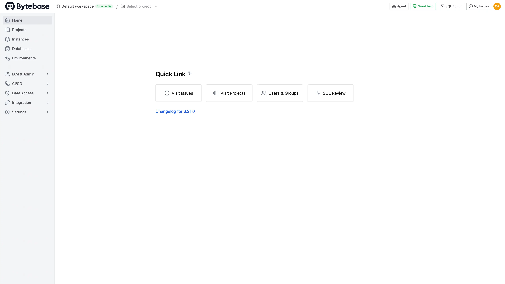

# 在 Sealos 上部署和托管 Bytebase

[Bytebase](https://www.bytebase.com/) 是一个面向开发者、数据库管理员和平台团队的数据库 DevOps 与 GitOps 平台。本模板会部署 Bytebase 3.21.0、持久化元数据存储，并可按需创建独立的 Sealos 托管 PostgreSQL 集群。

## 关于托管 Bytebase

Bytebase 将数据库资产、数据库结构变更、SQL 审核、访问控制、审计日志和 CI/CD 工作流集中在一个 Web 控制台中。团队可以连接现有数据库实例，按项目和环境组织数据库，并通过可审查的工单和发布计划执行变更。

Bytebase 3.21.0 包含用于自身元数据的内置 PostgreSQL 数据存储。默认模板会将该数据存储保存在持久卷中。部署选项可以创建独立的 PostgreSQL 16.4 集群并配置 Bytebase 使用它，让元数据库拥有独立的生命周期和 Sealos 数据库资源卡片。

## 常见使用场景

- **数据库变更管理**：通过可追踪工单审查、批准和执行数据库结构或数据变更。
- **数据库资产管理**：登记数据库实例，并按项目和环境组织数据库。
- **SQL 治理**：应用 SQL 审核规则，保留可审计的变更记录。
- **数据访问工作流**：管理访问申请、授权和数据脱敏豁免。
- **GitOps 交付**：将代码仓库和 CI/CD 流程连接到数据库发布过程。

## 托管 Bytebase 所需的依赖

本模板包含 Bytebase 3.21.0、1Gi 持久化应用卷、HTTPS 网络和健康检查。可选的托管存储模式还包含 PostgreSQL 16.4、1Gi 数据库卷，以及在 Bytebase 启动前等待数据库就绪的初始化流程。

### 部署依赖

- [Bytebase 文档](https://docs.bytebase.com/) - 产品与管理文档
- [Bytebase 入门指南](https://docs.bytebase.com/get-started/self-host/) - 自托管部署概念
- [Bytebase GitHub 仓库](https://github.com/bytebase/bytebase) - 源代码与问题跟踪

### 实现细节

**架构组件：**

- **Bytebase**：单个 StatefulSet，运行 `bytebase/bytebase:3.21.0` 并监听 8080 端口。
- **持久化应用卷**：在 `/var/opt/bytebase` 下保存 Bytebase 运行数据。
- **内置 PostgreSQL**：默认的元数据存储，数据持久化在应用卷中。
- **托管 PostgreSQL**：通过 `enable_managed_postgres` 选择的可选 PostgreSQL 16.4 集群。
- **公网访问**：Sealos 托管的 HTTPS 端点用于打开 Bytebase Web 控制台。

**存储选择：**

| `enable_managed_postgres` | 元数据存储 | 推荐用途 |
| --- | --- | --- |
| `false` | Bytebase 应用卷中的内置 PostgreSQL | 评估和紧凑型部署 |
| `true` | 独立的 Sealos 托管 PostgreSQL 集群 | 独立数据库运维与备份 |

**默认资源上限：**

| 组件 | CPU | 内存 | 存储 |
| --- | ---: | ---: | ---: |
| Bytebase | 100m | 512Mi | 1Gi |
| PostgreSQL 就绪等待容器 | 100m | 128Mi | - |
| 可选托管 PostgreSQL | 500m | 512Mi | 1Gi |

本模板保留单副本 Bytebase 拓扑，并使用 StatefulSet 提供稳定的存储身份。

**许可证信息：**

Bytebase 社区源代码使用 MIT 许可证，企业专属代码和功能控制使用 Bytebase 企业许可证。

## 为什么在 Sealos 上部署 Bytebase？

Sealos 提供基于 Kubernetes 的应用平台，负责完整的部署生命周期。在 Sealos 上部署 Bytebase 可以获得：

- **一键部署**：通过一个表单创建 Bytebase、存储、网络和所选的元数据库架构。
- **持久化元数据**：工作空间配置、用户、项目和审计数据可跨重启持续保留。
- **可选托管数据库**：通过一个部署开关添加独立 PostgreSQL 集群。
- **即时 HTTPS 访问**：获得 Bytebase 控制台的安全公网地址。
- **集成运维**：在 Canvas 中检查工作负载、日志、存储、网络和 PostgreSQL。

在 Sealos 上部署 Bytebase，将数据库交付工作流与其治理的基础设施放在一起管理。

## 部署指南

1. 打开 [Bytebase 模板](https://sealos.io/products/app-store/bytebase)，点击 **Deploy Now**。
2. 选择元数据存储模式：
   - 保持 **Managed PostgreSQL** 关闭，使用 Bytebase 内置 PostgreSQL 数据存储。
   - 开启 **Managed PostgreSQL**，创建独立的 Sealos PostgreSQL 集群。
3. 开始部署并等待完成，通常需要 2-3 分钟。托管 PostgreSQL 选项会增加一小段数据库启动等待时间。资源创建完成后，Sealos 会打开 Canvas。
4. 从应用卡片打开 Bytebase 应用地址。

## 首次注册与登录

全新部署会打开管理员注册页面：

1. 输入管理员邮箱地址。
2. 输入并确认符合页面策略的密码。
3. 输入管理员显示名称。
4. 接受 Bytebase 服务条款和隐私政策，然后点击 **Sign up as admin**。
5. 完成或跳过引导问卷。打开 **Projects** 和 **Instances**，确认已登录访问正常。

首次成功注册会创建工作空间管理员。后续访问使用该邮箱地址和密码在登录页登录。请将凭据保存在密码管理器中。

## 配置

登录后，可以使用 Bytebase 连接数据库实例、创建项目、定义环境、配置 SQL 审核策略、邀请成员并设置 GitOps 集成。Sealos 还提供：

- **AI 对话框**：描述基础设施变更，由 Sealos 应用配置。
- **资源卡片**：在 Canvas 中调整 CPU、内存和存储。
- **数据库卡片**：管理可选 PostgreSQL 集群、连接信息和备份。

## 扩展

已验证拓扑使用一个 Bytebase 副本。请根据已连接数据库数量、并发用户数和审计数据量扩展 CPU、内存与存储。托管 PostgreSQL 选项为生产元数据备份和数据库生命周期管理提供更清晰的运维边界。

## 故障排查

### Bytebase 一直停留在启动页面

打开 Canvas，确认 Bytebase StatefulSet 已就绪。启用托管 PostgreSQL 时，请确认 PostgreSQL 集群正在运行，并且 `wait-for-postgres` 初始化容器已经完成。

### 管理员注册页面不再出现

首次注册会创建工作空间管理员。请打开登录页，使用初始设置时创建的管理员邮箱和密码登录。

### 获取帮助

- [Bytebase 文档](https://docs.bytebase.com/)
- [Bytebase GitHub Issues](https://github.com/bytebase/bytebase/issues)
- [Sealos Discord](https://discord.gg/wdUn538zVP)

## 更多资源

- [Bytebase 核心概念](https://docs.bytebase.com/get-started/concepts/)
- [数据库变更工作流](https://docs.bytebase.com/change-database/overview/)
- [Sealos 文档](https://sealos.io/docs/)

## 许可证

本模板遵循 Sealos templates 仓库的许可证。上游许可条款请参阅 [Bytebase 许可证](https://github.com/bytebase/bytebase/blob/main/LICENSE) 和[企业许可证](https://github.com/bytebase/bytebase/blob/main/LICENSE.enterprise)。
