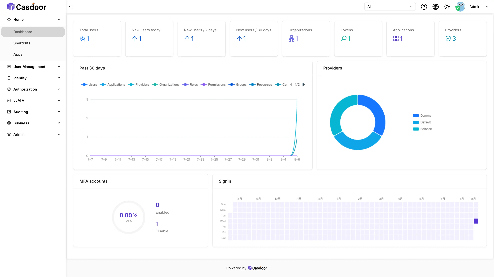

# 在 Sealos 上部署和托管 Casdoor

[Casdoor](https://casdoor.org/) 是一个开源身份与访问管理平台，支持 OAuth 2.0、OpenID Connect、SAML、CAS、LDAP、MFA 和用户管理。此模板会在 Sealos Cloud 上部署 Casdoor 3.141.0，并提供 SQLite、MySQL 和 PostgreSQL 三种数据存储选项。

## 关于 Casdoor 托管

Casdoor 提供 Web 管理控制台和标准身份协议端点。团队可以在一个服务中管理用户、组织、应用、身份提供商、角色、权限、会话和审计数据。

默认部署将 Casdoor 数据保存在持久卷上的 SQLite 中。MySQL 和 PostgreSQL 选项会创建独立的 Sealos 托管数据库、初始化 `casdoor` 数据库，并让 Casdoor 工作负载等待数据库就绪后再启动。

## 常见使用场景

- **单点登录**：为内部应用和面向客户的应用接入 OIDC、OAuth 2.0、SAML 或 CAS 登录。
- **集中用户管理**：管理用户、组织、邀请、验证流程和个人资料属性。
- **外部身份提供商**：连接社交、企业、邮件、短信和自定义认证提供商。
- **授权管理**：为应用和 API 定义角色与权限。
- **自托管身份控制平面**：在自己的 Sealos 工作空间中运行身份数据和配置。

## Casdoor 托管依赖

模板包含 Casdoor 3.141.0、HTTPS 网络、SQLite 部署所需的持久卷，以及可选的 MySQL 8.0.30 或 PostgreSQL 16.4 数据库资源。

### 部署依赖

- [Casdoor 文档](https://casdoor.org/docs/overview) - 产品与集成文档
- [Casdoor 服务端安装指南](https://casdoor.org/docs/basic/server-installation) - 自托管部署指南
- [Casdoor GitHub 仓库](https://github.com/casdoor/casdoor) - 源代码与问题跟踪

### 实现细节

**架构组件：**

- **Casdoor**：运行 `casbin/casdoor:3.141.0`，服务端口为 8000。
- **SQLite 模式**：使用 StatefulSet，并将 1Gi 持久卷挂载到 `/home`。
- **MySQL 模式**：创建 MySQL 8.0.30、初始化 `casdoor` 数据库，并部署无状态 Casdoor 工作负载。
- **PostgreSQL 模式**：创建 PostgreSQL 16.4、初始化 `casdoor` 数据库，并部署无状态 Casdoor 工作负载。
- **启动门控**：数据库任务和工作负载初始化器确保所选托管数据库可用后再启动 Casdoor。
- **管理员引导**：一次性 Job 从 Kubernetes Secret 读取必填密码并替换上游引导密码，随后公网 Service 才会选择 Casdoor Pod。
- **公网访问**：Sealos 管理的 HTTPS 端点同时提供 Casdoor 控制台和身份 API。

**数据库选择：**

| `driver_name` | 数据存储 | 推荐用途 |
| --- | --- | --- |
| `sqlite` | Casdoor 持久卷上的 SQLite | 评估和紧凑部署 |
| `mysql` | 独立的 Sealos 托管 MySQL 集群 | 独立数据库运维与备份 |
| `postgres` | 独立的 Sealos 托管 PostgreSQL 集群 | 独立数据库运维与备份 |

**默认资源限制：**

| 组件 | CPU | 内存 | 存储 |
| --- | ---: | ---: | ---: |
| Casdoor | 100m | 128Mi | SQLite 模式为 1Gi |
| 数据库初始化任务 | 100m | 128Mi | - |
| MySQL 或 PostgreSQL 就绪初始化器 | 100m | 128Mi | - |
| 管理员引导 Job | 100m | 128Mi | - |
| 可选 MySQL 或 PostgreSQL | 500m | 512Mi | 1Gi |

实测拓扑使用一个 Casdoor 副本。SQLite 模式保留稳定的工作负载身份和本地持久存储；托管数据库模式将应用计算与数据库持久化拆分为独立资源。

**许可证信息：**

Casdoor 使用 Apache License 2.0。

## 为什么在 Sealos 上部署 Casdoor？

Sealos 管理 Casdoor 所需的 Kubernetes 资源、数据库生命周期、网络和 TLS：

- **一键部署**：通过一个表单创建 Casdoor 和所选存储架构。
- **数据库选择**：使用持久化 SQLite，或创建托管 MySQL、PostgreSQL 集群。
- **即时 HTTPS 访问**：获得控制台和身份端点的安全公网 URL。
- **集成运维**：在 Canvas 中检查工作负载、日志、存储、网络和数据库状态。
- **身份数据持久化**：在应用重启后保留用户、组织、应用和提供商设置。

在 Sealos 上部署 Casdoor，让身份管理服务与使用它的应用运行在同一云平台。

## 部署指南

1. 打开 [Casdoor 模板](https://sealos.io/products/app-store/casdoor)，点击 **立即部署**。
2. 输入至少 8 个字符且不含空格的唯一管理员密码，并将其保存到密码管理器。
3. 选择数据库驱动：
   - 选择 **sqlite**，使用带持久卷的紧凑部署。
   - 选择 **mysql**，创建独立的 Sealos 托管 MySQL 集群。
   - 选择 **postgres**，创建独立的 Sealos 托管 PostgreSQL 集群。
4. 开始部署。SQLite 通常在一分钟内就绪；托管数据库首次初始化通常需要 2–3 分钟。
5. 从应用卡片打开 Casdoor 访问地址。

## 首次登录

全新 Casdoor 部署会使用部署表单中的密码创建内置管理员：

- **账号**：`built-in/admin`
- **密码**：必填的 `admin_password` 值

登录页已经显示 **Built-in Organization** 时，在用户名输入框填写 `admin`。引导 Job 会验证配置的凭据，并在公网端点接收流量前将工作负载标记为就绪。

打开 **Dashboard** 和 **Apps** 确认登录状态。随后可以配置身份流程所需的应用、回调地址、身份提供商、组织、角色和权限。

## 配置

通过 Casdoor 控制台创建应用、复制 OAuth/OIDC 客户端凭据、登记回调地址、配置身份提供商、邀请用户并定义授权规则。Sealos 还提供：

- **AI 对话**：描述基础设施变更，由 Sealos 执行操作。
- **资源卡片**：在 Canvas 中调整 Casdoor 的 CPU 和内存。
- **数据库卡片**：管理 MySQL 或 PostgreSQL 部署的连接信息、存储和备份。

## 扩展

实测默认资源适用于评估和轻量负载。随着流量增长，请在 Sealos 中监控 CPU、内存、请求延迟和数据库使用量；在持续登录流量到来前提高 Casdoor 资源，在容量接近上限前扩展数据库存储，并根据恢复目标规划数据库可用性。

SQLite 模式使用一个 Casdoor 副本，数据库文件位于其挂载卷中。MySQL 和 PostgreSQL 模式将数据库持久化与 Casdoor 工作负载分离，为生产运维提供更清晰的资源边界。

## 故障排查

### Casdoor 仍在启动

打开 Canvas 检查 Casdoor 工作负载和 `admin-bootstrap` Job。选择 MySQL 或 PostgreSQL 时，确认数据库集群和初始化任务已经就绪。管理员密码完成配置与验证后，公网 Service 才会获得端点。

### 引导管理员无法登录

确认组织为 **built-in**，用户名为 `admin`，密码与部署输入 `admin_password` 一致。集成要求包含组织的完整身份时，使用 `built-in/admin`。工作负载持续处于 pending 时检查引导 Job 日志；过短密码、包含空格的密码以及上游默认值都会被拒绝。

### OAuth 或 OIDC 回调失败

打开 **Apps**，选择对应应用，确认每个回调 URI 的协议、域名、端口和路径与调用应用完全一致。

### 获取帮助

- [Casdoor 文档](https://casdoor.org/docs/overview)
- [Casdoor GitHub Issues](https://github.com/casdoor/casdoor/issues)
- [Sealos Discord](https://discord.gg/wdUn538zVP)

## 更多资源

- [Casdoor 应用配置](https://casdoor.org/docs/application/config)
- [Casdoor OIDC 集成](https://casdoor.org/docs/how-to-connect/oidc-client)
- [Sealos 文档](https://sealos.io/docs/)

## 许可证

此模板遵循 Sealos templates 仓库的许可证。Casdoor 使用 [Apache License 2.0](https://github.com/casdoor/casdoor/blob/master/LICENSE)。
