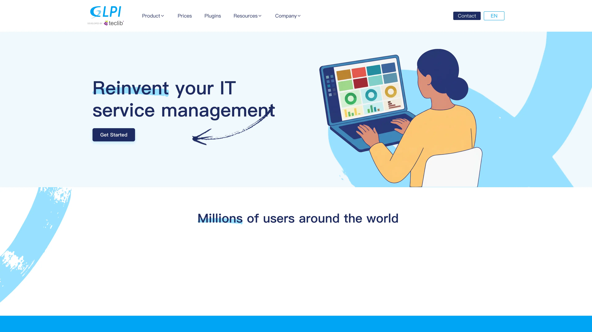

# 在 Sealos 上部署和托管 GLPI

GLPI 是一款开源 IT 资产管理与服务台平台。本模板会在 Sealos Cloud 上部署 GLPI 11.0.8，并配套独立的 KubeBlocks MySQL 数据库、持久化存储和公网 HTTPS 入口。

## 关于 GLPI 托管

GLPI 将软硬件资产盘点、许可证跟踪、服务台流程、知识管理和运营报表整合在一个 Web 应用中。团队可以用它统一管理 IT 资产与技术支持工作。

模板沿用官方的双服务容器拓扑：一套 GLPI 应用连接一套独立 MySQL 数据库。Sealos 会自动准备两块持久卷、数据库凭据、服务发现、TLS 证书和公网域名。MySQL 就绪后，官方镜像会自动安装或升级 GLPI 数据库结构。

## 常见使用场景

- **IT 资产管理**：跟踪电脑、显示器、网络设备、软件、许可证及其归属关系。
- **服务台**：管理事件、请求、问题、变更、服务级别目标和技术员队列。
- **资产盘点与合规**：维护可审计的资产清单，掌握软件许可证使用情况。
- **知识管理**：为员工和支持团队发布内部流程与可复用解决方案。
- **运营报表**：通过仪表盘和报表分析资产状态、工单流转和支持效率。

## GLPI 托管依赖

模板包含 GLPI 11.0.8 应用、由 KubeBlocks 管理的 MySQL 8 集群、挂载到 `/var/glpi` 的 1 GiB 应用卷、1 GiB 数据库卷和 HTTPS Ingress。

### 部署依赖

- [GLPI 文档](https://help.glpi-project.org/) - 产品与管理文档
- [GLPI 安装文档](https://glpi-install.readthedocs.io/en/latest/) - 系统要求与安装流程
- [GLPI 官方容器镜像](https://github.com/glpi-project/docker-images) - 容器配置与环境变量
- [GLPI 社区](https://forum.glpi-project.org/) - 社区支持论坛

### 实现细节

**架构组件：**

- **GLPI 应用**：单副本 `glpi/glpi:11.0.8` StatefulSet 提供 Web 界面，并运行官方镜像内置的定时任务进程。
- **MySQL 数据库**：单节点 KubeBlocks MySQL 8 集群保存 GLPI 配置、用户、资产和服务台数据。
- **持久化存储**：`/var/glpi` 保存配置、上传文件、日志、会话和应用市场数据；MySQL 使用独立持久卷。
- **公网入口**：由 Sealos 管理的 Ingress 通过自动分配的域名和证书提供 HTTPS 访问。

**配置说明：**

- 数据库凭据由 KubeBlocks 生成，并通过连接 Secret 自动注入 GLPI。
- 首次启动时会自动创建数据库并安装 GLPI 表结构。
- Pod 进入 Ready 前，模板会使用部署时填写的密码替换 `glpi` 预置密码，并禁用 `tech`、`normal` 和 `post-only` 账户。
- 应用保持单副本运行，与官方镜像内置的定时任务进程及 `/var/glpi` 的 ReadWriteOnce 存储模式相匹配。
- Sealos 实测确认 `100m` CPU、`512Mi` 内存是 GLPI 应用的最低稳定档位；相邻的 `256Mi` 档位在认证后的仪表盘请求阶段触发内存溢出终止。
- GLPI 社区版存储依赖 POSIX 文件系统语义，因此应用文件会保存在持久卷中。

**许可证信息：**

GLPI 采用 GNU 通用公共许可证 v3.0。

## 为什么在 Sealos 上部署 GLPI？

Sealos 是基于 Kubernetes 的云操作系统，通过可视化 Canvas 管理应用资源。本模板提供以下能力：

- **一键部署**：通过一个模板启动完整的 GLPI 与 MySQL 拓扑。
- **数据库凭据托管**：KubeBlocks 自动创建 MySQL 凭据并接入 GLPI。
- **数据持久化**：独立持久卷在重启后继续保留 GLPI 文件和数据库记录。
- **即时 HTTPS 访问**：Sealos 自动创建公网域名、Ingress 和 TLS 证书。
- **资源精简**：采用经过实测的资源档位和按量付费模式，降低初始成本。
- **可视化运维**：通过 Canvas、AI 对话框和资源卡片查看或更新部署。

## 部署指南

1. 打开 [GLPI 模板](https://sealos.io/products/app-store/glpi)，点击 **Deploy Now**。
2. 填写初始超级管理员密码。建议使用足够长且唯一的值；换行符会被拒绝。检查自动生成的应用名称、域名和资源方案，然后开始部署。
3. 等待部署完成。Canvas 通常会在 2-3 分钟内打开；首次 MySQL 初始化和 GLPI 表结构安装可能还需几分钟。
4. 打开 GLPI 应用卡片中的访问地址。初始化完成后，根路径 `/` 会显示登录页。

## 首次登录与账户设置

GLPI 自动安装时会创建四个上游预置账户。Readiness 门会在 Sealos 将 Pod 加入公网 Service 端点前完成安全处理：

| 角色 | 用户名 | Ready 时的状态 |
| --- | --- | --- |
| 超级管理员 | `glpi` | 已启用，密码为部署时填写的值 |
| 技术员 | `tech` | 已禁用 |
| 普通用户 | `normal` | 已禁用 |
| 自助服务用户 | `post-only` | 已禁用 |

在应用根地址使用用户名 `glpi` 和部署时填写的密码登录。请按以下顺序迁移引导账户：

1. 打开 **管理（Administration）→ 用户（Users）**，创建长期使用的管理员账户。
2. 为该用户分配 **超级管理员（Super-Admin）** 角色，实体选择 **根实体（Root entity）**；需要管理子实体时同时启用递归权限。
3. 新开一个无痕浏览器会话，使用新管理员登录，并确认可以访问 **管理 → 角色（Profiles）** 和 **设置（Setup）**。
4. 返回原会话，禁用或删除引导账户 `glpi`。其余三个预置账户继续保持禁用状态，也可以直接删除。

后续用户统一由管理员在 Users 页面创建和管理。

## 配置

部署完成后，可以通过以下方式管理 GLPI：

- **GLPI 管理界面**：在 Web 界面中配置实体、角色、认证、通知、资产盘点和插件。
- **AI 对话框**：在 Sealos Canvas 中描述基础设施变更，并检查系统生成的更新方案。
- **资源卡片**：从对应的 Canvas 卡片调整 CPU、内存、存储、环境变量或网络设置。
- **持久化文件**：同时备份 MySQL 数据卷和 `/var/glpi`，即可完整保留安装数据。

## 扩容

默认拓扑采用单 GLPI 副本。多副本方案需要为 `/var/glpi` 配置 ReadWriteMany 存储，在 Web 副本上设置 `GLPI_CRONTAB_ENABLED=0`，保留一个专用定时任务进程，并采用单次受控的数据库升级流程。扩展高可用拓扑时，请保持这些组件协同运行。

## 故障排查

### 登录页仍在初始化

打开 Sealos Canvas，确认 MySQL 集群和 GLPI StatefulSet 均已进入 Ready 状态。首次启动会等待 MySQL、创建 `glpi` 数据库、安装 400 多张数据表、启动 Apache、轮换引导密码并禁用其他预置账户，随后 readiness 才会通过。

### GLPI 报告数据库或文件系统异常

访问 `/status.php`，确认 `db.status` 和 `filesystem.status` 均为 `OK`。调整配置前，可先从对应的 Canvas 资源卡片查看 GLPI 与 MySQL 日志。

### 获取帮助

- [GLPI 文档](https://help.glpi-project.org/)
- [GLPI GitHub Issues](https://github.com/glpi-project/glpi/issues)
- [Sealos Discord](https://discord.gg/wdUn538zVP)

## 许可证

本 Sealos 模板遵循 templates 仓库的许可证。GLPI 采用 [GNU 通用公共许可证 v3.0](https://github.com/glpi-project/glpi/blob/11.0.8/LICENSE)。
