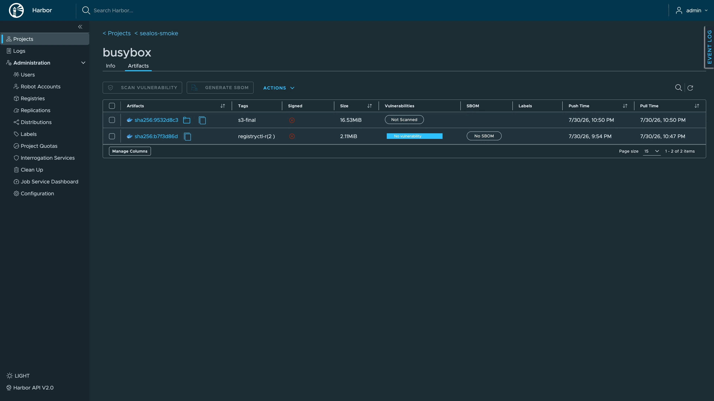

# Deploy and Host Harbor on Sealos

Harbor is an open-source OCI artifact registry with role-based access control, vulnerability scanning, replication, and artifact governance. This template deploys Harbor v2.15.2 with KubeBlocks-managed PostgreSQL and Redis, plus a choice of Sealos S3-compatible object storage or a Registry persistent volume.



## About Hosting Harbor

Harbor stores and distributes container images, Helm charts, SBOMs, signatures, and other OCI artifacts. Projects provide access boundaries for teams, while robot accounts and retention, replication, and scanning policies support automated delivery pipelines.

The template preserves Harbor's multi-service architecture with separate `core`, `portal`, `jobservice`, `registry`, `registryctl`, and `trivy` workloads. KubeBlocks provisions PostgreSQL 16.4 for metadata and Redis 7.2.7 with Sentinel for queues and cache state.

One HTTPS domain serves the web interface and registry API. The root path reaches the portal, while `/api/`, `/service/`, `/v2/`, and `/c/` reach Harbor Core.

## Common Use Cases

- **Private container registry**: Store internal images and OCI artifacts for development and production.
- **Software supply chain security**: Scan artifacts with Trivy before promotion.
- **Team governance**: Isolate projects and apply role-based permissions.
- **Automated delivery**: Use robot accounts from CI/CD pipelines.
- **Registry replication**: Copy artifacts between Harbor and external registries.

## Dependencies for Harbor Hosting

The template provisions the complete runtime:

- Six Harbor v2.15.2 services: Core, Portal, Jobservice, Registry, Registry Controller, and Trivy Adapter
- KubeBlocks PostgreSQL 16.4 with a 1 GiB persistent volume
- KubeBlocks Redis 7.2.7 replication topology with Sentinel
- A private Sealos ObjectStorageBucket in S3 mode
- A 1 GiB Registry persistent volume in local filesystem mode
- Persistent Jobservice logs and Trivy reports
- HTTPS ingress and internal Kubernetes services

### Deployment Dependencies

- [Harbor documentation](https://goharbor.io/docs/) - Administration and user guides
- [Harbor v2.15.2 release](https://github.com/goharbor/harbor/releases/tag/v2.15.2) - Version details
- [Harbor source repository](https://github.com/goharbor/harbor) - Source code and issue tracking
- [Sealos documentation](https://sealos.io/docs) - Platform operations

### Implementation Details

**Architecture components:**

- **Core** (`goharbor/harbor-core:v2.15.2`): Authentication, API, token service, and control-plane logic
- **Portal** (`goharbor/harbor-portal:v2.15.2`): Web interface
- **Jobservice** (`goharbor/harbor-jobservice:v2.15.2`): Scan, replication, retention, and garbage-collection jobs
- **Registry** (`goharbor/registry-photon:v2.15.2`): OCI distribution service
- **Registry Controller** (`goharbor/harbor-registryctl:v2.15.2`): Registry configuration and health control
- **Trivy Adapter** (`goharbor/trivy-adapter-photon:v2.15.2`): Vulnerability scanning
- **PostgreSQL**: Harbor metadata and configuration
- **Redis with Sentinel**: Queue, cache, and coordination state

**Verified minimum resource envelope:**

| Component | CPU limit | Memory limit | Persistent storage |
| --- | ---: | ---: | ---: |
| Each Harbor service | 100m | 128 MiB | Service-dependent |
| PostgreSQL | 500m | 512 MiB | 1 GiB |
| Redis | 500m | 512 MiB | 1 GiB |
| Redis Sentinel | 500m | 512 MiB | 1 GiB |
| Jobservice logs | Included above | Included above | 1 GiB |
| Trivy reports | Included above | Included above | 1 GiB |

Trivy also reserves 2 GiB of ephemeral storage for its vulnerability database. The first scan after a Trivy Pod replacement downloads this database and can take longer. The minimum envelope passed idle startup, authenticated UI use, image push and pull, Pod recreation, and vulnerability scanning; production traffic and larger repositories usually require additional CPU, memory, and storage.

**License information:**

Harbor is licensed under the [Apache License 2.0](https://github.com/goharbor/harbor/blob/main/LICENSE).

## Why Deploy Harbor on Sealos?

Sealos is an AI-assisted Cloud Operating System built on Kubernetes. A Harbor deployment on Sealos provides:

- **One-click provisioning**: Create the full Harbor, PostgreSQL, Redis, storage, and ingress stack together.
- **Managed dependencies**: KubeBlocks operates the database and cache resources.
- **Storage choice**: Select a private S3-compatible bucket or a local persistent volume.
- **Managed HTTPS**: Receive a public domain with TLS routing.
- **Canvas operations**: Use the AI dialog and resource cards for later configuration changes.
- **Usage-based resources**: Start from the verified minimum and expand for real workload demand.

## Deployment Guide

1. Open the [Harbor template](https://sealos.io/products/app-store/harbor) and click **Deploy Now**.
2. Configure the deployment parameters:
   - `harbor_admin_password`: Set the initial password for the built-in `admin` account. Use at least 8 characters and store it securely.
   - `enable_s3_storage`: Keep the default value `true` for a private Sealos ObjectStorageBucket. Select `false` for a 1 GiB Registry persistent volume.
3. Wait for deployment to complete, typically 2-3 minutes. Sealos then opens the Canvas for the deployment.
4. Open the Harbor URL shown in Canvas.
5. Sign in with username `admin` and the `harbor_admin_password` value.
6. Open **Projects**, create a project, then open the project to manage repositories, members, robot accounts, and policies.

Public self-registration is disabled by default. An administrator can create users from **Administration > Users**, and each project can create robot accounts for automated clients.

Harbor reads `harbor_admin_password` during the initial database setup. For an existing deployment, change the password from the admin profile or follow the official password reset procedure.

## Push Your First Image

Create a project in the Harbor UI, then run:

```bash
export HARBOR_HOST="<your-harbor-domain>"

docker login "$HARBOR_HOST" -u admin
docker pull busybox:1.37.0
docker tag busybox:1.37.0 "$HARBOR_HOST/<project>/busybox:1.37.0"
docker push "$HARBOR_HOST/<project>/busybox:1.37.0"
docker pull "$HARBOR_HOST/<project>/busybox:1.37.0"
```

Enter the deployment password at the `docker login` prompt. For CI/CD, create a project robot account and use its generated credentials.

## Configuration

### Template Parameters

| Parameter | Description | Required | Default |
| --- | --- | --- | --- |
| `harbor_admin_password` | Initial password for the built-in `admin` account | Yes | None |
| `enable_s3_storage` | Select private Sealos object storage (`true`) or the Registry PVC (`false`) | No | `true` |

### Storage Modes

| Mode | Artifact backend | Recommended use |
| --- | --- | --- |
| S3 enabled | Private Sealos ObjectStorageBucket | Durable registries and growing artifact collections |
| S3 disabled | 1 GiB Registry PVC | Small registries, development, and local storage workflows |

Choose the storage mode before the first image push. A later mode change requires a separate artifact migration. Increase the Registry PVC capacity in Canvas before storing artifact sets that approach 1 GiB.

After deployment, use:

- **Harbor administration** for users, projects, robots, scanners, replication, retention, and garbage collection
- **Canvas AI dialog** for requested infrastructure changes
- **Canvas resource cards** for CPU, memory, storage, workload, service, and ingress settings

## Scaling

The template starts each Harbor workload with one replica and preserves the original component boundaries. Increase resources from Canvas based on observed demand:

1. Expand Registry storage or keep S3 mode for artifact growth.
2. Increase Registry and Core resources for concurrent pushes and pulls.
3. Increase Jobservice and Trivy resources for scan, replication, and retention queues.
4. Increase PostgreSQL and Redis capacity as metadata and task volume grow.

Review Harbor's high-availability architecture before changing replica counts because several components require shared storage and coordinated configuration.

## Troubleshooting

### Admin login fails

- Confirm the username is `admin`.
- Use the password entered during the first deployment.
- For an existing database, use the password stored by Harbor or follow the official reset procedure.

### The first vulnerability scan takes several minutes

- Trivy downloads its vulnerability database after a fresh start.
- Check the Trivy Pod status and logs in Canvas.
- Keep at least 2 GiB of ephemeral storage available for the scanner database.

### An image push reaches the local storage limit

- Expand the Registry PVC from Canvas.
- S3 mode provides a better fit for growing artifact collections.

### The Harbor URL is still provisioning

- Allow the deployment, DNS, and TLS certificate to finish.
- Reopen the URL from the Canvas after the resources report Ready.

### Getting Help

- [Harbor documentation](https://goharbor.io/docs/)
- [Harbor GitHub issues](https://github.com/goharbor/harbor/issues)
- [Sealos documentation](https://sealos.io/docs)
- [Sealos Discord](https://discord.gg/wdUn538zVP)

## Additional Resources

- [Harbor administration](https://goharbor.io/docs/main/administration/)
- [Harbor vulnerability scanning](https://goharbor.io/docs/main/administration/vulnerability-scanning/)
- [Harbor replication](https://goharbor.io/docs/main/administration/configuring-replication/)
- [Harbor robot accounts](https://goharbor.io/docs/main/working-with-projects/project-configuration/create-robot-accounts/)

## License

This Sealos template follows the templates repository license policy. Harbor is licensed under the [Apache License 2.0](https://github.com/goharbor/harbor/blob/main/LICENSE).
