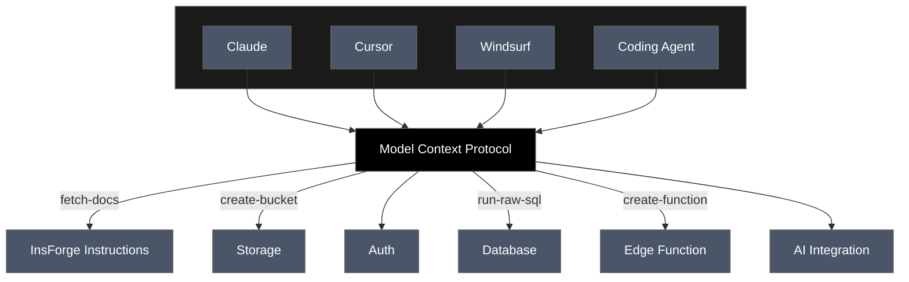

# InsForge

**InsForge is the backend built for AI-assisted development.**
Connect InsForge with any agent. Add authentication, database, storage, functions, and AI integrations to your app in seconds.
## Key Features & Use Cases

### Core Features:
- **Authentication** - Complete user management system
- **Database** - Flexible data storage and retrieval
- **Storage** - File management and organization
- **AI Integration** - Chat completions and image generation (OpenAI-compatible)
- **Serverless Functions** - Scalable compute power
- **Site Deployment** *(coming soon)* - Easy application deployment

### Use Cases: Building full-stack applications using natural language
- **Connect AI agents to InsForge** - Enable Claude, GPT, or other AI agents to manage your backend

## Prompt Examples:

<td align="center">
  
  <br>
</td>

## Quickstart TLDR;

### 0. Deploy on Sealos Cloud

[](https://template.hzh.sealos.run/deploy?templateName=insforge)

### 1. Connect an AI Agent

Visit InsForge Dashboard (default: https://[appname].usw-1.sealos.app), log in, and follow the "Connect" guide, and set up your MCP.

<div align="center">
  <table>
    <tr>
      <td align="center">
        
        <br>
        <em>Sign in to InsForge</em>
      </td>
      <td align="center">
        
        <br>
        <em>Configure MCP connection</em>
      </td>
    </tr>
  </table>
</div>

### 2. Test the Connection

In your agent, send:
```
I'm using InsForge as my backend platform, fetch InsForge instruction doc to learn more about InsForge.
```

<div align="center">
  
  <br>
  <em>Sample successful response calling insforge MCP tools</em>
</div>

### 3. Start Using InsForge

Start building your project in a new directory! Build your next todo app, Instagram clone, or online platform in seconds!

**Sample Project Prompt:**

"Build an app similar to Reddit with community-based discussion threads using InsForge as the backend platform that has these features:
- Has a "Communities" list where users can browse or create communities
- Each community has its own posts feed
- Users can create posts with a title and body (text or image upload to InsForge storage)
- Users can comment on posts and reply to other comments
- Allows upvoting and downvoting for both posts and comments
- Shows vote counts and comment counts for each post"

## Architecture


