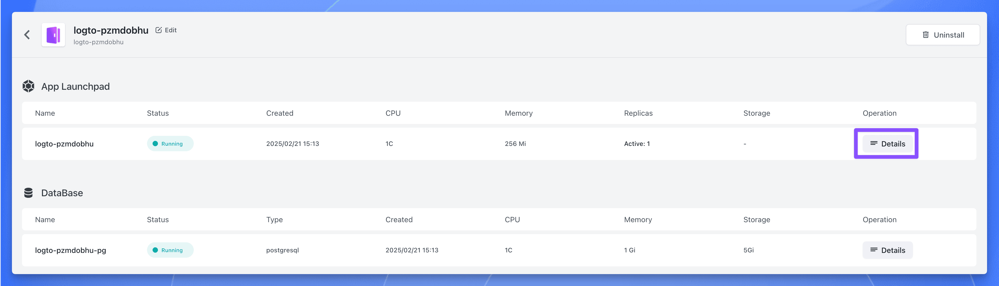
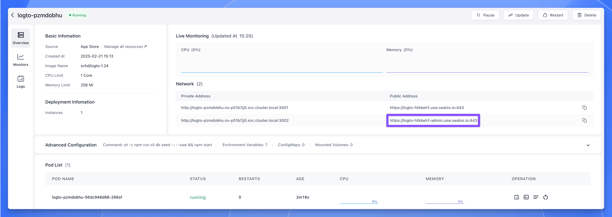
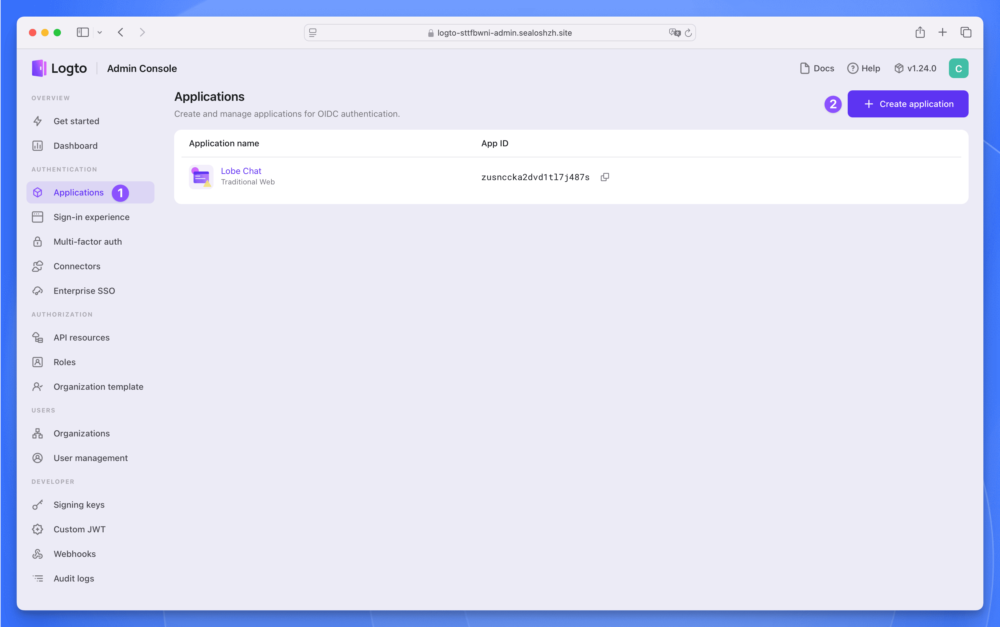
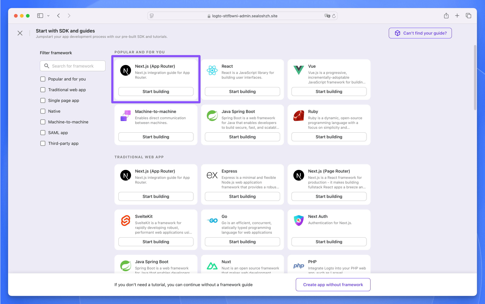
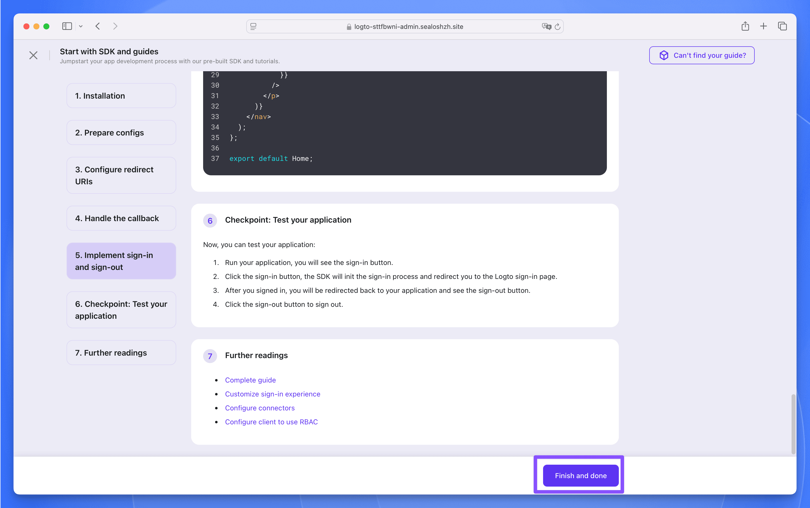
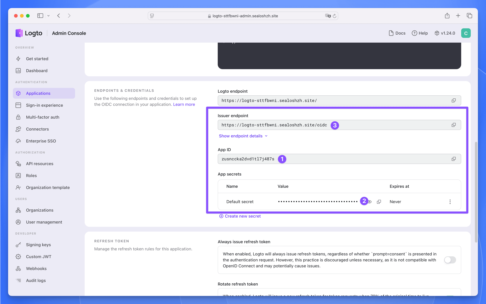
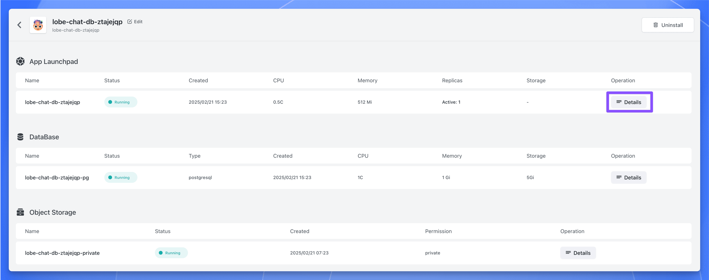

Lobe Chat is an open-source, modern-design ChatGPT/LLMs UI/Framework, it supports speech-synthesis, multi-modal, and extensible (function call) plugin system.

LobeChat defaults to using a client-side database (IndexedDB) but also supports deploying a server-side database. LobeChat uses Postgres as the backend storage database.

> PostgreSQL is a powerful open-source relational database management system with high scalability and standard SQL support. It provides rich data types, concurrency control, data integrity, security, and programmability, making it suitable for complex applications and large-scale data management.

This guide will introduce the process and principles of deploying the server-side database version of LobeChat on Sealos Cloud, a modern cloud platform designed for deploying, managing and scaling your applications in seconds, not minutes, not hours.

## Tech Stack

The app on Sealos will automatically setup your object storage with MinIO, so that you do not have to do any configuration. Besides, this app will auto setup your database with pgvector extension using Database app.

## Pre-Deployment Setup

**Step 1**：Click the button below to deploy a Logto service:

> Logto is an open-source identity and access management (IAM) platform, an open-source alternative to Auth0, designed to help developers quickly build secure and scalable login and registration systems and user identity systems.

**Step 2**：After the deployment is complete, wait for all the components of the application to be in the "Running" state, click the application's "Details" button to enter the application details page.

Click the public address corresponding to port 3002, you can use the public address to access the Logto service.

**Step 3**：Register a management account, then click the `Applications` menu on the left, enter the application list page. Click the `Create application` button in the upper right corner to create an application.

Select `Next.js (App Router)` as the framework, then click the `Start building` button.

**Step 4**：In the pop-up window, fill in the application name as `Lobe Chat`, then click the `Create application` button. Next, do not fill in anything, just click the bottom `Finish and done` button to create it.

**Step 5**：In the `Lobe Chat` application, find the following three parameters, which will be used later when deploying the Lobe Chat database version.

## Deploy Lobe Chat Database Version

**Step 1**：Fill in the following three required parameters:

- `AUTH_LOGTO_ID`：The App ID of the Logto application
- `AUTH_LOGTO_SECRET`：The App Secret of the Logto application
- `AUTH_LOGTO_ISSUER`：The Issuer endpoint of the Logto application

**Step 2**：Click the `Deploy App` button, after the deployment is complete, wait for all the components of the application to be in the "Running" state, click the application's "Details" button to enter the application details page.

**Step 3**：Find the public address, copy it, and use it later.

## Post-Deployment Configuration

**Step 1**：Enter the `Applications` page of Logto, find the `Lobe Chat` application, click to enter the application details page.

**Step 2**：In the `Settings` page, find the `Redirect URI` and `Post sign-out redirect URI` parameters, fill in the following values:

- Redirect URI: `https://<lobe-chat-db-public-address>/api/auth/callback/logto`
- Post sign-out redirect URI: `https://<lobe-chat-db-public-address>`

**Step 3**：Click the `Save changes` button to save the configuration.

**Step 4**：Now, access the Lobe Chat database version through `https://<lobe-chat-db-public-address>`, click the avatar in the upper left corner, and then click the [Log in / Sign up] button.

**Step 5**：Next, you will be redirected to the Logto login page, click the [Create account] button to register an account.

**Step 6**：After registration, you can use Logto to login to the Lobe Chat database version.

