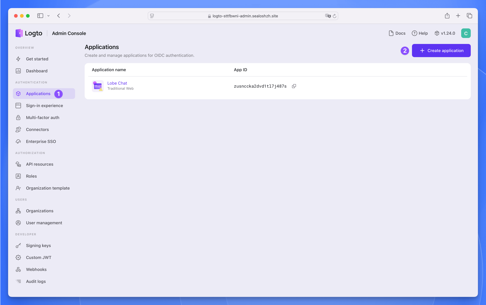
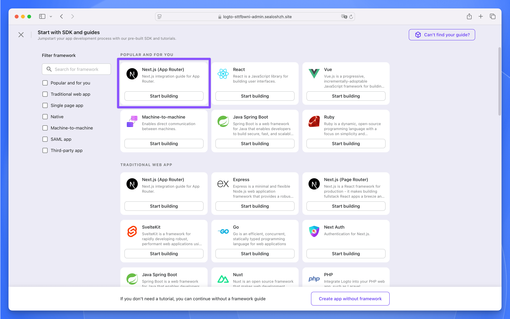

Lobe Chat 是一款现代化设计的开源 ChatGPT/LLMs 聊天应用与开发框架，支持语音合成、多模态、可扩展的（function call）插件系统。

LobeChat 默认使用客户端数据库（IndexedDB），同时也支持使用服务端数据库（下简称 DB 版）。LobeChat 采用了 Postgres 作为后端存储数据库。

> PostgreSQL 是一种强大的开源关系型数据库管理系统，具备高度扩展性和标准 SQL 支持。它提供了丰富的数据类型、并发处理、数据完整性、安全性及可编程性，适用于复杂应用和大规模数据管理。

本指南将介绍在 Sealos Cloud 上部署 LobeChat 数据库版的具体过程和原理。Sealos Cloud 是一个无需云计算专业知识，就能在几秒钟内部署、管理和扩展应用的云操作系统。

## 技术栈

Sealos Cloud 会自动为应用配置对象存储（MinIO），因此您无需进行任何配置。此外，Sealos Cloud 会使用【数据库】组件自动为应用配置数据库（pgvector 扩展）。

## 预部署配置

在开始部署之前，您需要完成以下配置：

**步骤 1**：点击下方按钮部署一个 Logto 服务：

> Logto 是一个开源的身份与访问管理（IAM）平台，是 Auth0 的开源替代方案，旨在帮助开发者快速构建安全、可扩展的登录注册系统和用户身份体系。

**步骤 2**：部署完成后，等待应用的所有组件状态都变成“运行中”，点击应用的【详情】按钮，进入应用详情页面。

点击 3002 端口对应的公网地址，即可使用公网域名访问 Logto 服务。

**步骤 3**：注册一个管理员账号，然后点击左侧的 `Applications` 菜单，进入应用列表页面。再点击右上角的 `Create application` 按钮创建应用。

选择 `Next.js (App Router)` 作为框架，然后点击 `Start building` 按钮。

**步骤 4**：在弹窗中填写应用的名称为 `Lobe Chat`，然后点击 `Create application` 按钮。接下来啥也不用填，直接点击底部的 `Finish and done` 按钮就创建完成了。

**步骤 5**：在 `Lobe Chat` 应用中找到以下三个参数，后面部署 Lobe Chat 数据库版时需要用到。

## 部署 Lobe Chat 数据库版

**步骤 1**：填入三个必填参数：

- `AUTH_LOGTO_ID`：Logto 应用的 App ID
- `AUTH_LOGTO_SECRET`：Logto 应用的 App Secret
- `AUTH_LOGTO_ISSUER`：Logto 应用的 Issuer endpoint

**步骤 2**：点击【部署】按钮，部署完成后，等待应用的所有组件状态都变成“运行中”，点击应用的【详情】按钮，进入应用详情页面。

**步骤 3**：找到公网地址，复制下来，后面需要用到。

## 部署后配置

**步骤 1**：进入 Logto 的 `Applications` 页面，找到 `Lobe Chat` 应用，点击进入应用详情页面。

**步骤 2**：在 `Settings` 页面中找到 “Redirect URI” 和 “Post sign-out redirect URI” 这两个参数，填入以下值：

- Redirect URI：`https://<lobe-chat-db-public-address>/api/auth/callback/logto`
- Post sign-out redirect URI：`https://<lobe-chat-db-public-address>`

其中 `https://<lobe-chat-db-public-address>` 为 Lobe Chat 数据库版的公网地址。

**步骤 3**：填完之后点击 `Save changes` 按钮保存配置。

**步骤 4**：现在通过 `https://<lobe-chat-db-public-address>` 访问 Lobe Chat 数据库版，点击左上角的头像，然后点击【登录 / 注册】按钮：

**步骤 5**：接下来会跳转到 Logto 的登录页面，点击【注册】注册一个账号。

**步骤 6**：注册完成后，即可使用 Logto 登录 Lobe Chat 数据库版。

