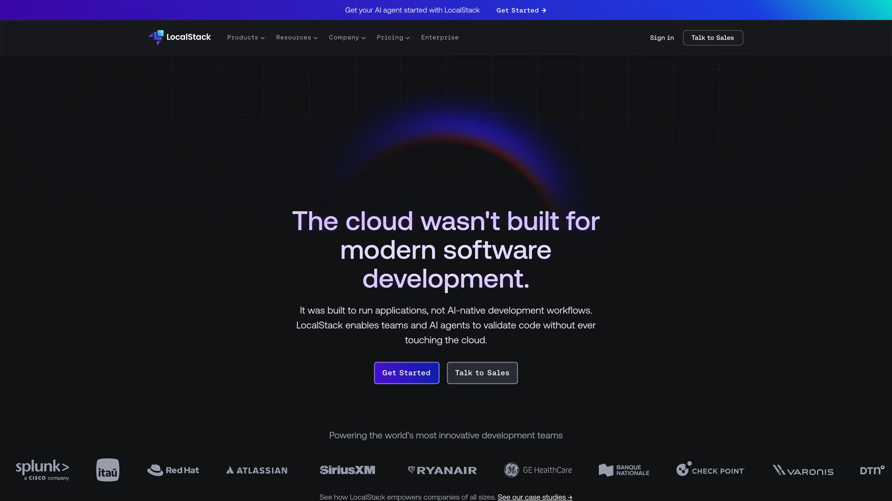

# Deploy and Host LocalStack on Sealos

LocalStack is an AWS-compatible cloud emulator for development and testing. This template deploys the final legacy Community release, LocalStack 4.14.0, behind a generated Sealos HTTPS endpoint.



## About Hosting LocalStack

LocalStack provides AWS-compatible APIs for services such as S3, SQS, SNS, DynamoDB, CloudFormation, and API Gateway. Applications can point an AWS SDK or CLI at the generated endpoint and exercise cloud workflows in an isolated environment.

The template creates one LocalStack Deployment, a ClusterIP Service, and a TLS Ingress. Port `4566` serves the public gateway. Ports `4510-4559` preserve the official external-service range for cluster clients.

Community 4.14.0 starts with an empty emulator state after each Pod replacement. Recreate test fixtures through scripts, Terraform, AWS CDK, or CloudFormation. Local state persistence is available in LocalStack Base and higher plans with an account-based image and auth token.

Container-runtime-backed services such as Lambda execution require a Docker or Kubernetes executor. This template supports gateway-backed services that execute inside the LocalStack process.

## Common Use Cases

- **AWS SDK development**: Test application integrations against an isolated AWS-compatible endpoint.
- **Infrastructure validation**: Exercise Terraform, AWS CDK, and CloudFormation workflows before connecting to an AWS account.
- **Integration testing**: Create disposable S3, SQS, SNS, and DynamoDB test environments.
- **Developer sandboxes**: Give a team a shared cloud emulator with a stable HTTPS endpoint.

## Dependencies for LocalStack Hosting

The Sealos template includes the LocalStack Community runtime, internal networking, and a public HTTPS gateway.

### Deployment Dependencies

- [LocalStack documentation](https://docs.localstack.cloud/) - Product and configuration documentation
- [LocalStack source repository](https://github.com/localstack/localstack) - Source code and releases
- [Official Helm chart](https://github.com/localstack/helm-charts/tree/main/charts/localstack) - Kubernetes runtime reference
- [LocalStack plans](https://docs.localstack.cloud/aws/licensing/) - Current service and feature entitlements

### Implementation Details

**Architecture Components:**

- **LocalStack Deployment**: Runs `localstack/localstack:4.14.0` with one replica and a recreate update strategy.
- **Ephemeral workspace**: Creates `/tmp/localstack-user` as a writable temporary directory for the non-root process.
- **Service**: Exposes gateway port `4566` and external service ports `4510-4559` inside the cluster.
- **Ingress**: Publishes the gateway through a generated HTTPS hostname.
- **App link**: Opens `/_localstack/health` so the running edition, version, and service status are visible.

**Configuration:**

- `LOCALSTACK_HOST` and `USE_SSL=1` align generated service URLs with the Sealos HTTPS endpoint.
- `SQS_ENDPOINT_STRATEGY=path` keeps queue URLs on the generated hostname and public TLS route.
- `TEMP=/tmp/localstack-user` places temporary service state in a directory owned by user `1000`.
- `DNS_ADDRESS=0` uses cluster DNS and keeps the non-root runtime on unprivileged ports.
- Startup, readiness, and liveness probes use the official `/_localstack/health` route.
- The Pod runs as LocalStack user `1000` with a runtime-default seccomp profile and dropped Linux capabilities.
- The validated starting allocation is `100m` CPU and `256Mi` memory.

**Release and License Information:**

LocalStack 4.14.0 is the final legacy Community release and uses the Apache License 2.0. Account-based LocalStack images provide maintained releases and plans for current commercial workflows.

## Why Deploy LocalStack on Sealos?

Sealos is a Kubernetes-based cloud operating system that manages application resources through a visual Canvas. Deploying LocalStack on Sealos provides:

- **One-click deployment**: Provision the runtime, networking, and HTTPS endpoint from one template.
- **Managed HTTPS**: Use a generated public hostname with platform-managed TLS.
- **Restricted runtime**: Start the Community image as a non-root user with a compact security context.
- **Canvas operations**: Adjust resources and inspect workloads through resource cards or the AI dialog.
- **Compact footprint**: Start with the live-tested `100m` CPU and `256Mi` memory profile.

## Deployment Guide

1. Open the [LocalStack template](https://sealos.io/products/app-store/localstack) and click **Deploy Now**.
2. Review the generated application name and hostname, then start the deployment.
3. Wait for deployment to complete, typically 2-3 minutes. Sealos then opens the Canvas for the new instance.
4. Open LocalStack from the App resource card. The health response shows the Community edition and version.

The generated endpoint is publicly reachable. Use synthetic test data and remove the instance after each testing session.

## Connect an AWS Client

Set standard AWS development credentials and direct the AWS CLI to the generated HTTPS endpoint:

```bash
export AWS_ACCESS_KEY_ID=test
export AWS_SECRET_ACCESS_KEY=test
export AWS_DEFAULT_REGION=us-east-1
export LOCALSTACK_URL=https://<generated-localstack-host>

aws --endpoint-url "$LOCALSTACK_URL" s3api create-bucket --bucket sealos-demo
aws --endpoint-url "$LOCALSTACK_URL" s3api list-buckets
aws --endpoint-url "$LOCALSTACK_URL" sqs create-queue --queue-name sealos-demo
aws --endpoint-url "$LOCALSTACK_URL" sqs list-queues
```

LocalStack Community accepts AWS-compatible request credentials. Development values such as `test` fit isolated test workloads.

## State Lifecycle

Each Pod replacement creates a fresh Community emulator state. Keep fixture creation in version-controlled setup scripts or infrastructure definitions so every test environment starts consistently.

LocalStack Base and higher plans provide local state persistence. Those plans use an account-based image, an auth token, and a mounted LocalStack volume.

## Configuration

Use the Sealos Canvas after deployment to adjust the LocalStack workload:

- **AI Dialog**: Describe environment or resource changes and let Sealos apply them.
- **Resource Cards**: Open the Deployment, Service, or Ingress settings directly.
- **Service selection**: Add `SERVICES` and `EAGER_SERVICE_LOADING=1` when a fixed service allowlist improves startup behavior.
- **Capacity**: Increase CPU or memory through the Deployment resource card for larger integration suites.

## Troubleshooting

### Client cannot reach the endpoint

Use the exact HTTPS URL shown by the App resource and pass its origin through the client's endpoint option. AWS CLI uses `--endpoint-url`, while SDKs expose an equivalent endpoint setting.

### SQS returns a path-style queue URL

The path-style URL keeps the queue on the generated Sealos hostname. Pass the returned `QueueUrl` directly to SQS operations.

### A service needs a container runtime

Lambda container execution and similar runtime-backed features require Docker or a Kubernetes executor with matching permissions. Gateway-backed services such as S3, SQS, SNS, and DynamoDB fit the default template profile.

### Requests become slow during a large test suite

Increase CPU and memory from the Deployment resource card. The default profile targets compact development workflows.

### Getting Help

- [LocalStack troubleshooting](https://docs.localstack.cloud/aws/getting-started/faq/)
- [LocalStack GitHub issues](https://github.com/localstack/localstack/issues)
- [Sealos Discord](https://discord.gg/wdUn538zVP)

## Additional Resources

- [LocalStack configuration reference](https://docs.localstack.cloud/aws/customization/configuration-options/)
- [LocalStack persistence](https://docs.localstack.cloud/aws/developer-tools/snapshots/persistence/)
- [AWS CLI integration](https://docs.localstack.cloud/user-guide/integrations/aws-cli/)

## License

This Sealos template follows the license of the templates repository. LocalStack Community is available under the [Apache License 2.0](https://github.com/localstack/localstack/blob/main/LICENSE.txt).
