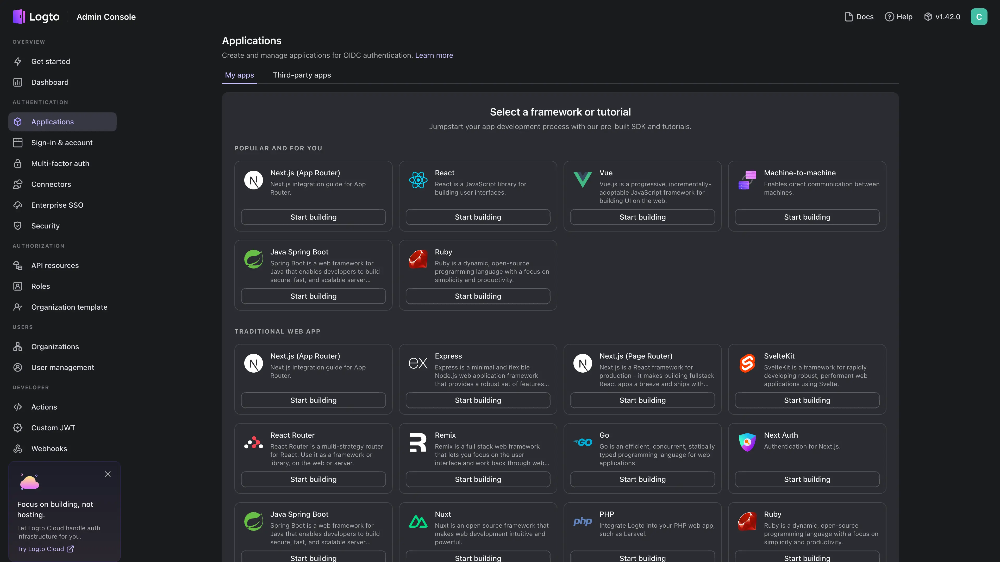

# 在 Sealos 上部署和托管 Logto

[Logto](https://logto.io/) 是一个开源身份平台，为应用提供身份认证、用户管理和授权能力。本模板会在 Sealos Cloud 上部署 Logto 1.42.0 和专用 PostgreSQL 数据库。

## 关于托管 Logto

Logto 通过一个管理控制台提供登录注册体验、OIDC/OAuth 2.0、SAML、多租户、基于角色的访问控制和用户管理。应用连接 Core/Auth 端点，运营人员通过独立的 Admin Console 端点管理身份设置。

本模板会部署 PostgreSQL 16.4、创建 `logto` 数据库、应用 Logto 数据库结构和种子数据，并通过 HTTPS 暴露两个端点。Sealos 负责服务发现、证书、数据库持久化存储、健康检查和应用生命周期管理。

## 常见使用场景

- **客户身份认证**：为 Web、移动端和 SaaS 产品添加安全的登录注册能力。
- **OIDC 和 OAuth 提供方**：为第一方及第三方应用签发身份和令牌。
- **企业身份管理**：配置 SAML、企业 SSO、MFA 和组织级访问控制。
- **授权管理**：管理 API 资源、角色、权限和组织角色。
- **自托管身份控制平面**：将身份配置和用户数据保存在自己的 Sealos 工作空间中。

## 托管 Logto 所需的依赖

本模板包含 Logto 1.42.0 运行时、PostgreSQL 16.4、数据库初始化任务、持久化存储、Service、Ingress 和自动 TLS。

### 部署依赖

- [Logto 文档](https://docs.logto.io/) - 产品与集成文档
- [Logto 快速入门](https://docs.logto.io/quick-starts) - 框架集成指南
- [Logto GitHub 仓库](https://github.com/logto-io/logto) - 源代码与问题跟踪

### 实现细节

**架构组件：**

- **Logto**：运行 `svhd/logto:1.42.0`，在 3001 端口提供 Core/Auth 端点，在 3002 端口提供 Admin Console。
- **PostgreSQL**：单个 PostgreSQL 16.4 实例存储 Logto 配置、身份、应用和审计数据。
- **数据库初始化**：幂等任务负责创建 `logto` 数据库。Logto 初始化容器会等待 PostgreSQL 就绪、写入数据库结构和种子数据，并应用待执行的变更。
- **公网访问**：Admin Console 是 Sealos 应用的主访问地址，Core/Auth 端点继续为应用集成提供公网访问。

**默认资源上限：**

| 组件 | CPU | 内存 | 存储 |
| --- | ---: | ---: | ---: |
| Logto | 100m | 256Mi | - |
| Logto 数据库初始化容器 | 100m | 128Mi | - |
| PostgreSQL | 500m | 512Mi | 1Gi |

默认拓扑包含一个 Logto 副本和一个 PostgreSQL 副本。接入生产流量、连接器或高吞吐审计工作负载前，请先增加资源。

**许可证信息：**

Logto 使用 Mozilla Public License 2.0 许可证。

## 为什么在 Sealos 上部署 Logto？

Sealos 提供基于 Kubernetes 的应用平台，负责完整的部署生命周期。在 Sealos 上部署 Logto 可以获得：

- **一键部署**：通过一个模板完成 Logto、PostgreSQL、初始化任务、网络和 TLS 的配置。
- **集成持久化**：身份数据保存在托管持久化存储中，可跨应用重启持续使用。
- **即时 HTTPS 端点**：分别获得用于 Admin Console 和认证流量的安全访问地址。
- **资源可观测性**：在 Canvas 中检查工作负载、日志、数据库状态和资源使用情况。
- **便捷自定义**：通过 Sealos 调整环境变量、CPU、内存、存储和副本设置。

在 Sealos 上部署 Logto，将身份层与使用它的应用统一管理。

## 部署指南

1. 打开 [Logto 模板](https://sealos.io/products/app-store/logto)，点击 **Deploy Now**。
2. 检查自动生成的应用名称和域名，然后开始部署。
3. 等待部署完成，通常需要 2-3 分钟。PostgreSQL 和数据库结构初始化完成后，Logto 才会进入就绪状态。部署完成后，Sealos 会打开应用 Canvas。
4. 从 Logto 应用卡片打开 **Admin Console** 地址。
5. 保存网络详情中的 **Core/Auth 端点**，用于 OIDC/OAuth 集成。

## 首次注册与登录

全新部署会打开 Logto 欢迎页：

1. 点击 **Create account**。
2. 输入初始管理员用户名并继续。
3. 输入并确认高强度密码，然后点击 **Save password**。
4. Logto 会打开已登录的 Admin Console。进入 **Dashboard** 和 **Applications** 验证访问权限。

首次成功注册会创建初始管理员。后续访问使用该用户名和密码通过 **Sign in** 登录。模板不会生成或显示这组凭据，请将其保存在密码管理器中。

Logto 提供两个 HTTPS 端点：

- **Admin Console**：`https://<generated-host>-admin.<sealos-cloud-domain>`
- **Core/Auth 端点**：`https://<generated-host>.<sealos-cloud-domain>`

配置应用和 SDK 时，请将 Core/Auth 端点用作基础 issuer URL。

## 配置

登录后，可以在 Admin Console 中创建应用、设置重定向 URI、配置登录方式、添加连接器、定义 API 资源并管理用户。Sealos 还提供：

- **AI 对话框**：描述基础设施变更，由 Sealos 应用配置。
- **资源卡片**：在 Canvas 中调整工作负载资源并检查运行时设置。
- **数据库卡片**：检查 PostgreSQL 状态、连接信息、存储和备份。

## 扩展

评估和轻量负载可以从已验证的默认资源开始。生产环境中，请通过 Sealos 监控 CPU 和内存，根据流量增长提升 Logto 和 PostgreSQL 的资源上限，在存储接近容量前完成扩容，并根据恢复目标规划 PostgreSQL 可用性。

## 故障排查

### 部署后 Admin Console 仍在加载

PostgreSQL 启动和 Logto 数据库结构初始化完成后，健康检查才会通过。请等待 PostgreSQL 集群和 Logto 工作负载都在 Canvas 中显示运行状态，然后重新加载 Admin Console。

### 应用无法完成 OIDC/OAuth 重定向

请确认应用使用 Core/Auth 端点作为 issuer，并确保每个重定向 URI 与 **Applications** 中登记的值完全一致。

### 获取帮助

- [Logto 文档](https://docs.logto.io/)
- [Logto GitHub Issues](https://github.com/logto-io/logto/issues)
- [Sealos Discord](https://discord.gg/wdUn538zVP)

## 更多资源

- [Logto SDK](https://docs.logto.io/quick-starts)
- [Logto 核心概念](https://docs.logto.io/end-user-flows)
- [Sealos 文档](https://sealos.io/docs/)

## 许可证

本模板遵循 Sealos templates 仓库的许可证。Logto 使用 [Mozilla Public License 2.0](https://github.com/logto-io/logto/blob/master/LICENSE) 许可证。
