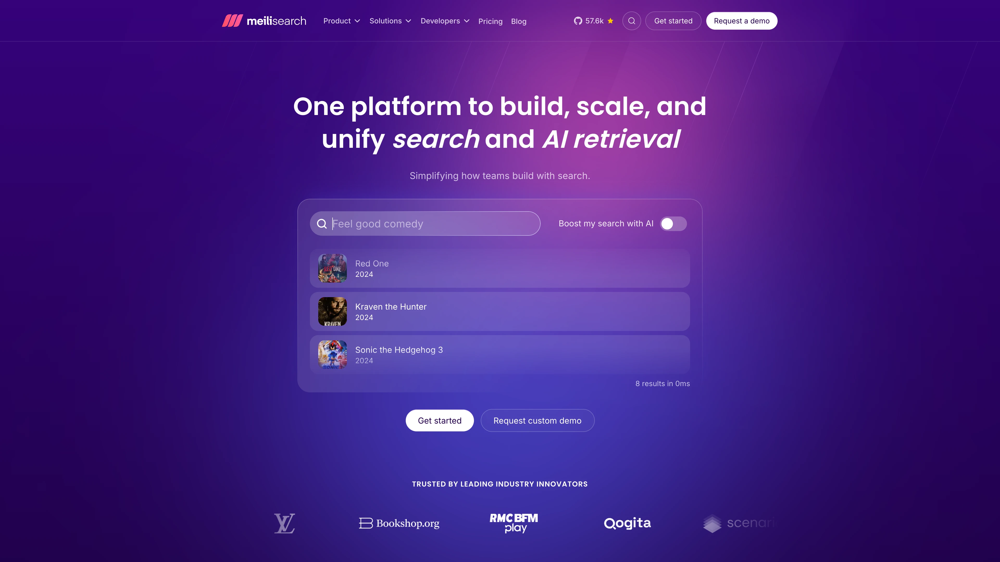

# Deploy and Host Meilisearch on Sealos

Meilisearch is a fast, open-source search engine API for building typo-tolerant search experiences. This template deploys Meilisearch v1.45.1 with persistent storage and a lightweight Meilisearch UI dashboard on Sealos Cloud.



## About Hosting Meilisearch

Meilisearch runs as a single-node StatefulSet and stores indexes, tasks, and runtime data in a persistent volume mounted at `/meili_data`. The API is exposed through a Sealos-managed HTTPS endpoint on port `7700`, so applications and SDK clients can connect from outside the cluster.

The template also deploys a separate Meilisearch UI service using `eyeix/meilisearch-ui:v0.15.1-lite`. The UI provides a browser-based dashboard for managing indexes, documents, search, and settings. It does not create a user account system; instead, you connect it to your Meilisearch API endpoint with the generated `MEILI_MASTER_KEY`.

## Common Use Cases

- **Application Search**: Add typo-tolerant search to SaaS products, dashboards, and content apps.
- **E-commerce Search**: Index products and enable fast keyword search with filtering and ranking.
- **Documentation Search**: Power search experiences for docs, knowledge bases, and help centers.
- **Internal Tools**: Use the bundled dashboard to inspect indexes and test search behavior.
- **API Prototyping**: Create indexes, add documents, and validate queries before integrating SDKs.

## Dependencies for Meilisearch Hosting

The Sealos template includes the Meilisearch API container, Meilisearch UI container, persistent storage for `/meili_data`, Kubernetes Services, HTTPS Ingress resources, and a Sealos App link.

### Deployment Dependencies

- [Meilisearch Documentation](https://www.meilisearch.com/docs) - Official product and API documentation
- [Meilisearch REST API Reference](https://www.meilisearch.com/docs/reference/api/overview) - API endpoint details
- [Meilisearch GitHub Repository](https://github.com/meilisearch/meilisearch) - Source code and releases
- [Meilisearch UI Repository](https://github.com/eyeix/meilisearch-ui) - Web dashboard used by this template

### Implementation Details

**Architecture Components:**

This template deploys the following resources:

- **Meilisearch StatefulSet**: Runs `getmeili/meilisearch:v1.45.1` with persistent `/meili_data` storage.
- **Meilisearch UI Deployment**: Runs `eyeix/meilisearch-ui:v0.15.1-lite` on port `24900` for browser-based administration.
- **Persistent Volume Claim**: Stores indexes, tasks, and runtime data across pod restarts.
- **API Service and Ingress**: Expose the Meilisearch HTTP API over an automatically generated HTTPS URL.
- **UI Service and Ingress**: Expose the dashboard through a separate HTTPS URL.
- **Sealos App**: Opens the Meilisearch UI from the Sealos Canvas.

**Configuration:**

- `MEILI_ENV` is set to `production`.
- `MEILI_MASTER_KEY` is generated automatically as `defaults.master_key` and protects all API routes except `GET /health`.
- The UI stores connection information in your browser. Enter the Meilisearch API URL and generated master key when connecting.
- The UI is intentionally not preloaded with the master key, because browser-delivered singleton configuration would expose the key in the frontend bundle.
- API resources use the lightweight validated profile: `100m` CPU and `128Mi` memory. The UI uses the standard Sealos baseline: `200m` CPU and `256Mi` memory.

**License Information:**

Meilisearch is distributed under the MIT License. This Sealos template is provided under the repository license for Sealos templates. Review the Meilisearch UI upstream repository for dashboard licensing details.

## Why Deploy Meilisearch on Sealos?

Sealos is an AI-assisted Cloud Operating System built on Kubernetes that unifies application deployment, operations, and management. By deploying Meilisearch on Sealos, you get:

- **One-Click Deployment**: Launch Meilisearch and its dashboard from the App Store template without writing Kubernetes manifests.
- **Persistent Storage Included**: Keep search indexes and task data across restarts.
- **Instant Public Access**: Receive HTTPS endpoints for both the API and Web UI after deployment.
- **Easy Customization**: Adjust resources, environment variables, and storage from the Canvas or AI dialog.
- **Zero Kubernetes Expertise Required**: Use Kubernetes-backed workloads without manually managing Services, Ingress, or StatefulSets.
- **Pay-as-You-Go Resources**: Start with a small search node and scale resources when indexing or query traffic grows.

Deploy Meilisearch on Sealos and focus on search quality instead of infrastructure setup.

## Deployment Guide

1. Open the [Meilisearch template](https://sealos.io/products/app-store/meilisearch) and click **Deploy Now**.
2. Review the generated application name, API host, UI host, and master key values in the popup dialog.
3. Wait for deployment to complete, typically 2-3 minutes. After deployment, you will be redirected to the Canvas. For later changes, describe your requirements in the AI dialog, or click the relevant resource cards to modify settings.
4. Open the Meilisearch UI from the Sealos App link. The UI does not require registration or a user login. Connect to your instance with:
   - **Host**: the generated Meilisearch API URL, for example `https://<your-meilisearch-api-url>`
   - **API Key**: the generated `MEILI_MASTER_KEY`
5. Use the API endpoint directly for SDKs or REST clients. Protected endpoints require `Authorization: Bearer <MEILI_MASTER_KEY>` or `X-Meili-API-Key: <MEILI_MASTER_KEY>`.

Example health check:

```bash
curl https://<your-meilisearch-api-url>/health
```

Example authenticated API call:

```bash
curl   -H "Authorization: Bearer <MEILI_MASTER_KEY>"   https://<your-meilisearch-api-url>/version
```

## Configuration

After deployment, you can configure Meilisearch through:

- **Meilisearch UI**: Connect with the generated API URL and master key to manage indexes, documents, and settings.
- **AI Dialog**: Describe resource or environment changes and let Sealos apply updates.
- **Resource Cards**: Open the StatefulSet, Deployment, Service, Ingress, PVC, or App cards to inspect and modify deployment settings.
- **API Clients**: Use the generated public URL and `MEILI_MASTER_KEY` with Meilisearch SDKs or REST requests.

## Scaling

To scale the deployment vertically:

1. Open the Canvas for your deployment.
2. Click the Meilisearch StatefulSet resource card.
3. Adjust CPU and memory resources based on your indexing and query workload.
4. Apply the changes and wait for the pod to roll out.

The bundled UI is stateless and can be redeployed independently. Meilisearch in this template is a single-node deployment; for larger production search workloads, review the official Meilisearch guidance before increasing traffic or index size.

## Troubleshooting

### The UI asks for a host and API key

- Cause: The lightweight UI stores connection information in your browser and is not preconfigured with the master key.
- Solution: Use the generated Meilisearch API URL as the host and the generated `MEILI_MASTER_KEY` as the API key.

### API requests return unauthorized errors

- Cause: Meilisearch runs in production mode with a generated master key.
- Solution: Include `Authorization: Bearer <MEILI_MASTER_KEY>` or `X-Meili-API-Key: <MEILI_MASTER_KEY>` in protected API requests.

### The UI cannot connect to the API

- Cause: The UI runs in the browser and must reach the public Meilisearch API URL.
- Solution: Use the HTTPS API URL generated by this template, not the internal Kubernetes Service name.

### Indexing uses too much memory

- Cause: Large document batches or complex indexing tasks can require more memory than the lightweight default.
- Solution: Increase the StatefulSet memory limit from the Canvas before running large imports.

### Getting Help

- [Official Documentation](https://www.meilisearch.com/docs)
- [GitHub Issues](https://github.com/meilisearch/meilisearch/issues)
- [Meilisearch UI Issues](https://github.com/eyeix/meilisearch-ui/issues)
- [Sealos Discord](https://discord.gg/wdUn538zVP)

## Additional Resources

- [Meilisearch Quick Start](https://www.meilisearch.com/docs/learn/getting_started/quick_start)
- [API Keys](https://www.meilisearch.com/docs/learn/security/master_api_keys)
- [Indexing Documents](https://www.meilisearch.com/docs/learn/getting_started/indexing)
- [Search API](https://www.meilisearch.com/docs/reference/api/search)

## License

This Sealos template is provided under the repository license for Sealos templates. Meilisearch itself is licensed under the MIT License.
