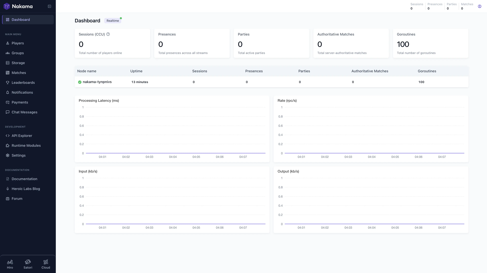

# 在 Sealos 上部署和托管 Nakama Server

Nakama 是一个开源游戏服务器，面向实时多人游戏、玩家账号、社交系统和在线运营场景。此模板会在 Sealos Cloud 上部署 Nakama v3.40.0，并自动配置托管 PostgreSQL 数据库。



## 关于托管 Nakama

Nakama 以单节点游戏服务器运行，内置 HTTP API、实时 WebSocket、gRPC 端点和管理控制台。用户、会话、排行榜、群组、存储对象、聊天消息等游戏数据会持久化到 PostgreSQL。

Sealos 模板会自动创建 PostgreSQL 16.4.0、初始化 `nakama` 数据库、运行 Nakama 数据库迁移，并在数据库就绪后启动服务。每次部署都会生成会话、运行时、控制台和 socket 所需的密钥。

Nakama Console 是主要的 Web 入口。HTTP API 会通过独立 URL 暴露给 REST 与 WebSocket 客户端；如果客户端需要直接访问 gRPC，也可以在部署时开启公开 gRPC 入口。

## 常见使用场景

- **实时多人游戏**：处理实时会话、匹配、权威比赛和游戏服务器逻辑。
- **玩家身份与账号**：支持设备、邮箱、社交账号或自定义认证流程。
- **游戏社交系统**：实现好友、群组、聊天、组队、通知和用户元数据。
- **排行榜与锦标赛**：构建竞技排名、赛季挑战和活动积分系统。
- **在线运营控制台**：通过 Nakama Console 查看玩家、存储、比赛、运行时模块和服务指标。

## Nakama 托管依赖

此 Sealos 模板包含所有必需运行依赖：Nakama Server 和 PostgreSQL。Nakama Console 已内置在 Nakama 二进制文件中，不需要单独的控制台镜像。

### 部署依赖

- [Nakama 官方文档](https://heroiclabs.com/docs/nakama/) - 产品文档和开发指南
- [Nakama GitHub 仓库](https://github.com/heroiclabs/nakama) - 源码和发布说明
- [Nakama Docker 安装指南](https://heroiclabs.com/docs/nakama/getting-started/install/docker/) - 官方容器部署参考
- [Nakama 客户端库](https://heroiclabs.com/docs/nakama/client-libraries/) - Unity、Unreal、Godot、JavaScript 等 SDK

### 实现细节

**架构组件：**

此模板会部署以下服务：

- **Nakama Server**：运行 `heroiclabs/nakama:3.40.0` 的 StatefulSet，并为 `/data` 提供持久存储，用于运行时模块。
- **PostgreSQL 数据库**：KubeBlocks PostgreSQL 16.4.0 集群，用于持久化 Nakama 数据。
- **PostgreSQL 初始化 Job**：以幂等方式创建 `nakama` 数据库。
- **Nakama Console Ingress**：主 Web 入口，路由到 Nakama Console 的 `7351` 端口。
- **Nakama HTTP API Ingress**：面向 `/v2` REST API 和 `/ws` 实时 WebSocket 流量的独立端点，路由到 `7350` 端口。
- **可选 gRPC Ingress**：开启 `enable_grpc` 后，公开 Nakama gRPC（`7349`）和控制台 gRPC（`7348`）。

**配置：**

Nakama 会在 PostgreSQL 可访问且目标数据库存在后启动。迁移 init container 会先执行 `nakama migrate up`，主容器启动后使用 `nakama healthcheck` 作为启动、就绪和存活探针。初始化任务和 Nakama 工作负载统一使用 UID/GID 1000、RuntimeDefault seccomp、空 Linux capabilities，并关闭权限提升。

**已验证的最小资源：**

| 组件 | CPU | 内存 | 存储 |
| --- | ---: | ---: | ---: |
| Nakama | 100m | 128Mi | 运行时模块 100Mi |
| 目录和 PostgreSQL 就绪初始化器 | 100m | 128Mi | - |
| Nakama 数据库迁移 | 200m | 256Mi | - |
| PostgreSQL | 500m | 512Mi | 1Gi |

在 Console、玩家认证、WebSocket 和 gRPC 实测期间，Nakama 容器使用约 6–9m CPU 和 11–17Mi 内存。模板为长期运行的服务采用 Sealos 支持的最小工作负载档位。

**登录和访问：**

Nakama Console 需要使用部署时配置的控制台凭据：

- **用户名**：必填 `console_username` 的值
- **密码**：`console_password` 的值

玩家账号不是从控制台登录页注册的。游戏客户端需要通过 Nakama API 创建或认证玩家账号，例如使用 `/v2/account/authenticate/device?create=true` 设备认证接口，并将配置的 socket/server key 作为 Basic Auth 用户名。

**许可证信息：**

Nakama 使用 Apache-2.0 许可证。此 Sealos 模板同样使用 Apache-2.0 许可证。

## 为什么在 Sealos 上部署 Nakama？

Sealos 是基于 Kubernetes 的 AI 云操作系统，统一应用从部署到运维的生命周期。在 Sealos 上部署 Nakama 可以获得：

- **一键部署**：无需编写 Kubernetes YAML，即可从应用商店部署 Nakama 和 PostgreSQL。
- **托管公网 URL**：自动获得控制台和 API 的 HTTPS 地址。
- **持久化数据**：玩家、排行榜、群组和存储数据会保存在托管 PostgreSQL 中。
- **易于定制**：可以通过部署表单或 Canvas 调整凭据、资源限制和可选 gRPC 暴露。
- **Kubernetes 底座**：获得 Kubernetes 能力，同时不需要直接管理集群资源。
- **按量资源**：从经过验证的小资源档位开始，并随着玩家流量增长逐步扩容。

## 部署指南

1. 打开 [Nakama Server 模板](https://sealos.io/products/app-store/nakama)，点击 **Deploy Now**。
2. 在弹窗中配置参数：
   - **Console Username**：Nakama Console 的必填管理员用户名，请选择唯一值。
   - **Console Password**：控制台用户密码。请设置强密码并妥善保存。
   - **Enable gRPC**：可选。仅当客户端需要公开 gRPC 端点时开启。
3. 等待部署完成。由于 PostgreSQL 需要先初始化，通常需要 2-3 分钟。
4. 打开主应用 URL 访问 **Nakama Console**。
5. 使用配置的 Console Username 和 Console Password 登录。
6. 游戏客户端使用 API URL 连接：
   - **HTTP API**：`https://<api-url>/v2/...`
   - **WebSocket**：`wss://<api-url>/ws`
   - **gRPC**：仅在开启 `enable_grpc` 时使用生成的 gRPC URL。

## 配置

部署后，你可以通过以下方式管理 Nakama：

- **Nakama Console**：查看用户、群组、存储、比赛、排行榜、通知、API Explorer 和运行时模块。
- **Canvas AI 对话框**：描述需要修改的配置，由 Sealos 帮助应用变更。
- **资源卡片**：在 Canvas 中调整 StatefulSet 资源、Ingress 路由和 PostgreSQL 设置。
- **运行时模块**：按需将 Lua、JavaScript 或 Go 运行时模块挂载或上传到 `/data/modules`。

### 控制台登录

部署表单会根据必填用户名和密码创建 Console 管理员。请将两项凭据保存到密码管理器。轮换凭据时，可以更新 Nakama StatefulSet 的对应参数，或使用新值重新部署。

### 客户端认证

Nakama 支持通过设备认证、邮箱认证和社交账号认证等 API 流程注册玩家。基础设备认证测试示例：

```bash
curl -X POST "https://<api-url>/v2/account/authenticate/device?create=true" \
  -H "Content-Type: application/json" \
  -H "Authorization: Basic $(printf '<server-key>:' | base64)" \
  -d '{"id":"unique-device-id","vars":{}}'
```

将 `<server-key>` 替换为当前部署生成的 server key。模板会自动生成 `server_key`；如果需要手动进行 API 测试，可以从渲染后的部署参数或 Nakama StatefulSet 的 `NAKAMA_SOCKET_SERVER_KEY` 环境变量中查看。

## 扩容

开发和小规模测试可以从默认验证资源档位开始。扩容 Nakama 的步骤如下：

1. 打开当前部署的 Canvas。
2. 点击 Nakama StatefulSet 资源卡片。
3. 如果玩家流量、运行时模块或比赛逻辑需要更多资源，将 CPU 和内存提升到下一个 Sealos 资源档位。
4. 如果瓶颈在数据库，点击 PostgreSQL 资源卡片调整数据库资源。
5. 应用变更后，在 Nakama Console 中确认服务就绪。

生产多人游戏上线前，请使用接近真实的并发用户、比赛逻辑、运行时模块和 API 流量进行压测，再决定最终资源限制。

## 故障排查

### 常见问题

**Nakama Console 登录失败**
- 原因：控制台用户名或密码不正确。
- 解决：使用部署表单中配置的用户名和密码，两项 Console 凭据均为必填输入。

**API 返回 `Server key invalid`**
- 原因：客户端使用了错误的 Basic Auth 用户名。
- 解决：使用当前部署的 server key 作为 Basic Auth 用户名，密码留空。

**数据库初始化时间较长**
- 原因：PostgreSQL 仍在启动或正在创建 `nakama` 数据库。
- 解决：等待几分钟。init containers 会自动等待数据库就绪并执行迁移。

**gRPC 客户端无法连接**
- 原因：未开启公开 gRPC Ingress，或客户端使用了 HTTP API URL。
- 解决：重新部署或更新模板并开启 `enable_grpc`，然后使用生成的 gRPC 端点。

### 获取帮助

- [Nakama 文档](https://heroiclabs.com/docs/nakama/)
- [Nakama GitHub Issues](https://github.com/heroiclabs/nakama/issues)
- [Heroic Labs 论坛](https://forum.heroiclabs.com/)
- [Sealos 文档](https://sealos.io/docs/)
- [Sealos Discord](https://discord.gg/wdUn538zVP)

## 更多资源

- [Nakama 入门指南](https://heroiclabs.com/docs/nakama/getting-started/)
- [Nakama 运行时代码](https://heroiclabs.com/docs/nakama/server-framework/runtime-code/)
- [Nakama API 参考](https://heroiclabs.com/docs/nakama/api/)
- [Nakama Console 指南](https://heroiclabs.com/docs/nakama/getting-started/install/console/)

## 许可证

此 Sealos 模板使用 Apache-2.0 许可证。Nakama 本身使用 Apache-2.0 许可证。
