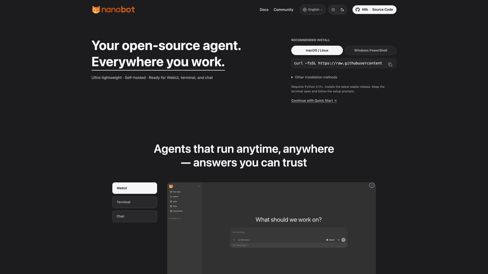

# Deploy and Host nanobot on Sealos

nanobot is a self-hosted AI agent with a browser workspace, tools, memory, and scheduled tasks. This template deploys the nanobot gateway and its bundled WebUI with persistent storage on Sealos Cloud.

## About Hosting nanobot

The gateway serves the WebUI and authenticated WebSocket connections together on port 8765. A single instance stores its configuration, conversations, memory, generated files, and automation state on a 1Gi persistent volume.

The template initializes the configuration once, prepares the tokenizer cache before startup, and preserves settings edited in the WebUI across restarts. Browser access uses a private generated password, and file tools start with workspace restrictions enabled.

## Common Use Cases

- **Personal AI workspace**: Keep separate conversations for research, writing, and project tasks.
- **File assistance**: Ask the agent to create, inspect, and edit files in its persistent workspace.
- **Repeatable tasks**: Use built-in tools, skills, and scheduled automations for recurring work.
- **Chat integrations**: Connect supported chat channels with your own platform credentials.

## Dependencies for nanobot Hosting

The template includes the Python runtime, bundled WebUI, built-in tools, and persistent storage. Provide an API key, an OpenAI-compatible API base URL, and an exact model ID from the same provider.

### Deployment Dependencies

- [Official website](https://nanobot.wiki)
- [WebUI guide](https://github.com/HKUDS/nanobot/blob/v0.3.0/docs/webui.md)
- [Deployment guide](https://github.com/HKUDS/nanobot/blob/v0.3.0/docs/deployment.md)
- [GitHub issues](https://github.com/HKUDS/nanobot/issues)

### Implementation Details

| Component | Configuration |
| --- | --- |
| Release | nanobot v0.3.0 |
| Runtime | One gateway with the bundled WebUI, running as UID 1000 |
| Storage | 1Gi at `/home/nanobot/.nanobot` |
| Configuration | `/home/nanobot/.nanobot/config.json`, initialized on first start |
| Model provider | OpenAI-compatible endpoint selected by the deployment inputs |
| Public entry | HTTPS WebUI with WebSocket support on port 8765 |
| Health endpoint | Container-local port 18790 |
| Validated low-load limits | Gateway: 200m CPU / 256Mi memory; initialization: 100m CPU / 128Mi memory |

The image `ghcr.io/yangchuansheng/sealos-template-init:nanobot-v0.3.0` is built from the unmodified upstream v0.3.0 Dockerfile and source. The selected upstream deployment stores data in local files; this template provisions the corresponding persistent volume. Keep one replica for this shared local-state runtime.

## Why Deploy nanobot on Sealos?

Sealos provides Kubernetes scheduling, persistent storage, HTTPS routing, and pay-as-you-go resources for the gateway. After deployment, use the Canvas AI dialog or resource cards to adjust resources and inspect logs.

## Deployment Guide

1. Open the [nanobot template](https://sealos.io/products/app-store/nanobot) and click **Deploy Now**.
2. Enter your provider's API key, API base URL, and model ID. Include the provider's version path in the URL, such as `https://api.openai.com/v1`.
3. Wait for deployment to complete, typically 2-3 minutes. The Canvas shows the gateway and its persistent storage after deployment.
4. Open the gateway resource card and copy the value of the `NANOBOT_WEB_TOKEN` environment variable. Keep this generated password private.
5. Open the application's public URL, enter that value in **Password**, and click **Connect**. This shared-password flow opens the WebUI directly.
6. Start a **New topic** and send a short message to verify your model. Ask the agent to create and read a small file to verify its workspace tools.

## Configuration

Use **Settings → Models** to manage model settings and **Settings → Channels** for chat integrations. Configuration changes are stored on the persistent volume; follow any restart notice shown by the WebUI. Deployment provider values remain available through `OPENAI_API_KEY`, `OPENAI_API_BASE`, and `NANOBOT_MODEL`.

The browser remembers its access password locally. Enter `NANOBOT_WEB_TOKEN` again when connecting from a new browser or after clearing browser storage. The gateway uses a shared access password, with each trusted user able to operate the same agent workspace.

Remote installation of optional Python packages starts disabled. The default image includes WhatsApp support; other channels may require an image rebuild with the upstream `NANOBOT_CHANNELS` build argument before enabling them.

## Troubleshooting

- **Password rejected**: Copy the current `NANOBOT_WEB_TOKEN` value from the gateway resource card and enter it without extra whitespace.
- **Model request fails**: Confirm the API key, base URL, and exact model ID belong to the same provider, then check its available quota.
- **Gateway is starting**: Inspect the initialization and gateway logs. The first run prepares the tokenizer cache before serving requests.
- **More demanding workloads**: Increase CPU, memory, or persistent storage from the Canvas resource card as conversations, attachments, and tool workloads grow.

## License

This Sealos template follows the [templates repository license](../../LICENSE). nanobot is licensed under the [MIT License](https://github.com/HKUDS/nanobot/blob/v0.3.0/LICENSE).
