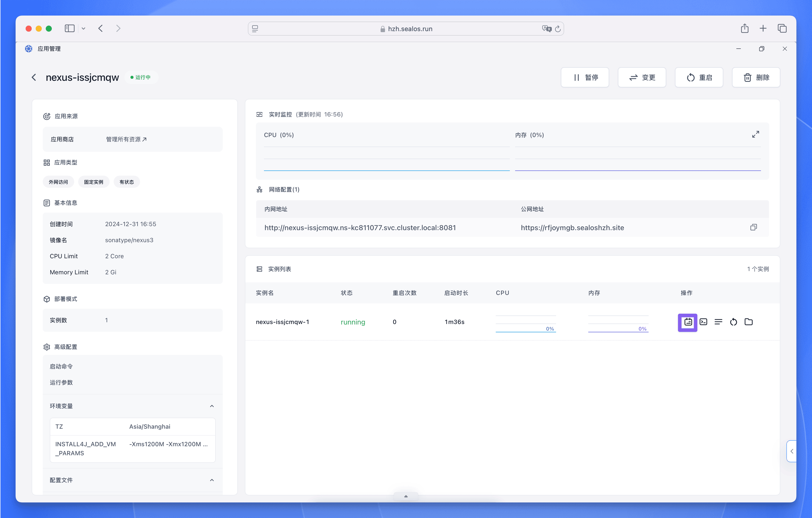
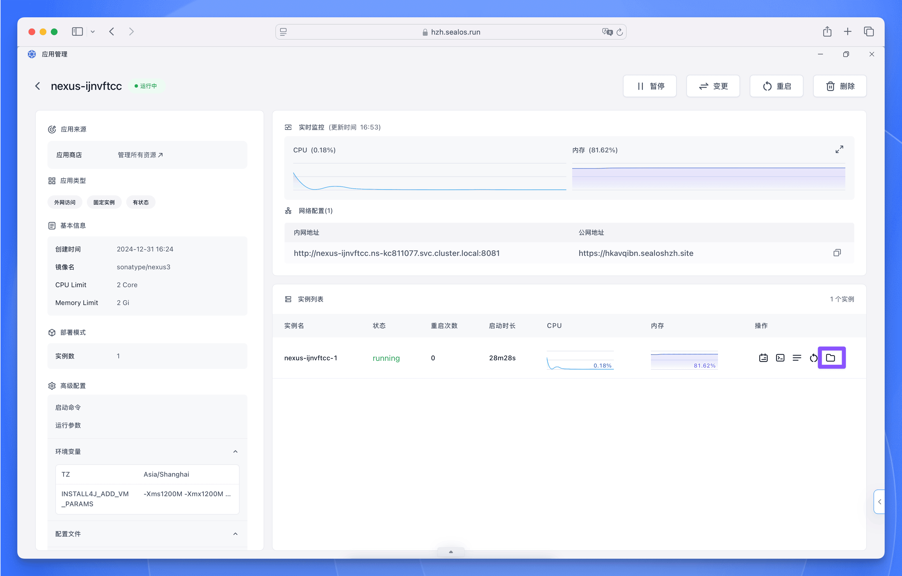

## 必看！！！

默认用户名：`admin`

默认密码获取方式👇

部署完成后，点击【详情】进入应用详情页面：

等待应用状态变成 running，然后点击实例右侧的日志按钮查看日志：

等待日志中出现 `Started Sonatype Nexus OSS` 字样，表示应用启动成功。

接下来点击实例右侧的文件管理按钮，进入文件管理页面：

找到 `admin.password` 文件，点击文件右侧的下载按钮，下载文件：

下载完成后，打开文件，复制文件中的密码，即为默认密码。

## 简介

Sonatype Nexus Repository 是一个强大的软件仓库管理工具，主要用于存储和管理软件开发过程中的各类组件（artifacts）。比如：

- 存储和管理各种类型的软件包和依赖
- 作为私有仓库使用，提供组织内部的组件共享
- 作为代理仓库，缓存远程仓库的资源

### 主要特性

1. **多仓库类型支持**
   - Maven 仓库（Java）
   - npm 仓库（Node.js）
   - Docker 镜像仓库
   - NuGet 仓库（.NET）
   - PyPI 仓库（Python）
   - Ruby Gems 仓库
   - 等多种格式

2. **仓库管理功能**
   - 代理仓库：缓存远程仓库内容
   - 宿主仓库：存储组织内部组件
   - 群组仓库：合并多个仓库为一个访问入口

3. **核心优势**
   - 提高构建速度（本地缓存）
   - 降低带宽使用
   - 确保组件可用性
   - 版本控制和安全管理
   - 统一的组件管理平台

### 应用场景

1. **企业内部使用**
   - 搭建私有组件仓库
   - 统一管理第三方依赖
   - 共享内部开发组件

2. **持续集成/持续部署（CI/CD）**
   - 与 Jenkins 等工具集成
   - 自动化构建和部署
   - 制品版本管理

3. **开发团队协作**
   - 统一依赖源
   - 版本一致性控制
   - 简化构建配置

### 在开发流程中的价值

1. **提升效率**
   - 加快构建速度
   - 简化依赖管理
   - 减少环境配置时间

2. **增强安全性**
   - 组件安全扫描
   - 漏洞检测
   - 访问控制

3. **降低风险**
   - 依赖可用性保障
   - 版本一致性控制
   - 组件质量管理

Nexus Repository 已经成为许多企业进行软件开发的标准工具之一，它不仅简化了依赖管理流程，还为企业提供了一个安全可靠的组件管理平台。
