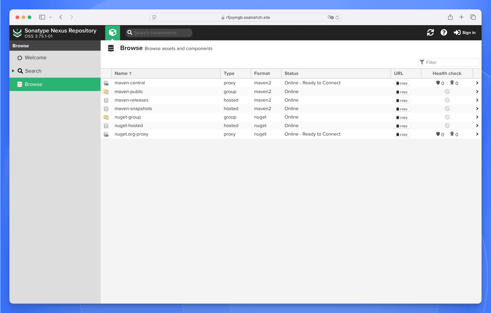

# 在 Sealos 上部署并托管 Nexus Repository

Sonatype Nexus Repository 是一款通用制品仓库管理器，可用于管理软件包与二进制制品。这个模板会在 Sealos Cloud 上以有状态服务（Stateful Service）的方式部署 Nexus Repository，并默认启用持久化存储与托管 Ingress。

## 关于在 Sealos 托管 Nexus Repository

Nexus Repository 可以把团队的制品管理集中起来，既能托管私有制品，也能代理上游仓库，还能为内部构建与发布提供可控的分发层。

该 Sealos 模板采用单实例 StatefulSet，并通过持久卷挂载 `/nexus-data`。同时，Sealos 会自动提供 HTTPS Ingress、公网访问地址，以及在 Canvas 中的全生命周期管理能力。

## 常见使用场景

- **私有制品托管**：集中存储团队内部 Maven、npm、Docker、NuGet、PyPI 等制品。
- **代理与缓存加速**：缓存外部仓库内容，加快构建速度，降低外网依赖。
- **CI/CD 制品管理**：在流水线中将 Nexus 作为统一的制品输入与输出中心。
- **依赖治理**：统一管控可用依赖版本，提升软件供应链可见性。

## Nexus Repository 托管依赖

该 Sealos 模板已包含运行 Nexus Repository 所需的核心依赖：

- Nexus 应用容器（`sonatype/nexus3`）
- `/nexus-data` 持久化存储
- Kubernetes Service 与 HTTPS Ingress

### 部署相关依赖链接

- [Nexus Repository Product Page](https://www.sonatype.com/products/sonatype-nexus-repository)
- [Nexus Public Source Repository](https://github.com/sonatype/nexus-public)
- [Sonatype Community](https://community.sonatype.com/)
- [Nexus Documentation](https://help.sonatype.com/en/nexus-repository-manager.html)

### 实现细节

**架构组件：**

该模板会部署以下组件：

- **Nexus StatefulSet**：主仓库服务，对外提供 `8081` 端口
- **Persistent Volume Claim（PVC）**：`1Gi` 持久化存储，挂载到 `/nexus-data`
- **Service**：提供集群内部访问入口
- **Ingress（NGINX）**：通过 Sealos 托管域名与证书提供公网 HTTPS 访问
- **App 资源**：在 Sealos 中生成应用入口与访问链接

**配置说明：**

- 模板默认单节点部署，适合中小规模场景与功能验证。
- 已预置资源限制与健康探针，保障启动与运行稳定性。
- 通过持久卷保存数据，Pod 重启后仍可保留仓库内容与配置。

**许可证信息：**

Nexus Repository Core 由 Sonatype 提供，基于 Eclipse Public License v1.0 发布。

## 为什么在 Sealos 上部署 Nexus Repository？

Sealos 是构建在 Kubernetes 之上的 AI 辅助云操作系统（Cloud Operating System），覆盖从开发到生产的完整流程。在 Sealos 上部署 Nexus，你可以获得：

- **一键部署**：无需手写 Kubernetes 清单即可快速启动 Nexus。
- **托管 HTTPS 访问**：自动分配公网域名并签发 TLS 证书。
- **易于定制**：可通过 AI 对话或资源卡片调整资源与运行配置。
- **内置持久化存储**：仓库数据与元数据可跨重启长期保留。
- **免运维复杂度**：享受 Kubernetes 可靠性，同时减少日常集群运维负担。
- **按量计费更高效**：按实际负载调整资源，优化成本投入。

## 部署指南

1. 打开 [Nexus template](https://sealos.io/products/app-store/nexus) 并点击 **Deploy Now**。
2. 在弹窗中配置部署参数并提交。
3. 等待部署完成（通常 2-3 分钟）。部署结束后会自动跳转到 Canvas。后续变更可通过 AI 对话描述需求，或点击资源卡片进行修改。
4. 在 Sealos 中使用生成的应用访问地址进入 Nexus。

## 初次登录与管理员密码

- 默认用户名：`admin`
- 初始密码由 Nexus 自动生成，保存在 `/nexus-data/admin.password`

在 Sealos 中获取初始密码的方法：

1. 部署完成后进入应用详情页。
2. 等待工作负载状态变为 `running`，然后查看 Pod 日志。
3. 在日志中确认出现 `Started Sonatype Nexus OSS`，表示启动完成。
4. 打开 Nexus Pod 的 **File Manager**。
5. 下载 `/nexus-data/admin.password`，文件内容即为登录密码。

## 配置

部署完成后，可通过以下方式管理 Nexus：

- **AI Dialog**：直接描述要调整的内容（资源、扩缩容或配置变更）。
- **Resource Cards**：在 Canvas 中点击 StatefulSet/Service/Ingress 资源卡片进行编辑。
- **Nexus 管理后台**：完成初始化后可进一步配置仓库、权限与策略。

## 扩缩容

如需调整 Nexus 资源：

1. 打开部署对应的 Canvas。
2. 点击 Nexus StatefulSet 资源卡片。
3. 调整 CPU/内存 Requests 与 Limits。
4. 在弹窗中提交变更。

## 故障排查

### 常见问题

**问题：使用 `admin` 无法登录**
- 原因：未从正确路径读取初始密码。
- 解决方案：在 Nexus Pod 文件管理中下载 `/nexus-data/admin.password` 后重试。

**问题：Nexus 启动较慢**
- 原因：首次启动需要初始化存储与内部组件。
- 解决方案：等待日志出现 `Started Sonatype Nexus OSS` 后再登录。

### 获取帮助

- [Nexus Documentation](https://help.sonatype.com/en/nexus-repository-manager.html)
- [GitHub Issues](https://github.com/sonatype/nexus-public/issues)
- [Sonatype Community](https://community.sonatype.com/)
- [Sealos Discord](https://discord.gg/wdUn538zVP)

## 更多资源

- [Nexus Public Repository](https://github.com/sonatype/nexus-public)
- [Nexus Community Edition Overview](https://www.sonatype.com/products/nexus-community-edition)
- [Sealos App Store](https://sealos.io/products/app-store)

## 许可证

该 Sealos 模板遵循当前仓库适用的开源条款。Nexus Repository Core 本身采用 Eclipse Public License v1.0。
