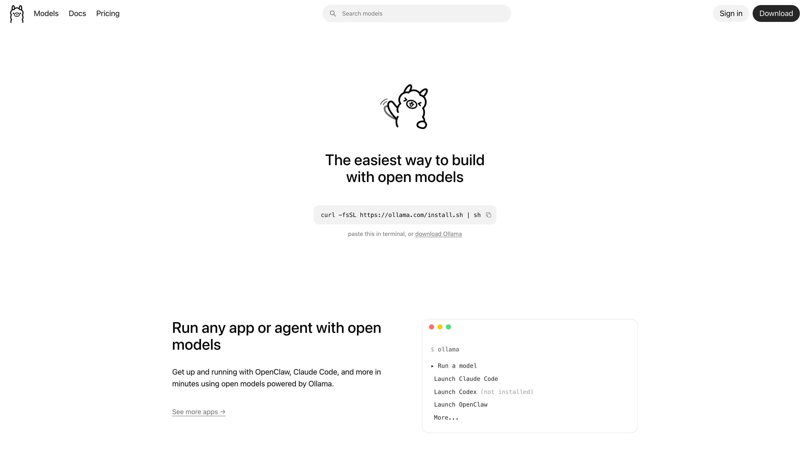

# 在 Sealos 上部署和托管 Ollama

Ollama 通过原生 REST API 和 OpenAI 兼容 API 运行开放模型。此 Sealos 模板部署官方 CPU 镜像，提供持久化模型存储和自动生成的 HTTPS 端点。



## 关于托管 Ollama

Ollama 将模型下载、运行时管理和生成 API 打包为单一服务。团队可以从 Ollama 模型库拉取模型，将模型文件保存在持久化卷中，并从内部工具、Agent、Notebook 或 OpenAI 兼容客户端调用同一个端点。

此模板以单副本 StatefulSet 运行 `ollama/ollama:0.32.5`。Sealos 会创建 Service、Ingress、持久化模型卷和 App 入口，让 API 可以通过自动生成的 HTTPS URL 访问。

## 常见使用场景

- **本地模型 API**：通过私有 API 端点运行轻量开放模型。
- **OpenAI 兼容测试**：将兼容 SDK 指向自动生成的 `/v1` 基础 URL。
- **Agent 后端**：为运行在 Sealos 上的工具和工作流提供文本生成能力。
- **模型评估**：拉取小模型、比较响应，并在 Pod 重启后保留模型文件。
- **原型部署**：先使用 CPU 配置起步，再为更大的模型服务架构调整资源。

## Ollama 托管依赖

此模板包含在 Sealos 上运行 Ollama API 所需的 Kubernetes 资源。

### 部署依赖

- [Ollama 文档](https://docs.ollama.com) - 产品和运行时文档
- [Ollama API 文档](https://docs.ollama.com/api/introduction) - 原生 REST API 参考
- [Ollama 模型库](https://ollama.com/library) - 可用模型名称和标签
- [Ollama 源代码仓库](https://github.com/ollama/ollama) - 源代码和版本历史

### 实现细节

**配置：**

- 使用官方 `ollama/ollama:0.32.5` 镜像。
- 通过 Sealos 托管 HTTPS Ingress 暴露 `11434` 端口。
- 将下载的模型和元数据保存到 `/root/.ollama`。
- 为模型存储挂载 `1Gi` `openebs-backup` 持久化卷。
- 使用 `/api/version` 作为启动、就绪和存活探针。
- 初始模型存储为空，用户可以按工作负载选择模型。

**许可证信息：**

Ollama 采用 MIT License。

## 为什么在 Sealos 上部署 Ollama？

- **一键 API 端点**：通过一个模板创建 StatefulSet、Service、Ingress、PVC 和 App 入口。
- **持久化模型缓存**：Pod 重启后继续保留已下载模型。
- **OpenAI 兼容访问**：复用支持 OpenAI 兼容基础 URL 的客户端。
- **简化运维**：从 Sealos Canvas 检查日志、资源使用、健康检查和网络。
- **CPU 友好基线**：从经过验证的轻量配置起步，并在模型需要更多容量时扩展资源。

## 部署指南

1. 打开 [Ollama 模板](https://sealos.io/products/app-store/ollama)，点击 **Deploy Now**。
2. 检查自动生成的应用名称和域名，然后开始部署。
3. 等待应用资源进入 Ready 状态。Sealos 通常会在 2-3 分钟内创建 StatefulSet、Service、Ingress、App 和 PVC；首次拉取 Ollama 镜像可能额外需要几分钟。
4. 打开生成的 App URL，或从 Sealos 应用详情中复制该地址。
5. 先通过 API 拉取模型，再发送首次生成请求。

App URL 指向 Ollama API。在浏览器中访问 `/` 会返回 `Ollama is running`。

## 使用 API

设置生成的 HTTPS 端点：

```bash
export OLLAMA_URL="https://<your-app>.usw-1.sealos.app"
```

检查部署版本和可用模型：

```bash
curl "$OLLAMA_URL/api/version"
curl "$OLLAMA_URL/api/tags"
```

拉取模板验证使用的轻量模型：

```bash
curl "$OLLAMA_URL/api/pull" \
  -H "Content-Type: application/json" \
  -d '{"model":"smollm2:135m","stream":false}'
```

生成回复：

```bash
curl "$OLLAMA_URL/api/generate" \
  -H "Content-Type: application/json" \
  -d '{
    "model": "smollm2:135m",
    "prompt": "What is 2 + 2?",
    "stream": false
  }'
```

OpenAI 兼容客户端可将 `$OLLAMA_URL/v1` 设置为基础 URL。

## 默认资源

| 资源 | 默认值 |
| --- | --- |
| CPU 限制 | `500m` |
| 内存限制 | `512Mi` |
| 模型存储 | `1Gi` |
| 副本数 | `1` |

该默认配置已在 Sealos 上使用 `smollm2:135m` 完成验证，其模型文件约为 271 MB。更大的模型需要足够的内存容纳权重和运行缓冲区；当模型文件超过可用空间时，还需要扩大持久卷。

## 存储和生命周期

StatefulSet 使用挂载到 `/root/.ollama` 的 `openebs-backup` 卷保存下载的模型和元数据。Pod 替换后会继续使用这些数据。删除模板实例及其 PVC 会移除已存储的模型。

## 安全

公开 HTTPS 端点会直接连接到 Ollama API。请将自动生成的域名视为敏感服务端点，并为共享部署配置带认证的网关、访问白名单或私有网络边界。

## 故障排查

### App URL 只返回 `Ollama is running`

该响应表示 API 进程可用。通过 `/api/pull` 拉取模型后，再调用 `/api/generate` 或 OpenAI 兼容 `/v1` 端点。

### 模型拉取速度较慢

较大的模型文件需要更多时间下载并写入持久化卷。建议从 `smollm2:135m` 这类轻量模型开始，再在拉取大模型前增加存储和内存。

### 拉取较大模型后生成失败

提高 StatefulSet 的内存限制。模型权重和运行缓冲区需要装入所选内存限制。

### 获取帮助

- [Ollama 文档](https://docs.ollama.com)
- [Ollama API 文档](https://docs.ollama.com/api/introduction)
- [Ollama GitHub Issues](https://github.com/ollama/ollama/issues)
- [Sealos Discord](https://discord.gg/wdUn538zVP)

## 更多资源

- [Ollama 官网](https://ollama.com)
- [Ollama 模型库](https://ollama.com/library)
- [源代码](https://github.com/ollama/ollama)

## 许可证

此模板遵循上游 [MIT License](https://github.com/ollama/ollama/blob/main/LICENSE)。
