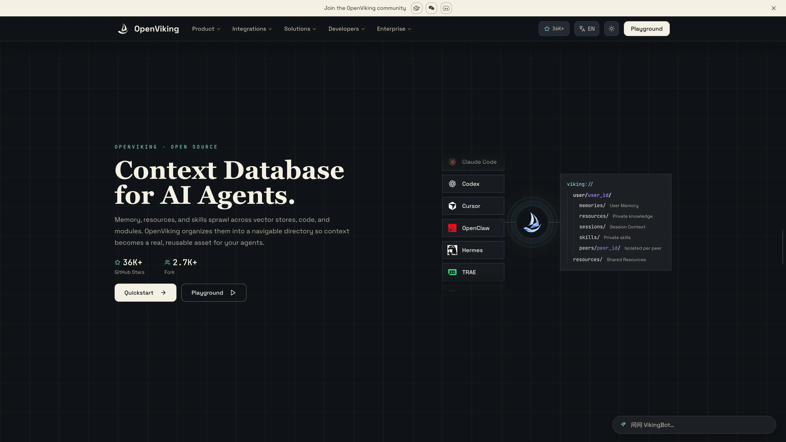

# Deploy and Host OpenViking on Sealos

OpenViking is a context database for AI agents that organizes memories, resources, and skills through a filesystem interface. This template deploys its API server and Web Studio on Sealos Cloud with persistent storage and optional managed S3 and Redis services.

## About Hosting OpenViking

OpenViking stores context under `viking://` URIs and generates summaries and vectors for semantic retrieval. Agents can use its HTTP API or SDK to maintain knowledge, record sessions, and retrieve relevant context. Web Studio provides a browser interface for resources, retrieval, sessions, and administration.

The template uses the official `ghcr.io/volcengine/openviking:v0.4.18` image. One application instance serves the API and Studio on port `1933`, with HTTPS access through Sealos. A persistent volume stores configuration, local vector indexes, authentication data, and application state. OpenAI-compatible embedding and language model services are required separately.

Context files use local storage by default. You can select private Sealos S3 storage for those files and independently select managed Redis for QueueFS. The application retains its persistent volume with either option.

## Common Use Cases

- **Agent knowledge bases**: Import documents and retrieve context with natural-language queries.
- **Persistent agent memory**: Organize user and agent context across sessions.
- **Skill libraries**: Store reusable instructions alongside the resources that support them.
- **Context inspection**: Use Studio to inspect files, search results, sessions, and processing tasks.

## Dependencies for OpenViking Hosting

The template includes OpenViking, Web Studio, persistent storage, and the selected managed storage services. Prepare credentials for an OpenAI-compatible embedding API and a compatible vision or language model API. Provider usage is billed separately; image processing requires a model that supports vision.

- [Official website](https://www.openviking.ai/)
- [Deployment guide](https://github.com/volcengine/OpenViking/blob/v0.4.18/docs/en/guides/03-deployment.md)
- [Configuration reference](https://github.com/volcengine/OpenViking/blob/v0.4.18/docs/en/guides/01-configuration.md)
- [Authentication guide](https://github.com/volcengine/OpenViking/blob/v0.4.18/docs/en/guides/04-authentication.md)
- [GitHub issues](https://github.com/volcengine/OpenViking/issues)

### Implementation Details

**Architecture Components:**

| Component | Configuration |
| --- | --- |
| OpenViking server and Studio | One StatefulSet replica; `100m` CPU and `512Mi` memory limits; `10m` CPU and `51Mi` memory requests |
| Application storage | `1Gi` persistent volume at `/app/.openviking`, including the local vector index |
| Context file storage | Local files by default; optional private Sealos S3 bucket |
| QueueFS | Persistent SQLite by default; optional KubeBlocks Redis 7.2.7 with one Redis and one Sentinel component |
| Optional Redis resources | Each managed component uses `500m` CPU, `512Mi` memory limits, and a `1Gi` data volume |
| Public access | HTTPS URL with Studio at `/studio/` and the API at `/api/v1/` |

The application resource profile targets personal use and small sequential operations. Increase CPU, memory, and storage for larger files, bulk ingestion, or concurrent users. Model concurrency starts at one. The official deployment uses a single replica because the local vector index requires exclusive access to its data directory.

## Why Deploy OpenViking on Sealos?

- **A single deployment form** configures the application and its optional managed services.
- **Persistent storage** preserves application data across pod restarts.
- **Managed HTTPS access** gives Studio and API clients a public endpoint.
- **Resource controls and logs** are available from the deployment Canvas and its resource cards.

## Deployment Guide

1. Open the [OpenViking template](https://sealos.io/products/app-store/openviking) and click **Deploy Now**.
2. Enter the model configuration and choose storage options in the deployment dialog:

   | Parameter | Value |
   | --- | --- |
   | `embedding_api_key` | Key for your embedding service |
   | `embedding_api_base` | OpenAI-compatible base URL, including `/v1` when your provider requires it |
   | `embedding_model` | Model available from that embedding endpoint; default `text-embedding-3-small` |
   | `embedding_dimension` | Positive integer matching the returned vector length; default `1536` |
   | `vlm_api_key` | Key for your vision or language model service |
   | `vlm_api_base` | Base URL for that model service |
   | `vlm_model` | Model for summaries and memory extraction; default `gpt-4o-mini` |
   | `enable_s3_storage` | Enable private Sealos S3 storage for context files; default `false` |
   | `enable_redis_queue` | Enable managed Redis for QueueFS; default `false` |

   Use each API key with its corresponding provider endpoint. Confirm the embedding model's actual vector dimension before deployment; model names alone do not establish the dimension.
3. Wait for deployment to complete, typically **2-3 minutes**. Initial image downloads or database provisioning can take longer. Readiness also checks the embedding provider. Sealos then opens the Canvas; use the AI dialog or relevant resource cards for later changes.
4. Open the application's public URL to reach **Web Studio** at `/studio/`, then complete the first access steps below. API clients use the same HTTPS origin with `/api/v1/` paths.

### First Access: Create an Account and Sign In

This template enables API key authentication. An administrator creates accounts and issues user API keys; Studio uses those keys as the sign-in credentials.

1. In the deployment Canvas, open the OpenViking application resource card and locate the generated `OPENVIKING_ROOT_API_KEY` environment variable. Keep this root key private.
2. Open Studio, select **EN** for the English interface, and go to **Connection Settings**. Keep **Server URL** set to the application's HTTPS origin. Paste the root key into **Root or Admin API Key**. Settings save automatically.
3. Open the account selector at the top left and choose **Create account**. Enter an **Account** name and **Initial admin user**, then click **Create and switch**. Studio creates the workspace, obtains its user key, and switches to that account. Copy the key from the **New API key** dialog and store it securely while it is displayed.
4. Confirm that the new account and user appear in Studio. Open **Sessions**, create a session, and add a message. Use **Retrieval** to search context after importing or writing a resource.
5. For another browser or a regular user, obtain a user key from the account administrator through **User Management** and paste it into **User API Key** in **Connection Settings**. User keys provide access to the associated account's data. The root key provides administrative access.

The [authentication guide](https://github.com/volcengine/OpenViking/blob/v0.4.18/docs/en/guides/04-authentication.md) also documents creating accounts and users through the Admin API. API clients authenticate with `X-API-Key: <user-key>` or `Authorization: Bearer <user-key>`.

## Configuration and Scaling

Model settings are supplied through the application's environment variables and `/app/.openviking/ov.conf`. Update them using the relevant Canvas resource cards, then restart the application to load the changed configuration. Keep the embedding model and vector dimension consistent with the existing index; plan an index rebuild when changing them.

Choose S3 and Redis options before the first deployment. S3 stores context files in a private bucket, and authenticated downloads pass through the OpenViking API. Redis stores QueueFS state; local vector indexes and other application state continue to use the persistent volume. Switching an existing storage backend requires a data migration plan.

Scale this deployment vertically by adjusting CPU, memory, and storage from its resource cards. Keep the application at one replica to match the local vector index's deployment requirements. Back up the persistent volume and any selected external storage before upgrades or migrations.

## Troubleshooting

- **The application stays unready**: Check logs and the embedding provider's URL, key, model availability, and vector dimension. `/ready` performs an actual embedding connectivity check.
- **Studio returns 401 or asks for a user key**: Verify the keys in Connection Settings. Use a user key belonging to the selected account for data operations; use the root or admin field for management credentials.
- **Context processing fails**: Inspect the model provider's quota and compatibility, then review the task and application logs. Increase resources for larger workloads.
- **Private S3 objects return 403 when opened directly**: Download them through OpenViking using the account's user API key.

## License

OpenViking is licensed under the [GNU Affero General Public License v3.0](https://github.com/volcengine/OpenViking/blob/v0.4.18/LICENSE).
