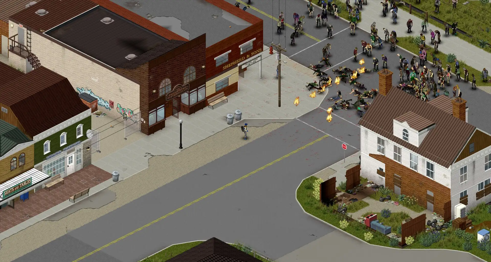

# Deploy and Host Project Zomboid on Sealos

Project Zomboid is a multiplayer zombie survival game. This template runs a persistent dedicated server on Sealos Cloud with Steam networking, private-world access, and RCON administration.

## About Hosting Project Zomboid

The deployment uses Danixu's `42.20.4-release` image, which bundles Project Zomboid 42.20.4 and its Java runtime. One server owns one world; saves, player accounts, server settings, and Workshop content are stored on persistent volumes.

Sealos provisions the server, storage, and public UDP/TCP endpoints. A small initialization container configures the allocated public UDP ports so the game advertises reachable endpoints. Players connect through the Project Zomboid client; administration uses the in-game administrator account or RCON.

## Common Use Cases

- **Private survival worlds:** Keep a persistent world available for friends between play sessions.
- **Cooperative campaigns:** Share a world with a server join password and individual player accounts.
- **World administration:** Inspect connected players, save progress, and manage a world through RCON.
- **Workshop experiments:** Test matching server/client mods in a dedicated world after increasing resources and storage.

## Dependencies for Project Zomboid Hosting

The image contains the dedicated server and Java runtime. The template includes persistent storage and a temporary Python initialization container. Project Zomboid stores its account database and world data locally on the world volume.

### Deployment Dependencies

- [Project Zomboid](https://projectzomboid.com/) — game information and client purchase.
- [Docker image documentation](https://github.com/Danixu/project-zomboid-server-docker) — image versions and server configuration.
- [Project Zomboid community](https://theindiestone.com/forums/) — game support and multiplayer discussions.

### Implementation Details

**Architecture Components:**

| Component | Purpose |
| --- | --- |
| Dedicated server | One StatefulSet replica running Project Zomboid 42.20.4 as user 1000. |
| Initialization container | Reads and patches only this instance's Service, then writes the allocated game ports and persistent server settings. |
| World volume | 1 GiB mounted at `/home/steam/Zomboid` for accounts, configuration, saves, and backups. |
| Workshop volume | 1 GiB mounted at `/home/steam/pz-dedicated/steamapps/workshop` for downloaded Workshop content. |
| Public networking | `game` UDP, `direct` UDP, and authenticated `rcon` TCP endpoints. |

**Configuration:** The world name is `sealos`, the player limit starts at 4, and public server-list advertising is disabled. The initialization step owns the port, join-password, RCON, public-list, player-limit, and UPnP settings; other saved INI options are preserved. Kubernetes sends the console `quit` command during shutdown and allows up to 120 seconds for saving.

**Verified low-load resources:**

| Container | CPU limit / request | Memory limit / request | Java heap |
| --- | --- | --- | --- |
| Dedicated server | 100m / 10m | 4096 MiB / 409 MiB | Initial 64m, maximum 2048m |
| Initialization | 100m / 10m | 128 MiB / 12 MiB | — |

These are the lowest tested Sealos ladder tiers for an empty, unmodded world. Validation covered cold startup, administrator creation and account reuse, public Steam/RakNet queries, RCON authentication, `players`, persistent `save`, and over 60 seconds of stable operation. Gameplay and multiplayer capacity require separate sizing. Cold startup took about 21 minutes at 100m CPU and about 10 minutes at 200m CPU.

Keep one replica for each world. Increase CPU, memory, Java `MAX_MEMORY`, and storage for active players, larger worlds, or mods. Leave room between the Java heap limit and the container memory limit for native game libraries and other runtime memory.

## Why Deploy Project Zomboid on Sealos?

[Sealos](https://sealos.io) provides a Kubernetes foundation with a one-click deployment flow and pay-as-you-go resources. Persistent volumes keep world data across server restarts, while resource cards expose logs, resource usage, and public network addresses.

After deployment, use the Canvas AI dialog to request changes or open the server's resource card to adjust its settings. This template keeps world ownership with a single server and supports vertical resource changes.

## Deployment Guide

1. Open the [Project Zomboid template](https://sealos.io/products/app-store/project-zomboid) and click **Deploy Now**.
2. Set `admin_username` and `admin_password`. Use ASCII letters and digits for the administrator name and a strong, single-line password. Optionally set `server_password`, which all joining players will need.
3. Resource creation typically takes 2-3 minutes. After deployment, open the Canvas and wait for the server to become **Running/Ready**. Image download and the first game/world startup take longer; the startup probe allows up to 30 minutes.
4. Open the server's resource card and its **Networks** section. Copy the public hostname and allocated external port for the `game` UDP entry. Keep the `direct` UDP endpoint enabled. Use the displayed external ports when connecting.
5. Start a matching Project Zomboid 42.20.4 client. Open **Join**, add a favorite server, and enter the public hostname and the `game` external port. Enter a player username and password in the account fields. Enter `server_password` in the separate server-password field when you configured it.
6. To administer the world, connect using the `admin_username` and `admin_password` entered at deployment. The administrator account is created during the first startup and stored on the world volume. Later administrator password changes should use the game's account-management commands; changing the deployment's bootstrap password leaves the existing account unchanged.

The `game` and `direct` Service ports appear as 16261 and 16262 inside the resource definition. Sealos assigns the external ports and the initializer synchronizes the actual game listeners with those assignments. The `rcon` entry maps an allocated external TCP port to the server's TCP port 27015.

## Configuration

### RCON administration

Retrieve `RCONPASSWORD` from the server's environment settings in its resource card. It is generated independently of the game administrator password and server join password. Use an RCON client with the displayed public hostname and the external TCP port from the `rcon` network entry. Authenticate with `RCONPASSWORD`, then use commands such as `players` and `save`.

Keep this RCON credential private and share player credentials separately. RCON exposes server-administration commands; use a trusted network when managing the server.

### Saves, settings, and mods

Server configuration lives at `/home/steam/Zomboid/Server/sealos.ini`, and game data remains under `/home/steam/Zomboid`. Back up the world volume before changing versions or mods. To add Workshop content, configure the matching `WorkshopItems` and `Mods` settings, ensure every client uses the same content, and expand the Workshop volume for the download size.

The game binaries remain in the versioned image. Upgrade by choosing a compatible image tag after backing up the world, then verify client compatibility and the saved world before resuming play.

## Troubleshooting

- **Startup takes several minutes:** Inspect the logs for world initialization progress. At low CPU limits, a fresh world takes substantially longer than resource creation. Wait for readiness before joining.
- **Java heap error or OOMKilled:** Increase the container memory limit and adjust `MAX_MEMORY` while reserving memory for native libraries. Increase CPU when startup or game commands time out under load.
- **Join fails:** Verify the client version, the `game` external UDP port, both enabled UDP entries, and the separate account/server passwords. Copy addresses from the current deployment's Networks section.
- **Administrator login fails after changing an input:** The account is persisted from first startup. Use its existing password or the game's documented account-management workflow.
- **Map metadata diagnostics:** The bundled game can emit mannequin-zone and room-metaID messages matching an [upstream report](https://theindiestone.com/forums/topic/98551-maniqui-and-basements-error/). This validation completed world reload, RCON operations, and saving. Keep backups and follow upstream game fixes.
- **World or mod storage fills:** Expand the relevant persistent volume and review old backups before adding more content.

For image issues, use the [upstream issue tracker](https://github.com/Danixu/project-zomboid-server-docker/issues). For game support, use the [official community forums](https://theindiestone.com/forums/).

## License

This template follows the [Sealos templates repository license](https://github.com/labring-actions/templates#-license). The upstream Docker packaging is distributed under [GPL-3.0](https://github.com/Danixu/project-zomboid-server-docker/blob/main/LICENSE). Project Zomboid is a commercial game by The Indie Stone; players need their own game license.
