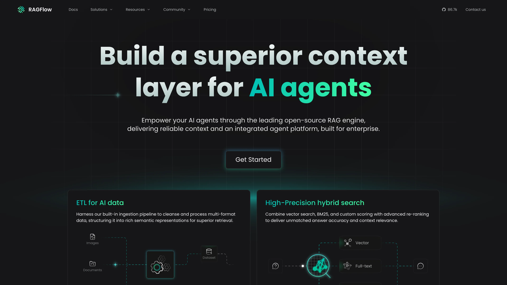

# 在 Sealos 上部署和托管 RAGFlow

RAGFlow 是一个面向文档理解、知识库和 AI Agent 的开源检索增强生成引擎。此模板在 Sealos 上部署 RAGFlow 0.26.4，并配套托管的 MySQL、Redis、Infinity 和私有 S3 兼容对象存储。

## 关于托管 RAGFlow

RAGFlow 将文档摄取、解析、检索、Agent 工作流和交互式 Web 界面整合在一起。用户可以将文件组织成知识库，连接语言模型与嵌入模型，并构建从上传内容中检索可靠上下文的应用。

此模板遵循官方基于 Infinity 的运行拓扑。Sealos 通过 KubeBlocks 配置 MySQL 和 Redis，运行 Infinity 文档引擎，为上传文件创建私有对象存储桶，并通过 HTTPS 端点发布 RAGFlow 界面。

## 常见使用场景

- **文档问答**：基于手册、报告、政策和研究资料构建知识库。
- **Agent 上下文层**：为 AI Agent 提供可搜索且有来源依据的上下文。
- **知识管理**：在自托管界面中集中管理团队文件和检索工作流。
- **RAG 原型验证**：比较解析、分块、检索和模型配置。
- **私有 AI 应用**：将应用数据保存在独立的 Sealos 部署中。

## RAGFlow 托管依赖

Sealos 模板包含所选 RAGFlow 版本所需的完整存储和服务拓扑。

### 部署依赖

- [RAGFlow 文档](https://ragflow.io/docs/dev/) - 产品与管理文档
- [RAGFlow 源代码仓库](https://github.com/infiniflow/ragflow) - 源代码和版本发布
- [Infinity 源代码仓库](https://github.com/infiniflow/infinity) - 文档引擎源代码和文档
- [模型提供商配置](https://ragflow.io/docs/dev/configurations#model-providers) - 语言模型和嵌入模型配置

### 实现细节

**架构组件：**

- **RAGFlow**：运行 `infiniflow/ragflow:v0.26.4`，提供 Web 界面和 API，并执行摄取任务。
- **Infinity**：运行 `infiniflow/infinity:v0.7.0`，使用 `1Gi` 持久化数据卷。
- **MySQL**：使用 Sealos 托管的 KubeBlocks MySQL 8.0 集群存储应用元数据。
- **Redis**：使用带 Sentinel 的 Sealos 托管 KubeBlocks Redis 7.2 集群。
- **对象存储**：使用私有 Sealos S3 兼容存储桶保存上传文件内容。
- **HTTPS Ingress**：通过带托管 TLS 的 Sealos 域名发布 RAGFlow。

**运行配置：**

- `REGISTER_ENABLED=1` 开启用户注册。
- `DOC_ENGINE=infinity` 选择模板内置的 Infinity 服务。
- RAGFlow 从平台托管的 Secret 获取 MySQL、Redis 和对象存储凭据。
- 持久生成的 `SECRET_KEY` 让浏览器会话在 Pod 重启后继续有效。
- 启动、就绪和存活探针使用 `/api/v1/system/healthz`。
- Ingress 默认接受最大 `32Mi` 的上传文件。

**许可证信息：**

RAGFlow 和 Infinity 均采用 Apache License 2.0。

## 为什么在 Sealos 上部署 RAGFlow？

- **一键创建完整拓扑**：通过一个模板配置 RAGFlow、数据库、文档引擎、存储和 HTTPS。
- **托管数据服务**：使用 KubeBlocks 管理 MySQL 和 Redis，并自动注入凭据。
- **私有对象存储**：将上传文件保存在独立的 S3 兼容存储桶中，限制匿名访问。
- **持久化文档引擎**：Infinity 数据在 Pod 重启后继续保存在持久化卷中。
- **可视化运维**：通过 Sealos Canvas 检查日志、健康状态、网络和资源使用量。
- **经过验证的初始资源**：使用针对个人低负载场景完成实测的资源配置。

## 部署指南

1. 打开 [RAGFlow 模板](https://sealos.io/products/app-store/ragflow)，点击 **立即部署**。
2. 检查自动生成的应用名称和域名，然后开始部署。
3. 等待所有资源进入 Ready 状态。Sealos 通常会在 2-3 分钟内创建应用资源，随后继续拉取体积较大的 RAGFlow 镜像并启动服务；首次完整部署通常需要 10-15 分钟。在经过验证的 `200m` CPU 限制下，RAGFlow Pod 的启动过程约需 7 分钟。
4. 从 App 资源打开自动生成的 RAGFlow URL。
5. 创建账户并登录，然后配置模型提供商，再创建知识库或 Agent。

## 注册和登录

1. 打开自动生成的 RAGFlow URL。
2. 在登录页面选择 **Sign up**。
3. 输入昵称、电子邮箱和密码，然后提交注册表单。
4. 在 **Sign in** 表单中使用同一邮箱和密码登录。
5. 在导航中选择 **File**，上传和管理源文档。

注册数据保存在托管的 MySQL 集群中。自动生成的应用密钥让认证会话在常规 RAGFlow Pod 替换后继续有效。

## 配置模型提供商

RAGFlow 启动后，应用服务和存储即可使用。运行文档解析、检索或聊天工作流前，请添加语言模型和嵌入模型：

1. 登录 RAGFlow。
2. 打开用户菜单并选择 **Model providers**。
3. 选择支持的提供商，输入 API 凭据和端点。
4. 添加或选择嵌入模型和聊天模型。
5. 创建知识库、上传文档、配置解析方式并开始摄取。

提供商凭据属于 RAGFlow 应用状态的一部分。请使用 Sealos 集群能够访问的提供商端点。

## 默认资源

| 组件 | CPU 限制 | 内存限制 | 持久化存储 |
| --- | ---: | ---: | ---: |
| RAGFlow | `200m` | `4096Mi` | 上传文件使用私有对象存储 |
| Infinity | `100m` | `128Mi` | `1Gi` |
| MySQL | `500m` | `512Mi` | `1Gi` |
| Redis | `500m` | `512Mi` | 每个数据组件 `1Gi` |

线上验证确定了 RAGFlow 的资源边界：`2048Mi` 会触发 OOM 终止，`100m` CPU 会超过 Deployment 进度期限。选定的 `200m/4096Mi` 配置完成了冷启动、登录、认证文件列表、私有对象存储上传与下载 SHA-256 一致性校验、删除操作和 60 秒稳定窗口，重启次数为零。

Infinity 在 Sealos 最低资源阶梯 `100m/128Mi` 下通过冷启动和多次文档引擎健康检查，观测内存约为 `92Mi`，重启次数为零。

## 存储和生命周期

RAGFlow 将上传文件的字节内容写入私有 Sealos 对象存储桶。MySQL 保存账户和应用元数据，Redis 提供运行时状态，Infinity 将文档引擎数据保存在持久化卷中。

删除完整模板实例会一并删除托管资源，包括对象存储桶和持久化数据。删除实例前，请导出重要的知识库内容和配置。

## 扩展

默认拓扑使用一个 RAGFlow 副本和一个 Infinity 副本，与所选官方运行配置保持一致。通过 Deployment 和 StatefulSet 资源卡提高 CPU 与内存，可加快启动、解析和检索。请让副本数量与官方 RAGFlow 拓扑保持一致；引入额外应用副本前，请验证共享状态行为。

## 故障排查

### 部署期间公共 URL 返回 502

RAGFlow 会先初始化 Python 服务和模型提供商表，然后健康端点进入就绪状态。当 Pod 仍处于启动探针窗口时，请保持部署继续运行。默认 CPU 限制下，缓存镜像的冷启动约需 7 分钟，首次镜像拉取还会增加几分钟。

### 注册或登录失败

确认 RAGFlow Pod、MySQL 集群和 Redis 集群均为 Ready。检查 RAGFlow 日志中的数据库连接信息，然后使用有效邮箱和注册时设置的密码重试。

### 文件上传失败

默认 Ingress 上传限制为 `32Mi`。上传更大文件时，提高 Ingress 上的 `nginx.ingress.kubernetes.io/proxy-body-size`，并让该值保持在 RAGFlow 应用上传限制内。确认对象存储桶及其托管 Secret 均已就绪。

### 知识库解析或聊天无法启动

在 **Model providers** 中配置可访问的聊天模型和嵌入模型。解析和生成工作流需要有效的提供商凭据和兼容的模型选择。

### 响应速度较慢

默认资源面向个人低负载场景。将 RAGFlow CPU 限制提高到 `500m`、`1` 或更高，可以加快启动和摄取；更大的索引或并发检索工作负载可以提高 Infinity 资源。

### 获取帮助

- [RAGFlow 文档](https://ragflow.io/docs/dev/)
- [RAGFlow GitHub Issues](https://github.com/infiniflow/ragflow/issues)
- [Sealos Discord](https://discord.gg/wdUn538zVP)

## 更多资源

- [RAGFlow 官网](https://ragflow.io/)
- [RAGFlow 配置指南](https://ragflow.io/docs/dev/configurations)
- [支持的模型](https://ragflow.io/docs/dev/supported_models)
- [源代码](https://github.com/infiniflow/ragflow)

## 许可证

此模板遵循上游 [Apache License 2.0](https://github.com/infiniflow/ragflow/blob/main/LICENSE)。
