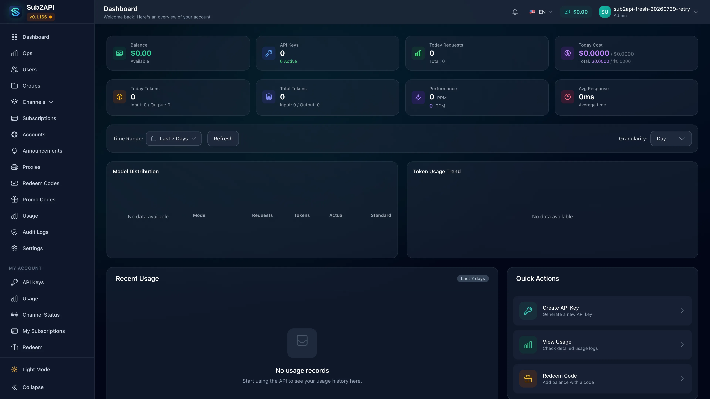

# 在 Sealos 上部署和托管 Sub2API

Sub2API 是一套自托管 AI API 网关，用于管理上游账号、API 密钥、额度、路由与用量。这个模板会在 Sealos Cloud 上部署 Sub2API、PostgreSQL、Redis、持久化存储、公网 HTTPS 入口，并可选配私有 S3 兼容对象存储。

## 关于在 Sealos 上托管 Sub2API

Sub2API 把 AI 服务订阅接入与 API 分发集中到同一个控制平面。管理员可以通过 Web 控制台管理上游账号、分组、订阅、计费策略、API 密钥、用量记录与服务健康状态。

模板会准备完整运行栈。PostgreSQL 保存业务数据，Redis 提供缓存与协调能力，独立持久卷保存 `/app/data`。依赖检查容器会等 PostgreSQL 与 Redis 开始接受连接后再启动 Sub2API，Sealos 同时提供公网域名与 TLS 证书。

Sub2API 还为异步生图结果提供 S3 兼容存储方案。开启对象存储选项后，模板会创建一个私有 Sealos 对象存储桶，并把托管端点与凭据直接注入应用。

## 常见使用场景

- **统一 AI 网关**：让受支持的 AI 客户端通过同一个托管入口访问服务。
- **账号与额度运营**：汇集上游账号，并按用户或分组分配容量。
- **API 密钥管理**：在同一个控制台中签发密钥、控制访问并查看用量。
- **订阅运营**：管理套餐、余额、兑换码与计费策略。
- **异步生图工作流**：把生成的图片结果保存到私有 S3 兼容存储桶。

## Sub2API 托管依赖

模板包含 Sub2API `0.1.166`、PostgreSQL `16.4.0`、Redis `7.2.7`、持久卷、HTTPS Ingress，以及可选的 Sealos 对象存储桶。

### 部署依赖与参考资料

- [Sub2API 仓库](https://github.com/Wei-Shaw/sub2api) - 上游源码与项目文档
- [Sub2API v0.1.166 版本](https://github.com/Wei-Shaw/sub2api/releases/tag/v0.1.166) - 模板使用的容器版本
- [异步生图任务文档](https://github.com/Wei-Shaw/sub2api/blob/v0.1.166/docs/ASYNC_IMAGE_TASKS.md) - S3 兼容图片结果存储
- [PostgreSQL 文档](https://www.postgresql.org/docs/) - 数据库参考
- [Redis 文档](https://redis.io/docs/latest/) - Redis 参考
- [Sealos 文档](https://sealos.io/docs) - 平台文档

## 实现细节

### 架构组件

- **Sub2API**：1 个 `StatefulSet` 副本，运行 `weishaw/sub2api:0.1.166`，服务端口为 `8080`。
- **依赖检查**：带资源上限的 init container 会等待可用的 PostgreSQL 与 Redis 端点。
- **应用存储**：挂载到 `/app/data` 的 `1Gi` 持久卷。
- **PostgreSQL**：1 个 KubeBlocks PostgreSQL `16.4.0` 组件，配有 `1Gi` 持久存储。
- **数据库初始化**：幂等 Job 会在 PostgreSQL 可用后创建 `sub2api` 数据库。
- **Redis**：KubeBlocks Redis `7.2.7` replication 拓扑，包含 1 个 Redis 组件与 1 个 Sentinel 组件，并各自使用持久存储。
- **对象存储**：用于异步生图结果的可选私有 `ObjectStorageBucket`。
- **公网访问**：由 Sealos 托管的 HTTPS Ingress 与 Canvas 应用入口。

### 资源规格

| 组件 | 副本数 | CPU 上限 | 内存上限 | 存储 |
| --- | ---: | ---: | ---: | ---: |
| Sub2API | 1 | `100m` | `128Mi` | `1Gi` |
| 依赖检查 | 每次启动 1 个 | `100m` | `128Mi` | - |
| PostgreSQL 初始化 Job | 每次部署 1 个 | `100m` | `128Mi` | - |
| PostgreSQL | 1 | `500m` | `512Mi` | `1Gi` |
| Redis | 1 | `500m` | `512Mi` | `1Gi` |
| Redis Sentinel | 1 | `500m` | `512Mi` | `1Gi` |

### 模板参数

| 参数 | 必填 | 用途 |
| --- | --- | --- |
| `admin_email` | 是 | 初始管理员邮箱 |
| `admin_password` | 是 | 初始管理员密码，至少 8 个字符 |
| `enable_s3_storage` | 否 | 为异步生图结果创建并连接私有 Sealos 存储桶 |
| `timezone` | 否 | 应用时区，默认 `Asia/Shanghai` |
| `run_mode` | 否 | 可选 `standard` 或 `simple` |
| Gemini 与 Antigravity 参数 | 否 | 特定厂商的 OAuth 与客户端配置 |
| 安全白名单参数 | 否 | 上游 URL 校验策略 |
| `update_proxy_url` | 否 | 更新检查与 GitHub 访问代理 |

模板会为每次部署生成固定的 `JWT_SECRET` 与 `TOTP_ENCRYPTION_KEY`。数据库与对象存储凭据由 Sealos 托管 Secret 提供。

### 健康检查与存储行为

- `GET /health` 通过 `8080` 端口报告应用健康状态。
- `AUTO_SETUP=true` 会初始化数据库并创建首个管理员。
- 可选 S3 分支会设置 `IMAGE_STORAGE_ENABLED=true`，采用 path-style 访问，并把图片对象保存到 `images/` 前缀。
- 默认本地分支会设置 `IMAGE_STORAGE_ENABLED=false`。
- 存储桶策略为私有，应用通过签名 URL 控制对象访问。

## 为什么选择 Sealos 部署 Sub2API？

- **统一部署流程**：一次启动应用、数据服务、存储与 Ingress。
- **托管凭据**：Sealos 创建数据库与对象存储凭据，并注入对应工作负载。
- **数据持久化**：PostgreSQL、Redis 与应用数据均使用持久卷。
- **可选对象存储**：通过表单开关为官方支持的图片工作流添加私有 S3 兼容存储。
- **公网 HTTPS 入口**：Sealos 提供域名、Ingress 与 TLS 证书。
- **Canvas 运维**：在同一个部署视图中查看日志、资源健康、存储与配置。

## 部署指南

1. 打开 [Sub2API 模板](https://sealos.io/products/app-store/sub2api)，点击 **Deploy Now**。
2. 填写 `admin_email`，并设置至少 8 个字符的 `admin_password`。
3. 选择时区与运行模式。异步生图结果需要私有 Sealos 存储桶时，开启 `enable_s3_storage`。
4. 按实际环境填写厂商 OAuth、URL 白名单或更新代理参数。
5. 开始部署，等待 PostgreSQL、Redis、数据库初始化 Job 与 Sub2API 全部进入健康状态。这个过程通常需要几分钟。
6. 打开 Canvas 中显示的应用地址。

## 登录与用户接入

1. 打开应用地址，Sub2API 会显示登录页面。
2. 使用部署时填写的 `admin_email` 与 `admin_password` 登录。
3. 首次管理员会话中，阅读部署与运营合规提示，逐字输入 Sub2API 页面显示的确认短语，然后进入控制台。
4. 通过 **用户管理 > 创建用户** 添加受控用户。应用设置中可以管理公开注册策略。

首个管理员会在首次启动时自动创建。复用已有数据卷时，PostgreSQL 会保留已经创建的管理员。

## 配置说明

上游账号、分组、订阅、API 密钥、用量、公告与服务设置都在 Sub2API 控制台中管理。工作负载资源、持久卷、日志、域名与环境配置则通过 Sealos Canvas 管理。

开启 S3 存储后，应用会自动获得私有存储桶配置。打开 **管理后台 > 备份**，可以查看当前异步生图存储配置并执行连接测试。

## 扩缩容

当前资源规格适合空闲或评估环境。随着流量、并发请求、后台任务或账号数量增长，可以在 Canvas 中提高 Sub2API 的 CPU 与内存。

当前 `/app/data` 使用单个 `ReadWriteOnce` 持久卷，应用副本数应保持现有配置。设计多副本部署前，请先评估 Sub2API 的存储与会话要求。

## 故障排查

### 应用地址仍处于启动状态

PostgreSQL 与 Redis 初始化通常需要几分钟。请在 Canvas 中检查两个 KubeBlocks 集群、PostgreSQL 初始化 Job 与 Sub2API `StatefulSet`。

### 管理员登录失败

请使用部署表单中填写的邮箱与密码。密码区分大小写，长度至少为 8 个字符。

### 控制台停留在合规确认页面

请按页面当前语言与空格逐字输入确认短语。

### 异步生图存储不可用

请确认部署时已开启 `enable_s3_storage`。进入 Sub2API 的 **管理后台 > 备份**，查看图片存储配置并运行连接测试。

### 原始对象地址返回授权错误

这是私有存储桶的预期行为。请通过应用提供的签名 URL 流程访问图片结果。

### 获取帮助

- [Sub2API Issues](https://github.com/Wei-Shaw/sub2api/issues)
- [Sealos 文档](https://sealos.io/docs)
- [Sealos Discord](https://discord.gg/wdUn538zVP)

## 许可证

Sub2API 采用 [GNU Lesser General Public License v3.0 或更高版本](https://github.com/Wei-Shaw/sub2api/blob/v0.1.166/LICENSE)。这个 Sealos 模板按 templates 仓库的许可证分发。
