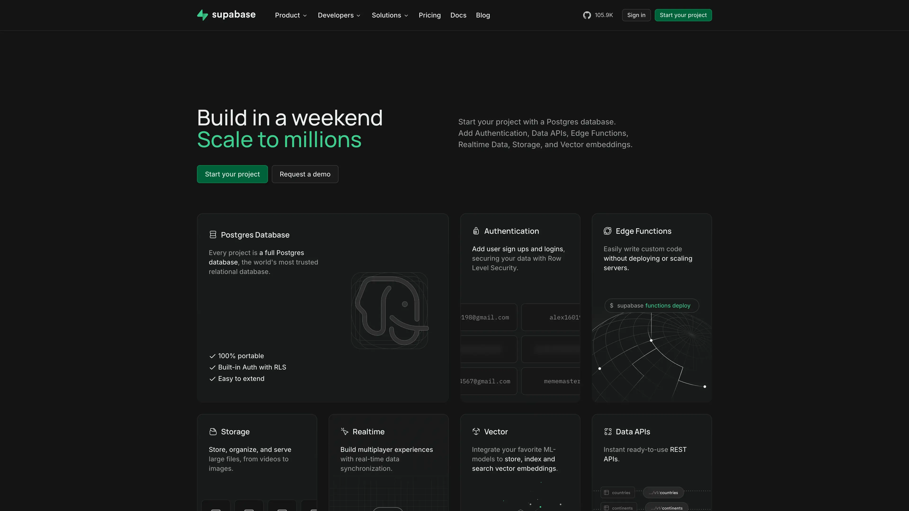

# Deploy and Host Supabase on Sealos

Supabase is an open source backend platform that combines PostgreSQL, authentication, realtime subscriptions, storage, and edge functions. This template deploys a production-ready Supabase stack with managed PostgreSQL and API gateway routing on Sealos Cloud.



## About Hosting Supabase

Supabase in this template runs as a multi-service architecture behind Kong. Studio provides the web console, while Auth, REST, Realtime, Storage, and Edge Functions are exposed through a single public domain with path-based routing. Imgproxy runs as a sidecar in the Storage pod so local files remain available to image transformations through one shared volume.

The deployment automatically provisions a PostgreSQL cluster through Kubeblocks, initializes required Supabase schemas and roles with a bootstrap job, enables logical WAL through a managed cold restart, and wires credentials through Kubernetes secrets. The Storage service supports two documented backends: local files on a persistent volume, or a private Sealos `ObjectStorageBucket` selected with `enable_s3_storage=true`.

Sealos also handles ingress, TLS, public domain access, and lifecycle operations in Canvas, so you can focus on product development instead of cluster plumbing.

## Common Use Cases

- **SaaS Backends**: Build full backend services with PostgreSQL, auth, and APIs from one stack.
- **Mobile App Backends**: Provide authentication, data APIs, and file storage for iOS and Android apps.
- **Realtime Dashboards**: Stream database changes to web clients using realtime channels.
- **Internal Tools**: Ship admin tools with role-based access and SQL-backed APIs.
- **Edge API Logic**: Run custom TypeScript functions close to your data with Supabase Edge Functions.

## Dependencies for Supabase Hosting

The Sealos template includes all required dependencies from the current Supabase self-hosted Compose release: Studio `2026.07.07-sha-a6a04f2`, Kong `3.9.1`, GoTrue `v2.189.0`, PostgREST `v14.12`, Realtime `v2.102.3`, Storage API `v1.60.4`, Imgproxy `v3.30.1`, Postgres Meta `v0.96.6`, Edge Runtime `v1.74.0`, Logflare `1.43.1`, Vector `0.53.0-alpine`, Supavisor `2.9.5`, and a managed PostgreSQL 16.4 cluster.

### Deployment Dependencies

- [Supabase Documentation](https://supabase.com/docs) - Official docs and product guides
- [Supabase Self-Hosting Guide](https://supabase.com/docs/guides/self-hosting) - Self-hosting concepts and architecture
- [Supabase GitHub Repository](https://github.com/supabase/supabase) - Source code and release information
- [Supabase Auth Docs](https://supabase.com/docs/guides/auth) - Authentication setup and providers
- [Supabase Storage Docs](https://supabase.com/docs/guides/storage) - Bucket and object storage usage
- [Supabase S3 Storage Guide](https://supabase.com/docs/guides/self-hosting/self-hosted-s3) - Local and S3 backend configuration
- [Supabase Edge Functions Docs](https://supabase.com/docs/guides/functions) - Serverless function development

### Implementation Details

**Architecture Components:**

This template deploys the following services:

- **Supabase Studio**: Web dashboard for project management and SQL tooling (port `3000`).
- **Kong Gateway**: Unified API entrypoint and route management for all Supabase APIs (ports `8000` and `8443`).
- **Auth (GoTrue)**: Authentication and user management APIs (`/auth/v1/*`).
- **REST (PostgREST)**: PostgreSQL-backed REST and GraphQL endpoints (`/rest/v1/*`, `/graphql/v1`).
- **Realtime**: WebSocket and realtime API endpoints (`/realtime/v1/*`).
- **Storage API**: Object and file operations (`/storage/v1/*`) with local persistent storage or the conditional Sealos S3 backend.
- **Imgproxy**: Image transformation sidecar in the Storage pod; it shares the local Storage volume and listens on port `5001`.
- **Postgres Meta**: Metadata and admin API used by Studio (`/pg/*` via gateway).
- **Edge Functions Runtime**: Deno-based function runtime exposed at `/functions/v1/*`.
- **Analytics (Logflare) + Vector**: Internal telemetry pipeline used by Studio and platform logs.
- **Supavisor**: PostgreSQL connection pooling service (ports `5432` and `6543`).
- **PostgreSQL (Kubeblocks)**: Persistent database cluster plus init and restart jobs that prepare Supabase roles, schemas, and logical WAL.

**Configuration:**

- Required input parameters:
  - `jwt_secret`: JWT signing secret used by Auth, REST, Studio, and Storage.
  - `anon_key`: Anonymous API key signed by `jwt_secret`.
  - `service_role_key`: Service role API key signed by `jwt_secret`.
  - `dashboard_username`: Username for the Studio HTTP Basic Auth prompt; the default is `supabase`.
  - `dashboard_password`: Password you set for the Studio HTTP Basic Auth prompt.
- Optional storage input:
  - `enable_s3_storage=false` stores objects under `/var/lib/storage` on one 1 GiB PVC shared by Storage API and Imgproxy.
  - `enable_s3_storage=true` provisions a private Sealos `ObjectStorageBucket`, injects its S3 credentials, and removes the Storage PVC from the rendered topology.
- Public access defaults to `https://<app-name>-kong.<your-sealos-domain>`.
- Studio dashboard traffic is protected by HTTP Basic Auth through Kong. Use the `dashboard_username` and `dashboard_password` entered during deployment.
- Email signup is enabled with automatic confirmation by default, so `/auth/v1/signup` returns a usable session without an SMTP server. Configure SMTP and set `GOTRUE_MAILER_AUTOCONFIRM=false` when production accounts require email verification.
- SMTP, signup behavior, JWT expiry, storage backend settings, and pooler limits are configurable via environment variables in Canvas.
- Persistent volumes are created for PostgreSQL data, shared Storage/Imgproxy files, Studio snippets/functions, and Edge Runtime cache.

Generate a unique, matching legacy JWT key set before deployment. The official Supabase Docker helper writes the required values to `docker/.env`:

```bash
git clone --depth 1 https://github.com/supabase/supabase.git
cd supabase/docker
cp .env.example .env
sh ./utils/generate-keys.sh
```

Copy `JWT_SECRET`, `ANON_KEY`, and `SERVICE_ROLE_KEY` from `.env` into `jwt_secret`, `anon_key`, and `service_role_key`. Keep `service_role_key` on trusted server-side systems because it bypasses Row Level Security.

**License Information:**

Supabase is open source and distributed under component-specific licenses (many Supabase repositories use Apache-2.0). Review the upstream repositories for exact license terms of each component.

## Why Deploy Supabase on Sealos?

Sealos is an AI-assisted Cloud Operating System built on Kubernetes that unifies development, deployment, and operations. By deploying Supabase on Sealos, you get:

- **One-Click Deployment**: Launch a full Supabase stack without manually assembling multiple services.
- **Kubernetes Reliability**: Get Kubernetes orchestration, health checks, and service discovery by default.
- **Pay-as-You-Go Efficiency**: Start with small resources and scale only when traffic grows.
- **Built-In HTTPS Access**: Receive an automatic public domain with SSL certificates.
- **Persistent Storage Included**: Keep database and object data durable across restarts.
- **Easy Customization**: Update env vars, resources, and replicas through Canvas dialogs.
- **AI-Assisted Operations**: Describe desired changes in the AI dialog for faster day-2 operations.

Deploy Supabase on Sealos and focus on shipping features instead of managing infrastructure.

## Deployment Guide

1. Open the [Supabase template](https://sealos.io/products/app-store/supabase) and click **Deploy Now**.
2. Configure the parameters in the popup dialog:
   - Generate a unique key set with the official helper above.
   - Enter the matching `JWT_SECRET`, `ANON_KEY`, and `SERVICE_ROLE_KEY` values in `jwt_secret`, `anon_key`, and `service_role_key`.
   - Set a memorable `dashboard_username` and a strong `dashboard_password` for Studio.
   - Keep defaults for other values unless you have specific networking or auth requirements.
3. Wait for deployment to complete (typically 2-3 minutes). After deployment, you will be redirected to the Canvas. For later changes, describe your requirements in the AI dialog or edit resource cards directly.
4. Access your application via the generated public URL:
   - **Studio Dashboard**: `https://<app-name>-kong.<your-sealos-domain>/`
   - **REST API**: `https://<app-name>-kong.<your-sealos-domain>/rest/v1/`
   - **Auth API**: `https://<app-name>-kong.<your-sealos-domain>/auth/v1/`
   - **Realtime API**: `https://<app-name>-kong.<your-sealos-domain>/realtime/v1/`
   - **Storage API**: `https://<app-name>-kong.<your-sealos-domain>/storage/v1/`
   - **Edge Functions API**: `https://<app-name>-kong.<your-sealos-domain>/functions/v1/`

### Studio login and first actions

1. Open the Studio URL. In the browser Basic Auth prompt, enter the `dashboard_username` and `dashboard_password` chosen during deployment.
2. In **Table Editor**, create a table such as `notes` with a text column, then insert one row. This confirms Studio, PostgREST, and PostgreSQL migrations are ready.
3. In **SQL Editor**, run `select * from notes;` and confirm the inserted row is returned.
4. In **Storage**, create a private bucket, upload a small file, download it, and compare its contents. Keep the bucket private when testing anonymous access.

When `enable_s3_storage=true`, the upload and download flow uses the private Sealos Object Storage bucket. Anonymous requests to the raw bucket endpoint remain restricted; use the Storage API or a time-bounded signed URL for delivery.

## Configuration

After deployment, you can configure Supabase through:

- **AI Dialog**: Describe updates such as changing auth behavior or adjusting resources.
- **Resource Cards**: Modify environment variables, CPU/memory, and replica counts for each service.
- **Studio UI**: Manage tables, SQL, auth users, and storage buckets.

Recommended post-deployment checks:

- Replace placeholder SMTP values if you need production email flows.
- Disable automatic email confirmation after production SMTP is configured and verified.
- Confirm `GOTRUE_DISABLE_SIGNUP`, phone/email signup options, and redirect allow list fit your auth policy.
- Verify your client apps use `anon_key` and server-side jobs use `service_role_key`.
- Keep `functions_verify_jwt` aligned with your edge function security model.

## Scaling

To scale your Supabase deployment:

1. Open your deployment in Canvas.
2. Select the services you want to scale (for example `rest`, `realtime`, `auth`, or `storage`).
3. Increase CPU and memory resources, then raise replica count where stateless scaling is appropriate.
4. Apply the changes and monitor pod status and latency metrics.

## Troubleshooting

### Common Issues

**Issue: 401/403 when calling APIs**
- Cause: Invalid API key usage or missing `apikey`/`Authorization` headers.
- Solution: Use `anon_key` for client requests and `service_role_key` only on trusted server-side paths.

**Issue: Cannot sign in or receive verification emails**
- Cause: SMTP defaults are placeholders or signup policies are restrictive.
- Solution: Configure valid SMTP credentials and review Auth env settings in the `auth` deployment.

**Issue: Edge Functions return auth errors**
- Cause: JWT verification settings do not match your request tokens.
- Solution: Check `functions_verify_jwt` and pass a valid bearer token if verification is enabled.

**Issue: Storage uploads work but image transformations fail**
- Cause: The Imgproxy sidecar is unavailable or storage/image env values were modified incorrectly.
- Solution: Verify the Imgproxy container in the `storage` pod and confirm `IMGPROXY_URL` points to `http://127.0.0.1:5001`.

**Issue: Early startup errors in Supabase services**
- Cause: PostgreSQL init job or dependent services are still starting.
- Solution: Wait until PostgreSQL cluster and init job complete, then recheck dependent pod logs.

### Getting Help

- [Supabase Docs](https://supabase.com/docs)
- [Supabase GitHub Issues](https://github.com/supabase/supabase/issues)
- [Supabase Discord](https://discord.supabase.com)
- [Sealos Discord](https://discord.gg/wdUn538zVP)

## Additional Resources

- [Supabase API Reference](https://supabase.com/docs/reference)
- [PostgREST Documentation](https://postgrest.org/en/stable/)
- [Kong Gateway Documentation](https://docs.konghq.com/gateway/latest/)
- [Sealos App Store](https://sealos.io/products/app-store)

## License

This Sealos template is provided under the template repository license. Supabase and related runtime components are distributed under their respective upstream open source licenses.
