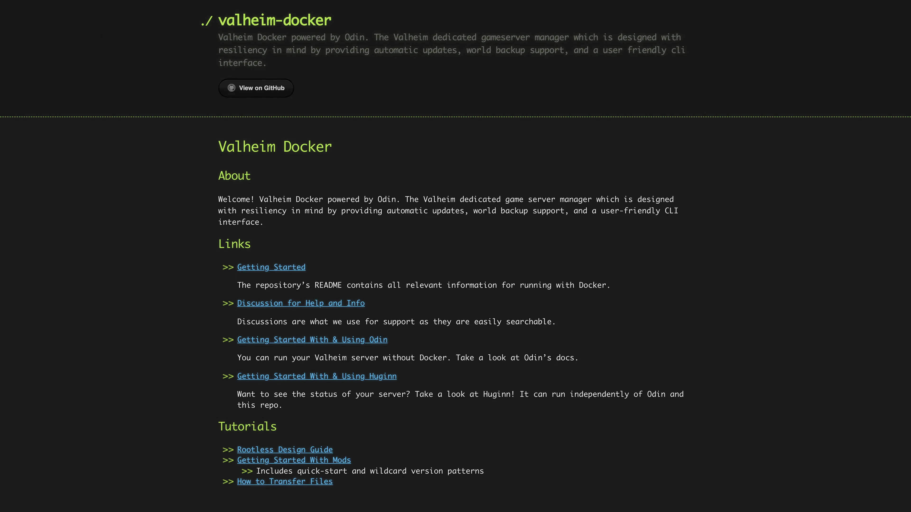

# Deploy and Host Valheim Docker on Sealos

[Valheim Docker](https://github.com/mbround18/valheim-docker) runs a Valheim dedicated server with Odin process management and the built-in Huginn status dashboard. This template deploys one vanilla server with persistent game files and world saves.

## About Hosting Valheim Docker

Odin installs the dedicated server through SteamCMD, starts Valheim, and shuts it down gracefully. Huginn provides a public, read-only dashboard, player information, health checks, and interactive API documentation.

Game binaries and configuration use a 2 GiB persistent volume. World saves use a separate 1 GiB volume at `/home/steam/.config/unity3d/IronGate/Valheim`. Sealos exposes the dashboard through HTTPS and the game through UDP NodePorts.

## Common Use Cases

- Hosting a persistent cooperative world for friends.
- Moving an existing vanilla world to a server that stays online.
- Checking server health and player counts from a browser.

## Dependencies for Valheim Docker Hosting

The template includes the server image, SteamCMD, Odin, Huginn, persistent volumes, a Service, and an HTTPS Ingress. Players need a licensed Valheim client compatible with the installed server version.

- [Project documentation](https://mbround18.github.io/valheim-docker/)
- [Valheim dedicated server guide](https://www.valheimgame.com/support/a-guide-to-dedicated-servers/)
- [Huginn API documentation](https://github.com/mbround18/valheim-docker/blob/v3.7.0/src/huginn/README.md)

### Implementation Details

| Component | Configuration |
| --- | --- |
| Server | `mbround18/valheim:3.7.0`, one StatefulSet replica |
| CPU / memory limits | 100m / 2 GiB |
| Game installation | 2 GiB PVC at `/home/steam/valheim` |
| World saves | 1 GiB PVC at `/home/steam/.config/unity3d/IronGate/Valheim` |
| Dashboard | Huginn on port `3000`, exposed through HTTPS |
| Game networking | UDP `2456` (game), `2457` (query), and `2458` |
| Runtime | Vanilla, public server listing, Steam backend, UTC |

The container runs as UID `111` and GID `1000`. Startup and readiness checks use Huginn's `/readiness`; liveness verifies both the Valheim process and Huginn. The container image version pins the Docker tooling; SteamCMD installs the current stable Valheim server on first start. Later restarts reuse the installed version. Set `UPDATE_ON_STARTUP=1` temporarily when you want to update, then return it to `0`.

The resource limits were tested with an empty world, public server queries, dashboard/API access, and save persistence. Increase capacity before sustained multiplayer sessions. The 2 GiB installation volume fits the tested vanilla build. Expand it before large updates or adding mods. Use one replica per world, and increase CPU and memory for active players or larger worlds. Automatic update and backup schedules are disabled by default; keep separate copies of important saves.

## Why Deploy Valheim Docker on Sealos?

Sealos provides a Kubernetes foundation, one-click deployment, persistent storage, and an HTTPS status page. Pay-as-you-go resource allocation lets you start with a small server and adjust its capacity from the Canvas resource cards or AI dialog.

## Deployment Guide

1. Open the [Valheim Docker template](https://sealos.io/products/app-store/valheim) and click **Deploy Now**.
2. Set `server_name`, `world_name`, and `server_password`. Use at least 5 characters for the password and a value different from the server name. Use letters, numbers, and hyphens for passwords; world names also support underscores, and server names support spaces.
3. Sealos typically provisions the resources in 2-3 minutes. The first server start downloads approximately 1.64 GiB and generates the world, which can take tens of minutes at the minimum CPU limit. Startup checks allow up to 60 minutes for this first initialization. Open the Canvas and wait for the server to become Ready.
4. Open the application's HTTPS URL to view Huginn. The dashboard opens directly and uses public read-only endpoints; game access uses the password supplied during deployment.
5. Open the Service resource card and copy the public UDP host and the NodePort mapped from `2456`. In Valheim, select **Start Game**, choose your character, open **Join Game**, and use **Add Server** with `<public-host>:<game-node-port>`. Enter `server_password` when prompted.
6. For Steam's server browser, use the separately mapped query port from `2457`. Keep the game and query mappings distinct when copying addresses. Canvas shows the actual assigned ports for your deployment.

### Dashboard and Game Access

Huginn includes `/status`, `/players`, `/mods`, `/metrics`, and `/docs`. It provides server visibility without an account registration flow. The game's password is configured in the StatefulSet's `PASSWORD` environment variable and can be viewed or changed from its resource card.

The bundled dashboard's Steam connection buttons assume a direct port mapping. Use the public UDP address shown in Canvas for this NodePort deployment.

## Configuration and Backups

Use the Canvas AI dialog or resource cards for post-deployment changes. Keep the replica count at one. Increasing CPU and memory is the supported way to provide more capacity for a single world.

To import a world, stop the server, copy its matching `.db` and `.fwl` files into `worlds_local` under the save volume, set `world_name` to their base name, and restart. Preserve the entire save directory when making backups. Deleting persistent volumes deletes their stored worlds and game files.

## Troubleshooting

**The status page reports offline:** Inspect the server logs for SteamCMD progress and the final `Game server connected` message. Huginn starts before world initialization finishes. Repeated OOM terminations require a higher memory tier.

**A game client cannot connect:** Check the public UDP host, the assigned game port, the password, and the client/server versions. The HTTPS dashboard address serves web traffic; game clients use the Service's UDP address.

**An update reports insufficient disk space:** Expand the game installation PVC, then restart the server. The world-save volume is separate.

## License

Valheim Docker, Odin, and Huginn are distributed under the [BSD 3-Clause License](https://github.com/mbround18/valheim-docker/blob/v3.7.0/LICENSE), copyright © 2021 mbround18. Valheim and its game assets are governed by their respective owners' terms.
