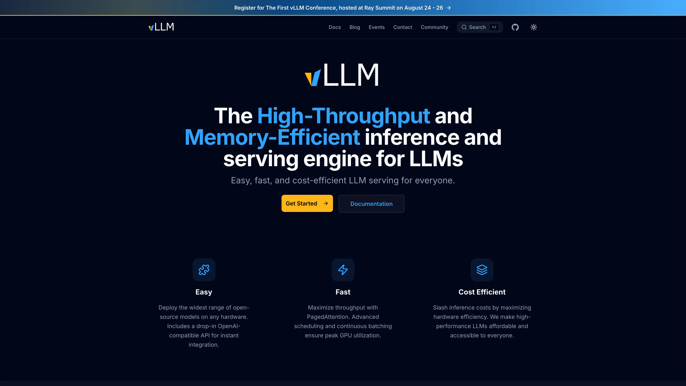

# vLLM

vLLM is an inference and serving engine for language models. This Sealos template runs the official CPU image with a compact instruction model, a persistent Hugging Face cache, and an OpenAI-compatible HTTPS API.



## Features

- Official `vllm/vllm-openai-cpu:v0.26.0` image
- OpenAI-compatible chat and text completion APIs
- Interactive API documentation at `/docs`
- Persistent Hugging Face model cache
- CPU-only default deployment

## Deploy on Sealos

1. Open the [vLLM template](https://sealos.io/products/app-store/vllm).
2. Click **Deploy Now**.
3. Wait for the StatefulSet to become Ready. The first image pull takes several minutes, and the low-CPU server startup can take up to 10 minutes.
4. Open the generated App URL to view the interactive API documentation.

The template downloads `HuggingFaceTB/SmolLM2-135M-Instruct` and serves it as `smollm2-135m`.

## Use the API

Set the generated HTTPS endpoint:

```bash
export VLLM_URL="https://<your-app>.usw-1.sealos.app"
```

Check service health and the served model:

```bash
curl "$VLLM_URL/health"
curl "$VLLM_URL/v1/models"
```

Create a chat completion:

```bash
curl "$VLLM_URL/v1/chat/completions" \
  -H "Content-Type: application/json" \
  -d '{
    "model": "smollm2-135m",
    "messages": [
      {"role": "user", "content": "What is 2 + 2?"}
    ],
    "max_tokens": 32,
    "temperature": 0
  }'
```

Create a text completion:

```bash
curl "$VLLM_URL/v1/completions" \
  -H "Content-Type: application/json" \
  -d '{
    "model": "smollm2-135m",
    "prompt": "The capital of France is",
    "max_tokens": 16,
    "temperature": 0
  }'
```

## Default resources

| Resource | Default |
| --- | --- |
| CPU limit | `100m` |
| Memory limit | `4096Mi` |
| Model cache | `1Gi` |
| CPU KV cache | `1Gi` |
| Maximum model length | `512` tokens |
| Maximum concurrent sequences | `1` |

This is the lowest Sealos CPU ladder tier. Live validation measured about 8.5 minutes for a cached cold start and about 55 seconds for an 8-token first completion at `100m`. Increase the CPU limit to `500m` or `1` for substantially lower startup and response latency, and keep the CPU request at 10% of the selected limit. The adjacent `2048Mi` memory tier produced an OOM termination, so `4096Mi` is the validated memory minimum for this model and 1Gi KV cache.

## Persistence

The StatefulSet mounts an `openebs-backup` volume at `/root/.cache/huggingface`. Model snapshots stay available across Pod restarts. Deleting the template instance and its PVC removes the cached model.

## Access control

The default endpoint accepts requests without an API key. The Sealos Ingress publishes the generated HTTPS endpoint to the internet. Add an authenticated API gateway or network access policy before sharing the endpoint with untrusted clients.

## Links

- [vLLM website](https://vllm.ai)
- [vLLM documentation](https://docs.vllm.ai)
- [CPU installation guide](https://docs.vllm.ai/en/latest/getting_started/installation/cpu/)
- [Default model](https://huggingface.co/HuggingFaceTB/SmolLM2-135M-Instruct)
- [Source code](https://github.com/vllm-project/vllm)
- [Apache 2.0 License](https://github.com/vllm-project/vllm/blob/main/LICENSE)
