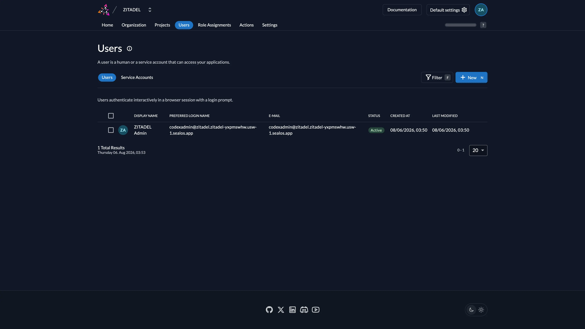

# Deploy and Host ZITADEL on Sealos

ZITADEL is an open-source identity and access management platform for SSO, OAuth 2.0, OpenID Connect, SAML, user management, and policy-based authorization. This template deploys ZITADEL v4.16.2 with a managed PostgreSQL database on Sealos Cloud.



## About Hosting ZITADEL

ZITADEL provides a central identity layer for applications, APIs, employees, and customers. Its management console lets administrators organize users, projects, applications, roles, login policies, and identity providers from one place.

The template keeps a compact single-ZITADEL topology and provisions PostgreSQL 16.4 through KubeBlocks. Sealos supplies persistent database storage, a TLS-enabled public endpoint, service discovery, and an App link. A startup gate waits for PostgreSQL before ZITADEL initializes, which prevents database readiness races during a fresh deployment.

## Common Use Cases

- **Workforce SSO**: Centralize authentication for internal dashboards and business applications.
- **Customer Identity (CIAM)**: Manage customer sign-in, account lifecycle, MFA, and recovery flows.
- **Application Authentication**: Add OAuth 2.0 and OpenID Connect to web, native, and mobile applications.
- **API Authorization**: Issue and validate tokens for APIs and machine-to-machine workloads.
- **B2B Organizations**: Separate users, roles, and access policies across customer organizations.

## Dependencies for ZITADEL Hosting

The template includes the ZITADEL service, a managed PostgreSQL cluster, persistent database storage, an HTTPS ingress, and the Sealos App resource.

### Deployment Dependencies

- [ZITADEL Kubernetes Guide](https://zitadel.com/docs/self-hosting/deploy/kubernetes) - Official Kubernetes deployment guidance
- [ZITADEL Configuration Reference](https://zitadel.com/docs/self-hosting/manage/configure/configure) - Runtime and first-instance settings
- [ZITADEL GitHub Repository](https://github.com/zitadel/zitadel) - Source code and releases

## Implementation Details

### Architecture Components

- **ZITADEL StatefulSet**: Runs `ghcr.io/zitadel/zitadel:v4.16.2` with the official `start-from-init` command.
- **PostgreSQL Readiness Gate**: Uses `postgres:16.4-alpine` and `pg_isready` before starting ZITADEL.
- **PostgreSQL Cluster**: Runs PostgreSQL 16.4 through KubeBlocks with a 1 GiB persistent volume.
- **Service and Ingress**: Expose port 8080 through a public HTTPS endpoint.
- **App Resource**: Adds the ZITADEL entry URL to the Sealos deployment Canvas.

Database host, port, username, and password values come from the KubeBlocks connection Secret. The first organization and its IAM owner are created from the required deployment inputs.

### Verified Minimum Resources

These values passed a fresh database initialization, administrator login, Organization and Users console actions, and a 222-second stability window with zero restarts:

| Component | CPU Request | CPU Limit | Memory Request | Memory Limit | Storage |
|---|---:|---:|---:|---:|---:|
| ZITADEL | 10m | 100m | 25Mi | 256Mi | - |
| PostgreSQL readiness gate | 10m | 100m | 12Mi | 128Mi | - |
| PostgreSQL | 50m | 500m | 51Mi | 512Mi | 1Gi |

The 128 MiB ZITADEL memory tier reached `OOMKilled` during first initialization. Keep the application memory limit at 256 MiB or higher.

## Why Deploy ZITADEL on Sealos?

Sealos is an AI-assisted cloud operating system built on Kubernetes. This template provides:

- **One-Click Deployment**: Provision the application, database, networking, and storage together.
- **Managed PostgreSQL**: Create and connect a persistent KubeBlocks database automatically.
- **Secure Public Access**: Receive an HTTPS URL with TLS termination at the ingress.
- **Resource Efficiency**: Start with verified low-load limits and pay for the resources you use.
- **AI-Assisted Operations**: Update resources through the Canvas AI dialog or resource cards.

## Deployment Guide

1. Open the [ZITADEL template](https://sealos.io/products/app-store/zitadel) and click **Deploy Now**.
2. Enter the required first administrator values:
   - `admin_username`: The username portion of the initial IAM owner account.
   - `admin_password`: A password with at least 8 characters containing uppercase and lowercase letters, a number, and a special character.
3. Start the deployment and wait for PostgreSQL and ZITADEL to become ready. A fresh deployment typically takes 2-3 minutes, then Sealos opens the Canvas.
4. Open the ZITADEL App URL. The root URL redirects to the login flow; the management console is available at `/ui/console/`.
5. Sign in with the generated login name and your configured password:
   - **Login name**: `<admin_username>@zitadel.<deployed-domain>`
   - **Password**: The value entered for `admin_password`
6. On the first sign-in, configure two-factor authentication or select **Skip** to continue to the management console.

For example, an `admin_username` of `admin` on `zitadel-ab12cd34.usw-1.sealos.app` produces this login name:

```text
admin@zitadel.zitadel-ab12cd34.usw-1.sealos.app
```

Use the complete login name shown above. ZITADEL uses the organization suffix to identify the account.

## Configuration

After signing in, use the ZITADEL console to create projects and applications, add users, configure identity providers, and manage policies. Complete these security tasks before connecting production applications:

1. Configure MFA for the administrator account.
2. Review organization and instance login policies.
3. Create a dedicated project and application for each relying service.
4. Record client credentials and redirect URIs in a secure system.

The generated 32-character master key protects encrypted ZITADEL data. Keep the deployed master key unchanged for the lifetime of the database.

Use the Sealos Canvas AI dialog or resource cards for later resource changes. Keep the StatefulSet at one replica for this template topology; a highly available architecture requires coordinated ZITADEL and PostgreSQL planning from the official production guide.

## Troubleshooting

### The login page says the user cannot be found

Use `<admin_username>@zitadel.<deployed-domain>`. The organization domain adds the `zitadel.` prefix before the public deployment domain.

### The application is still starting

The readiness gate waits for the managed PostgreSQL endpoint before ZITADEL runs its first-instance migrations. Allow 2-3 minutes for a fresh deployment and inspect the PostgreSQL and StatefulSet resource cards in Canvas.

### ZITADEL restarts with `OOMKilled`

Set the ZITADEL memory limit to at least 256 MiB. The 128 MiB tier failed during verified first initialization.

### Getting Help

- [ZITADEL Documentation](https://zitadel.com/docs)
- [ZITADEL GitHub Issues](https://github.com/zitadel/zitadel/issues)
- [Sealos Discord](https://discord.gg/wdUn538zVP)

## License

This Sealos template follows the repository license. ZITADEL is licensed under the [GNU Affero General Public License v3.0](https://github.com/zitadel/zitadel/blob/main/LICENSE).
